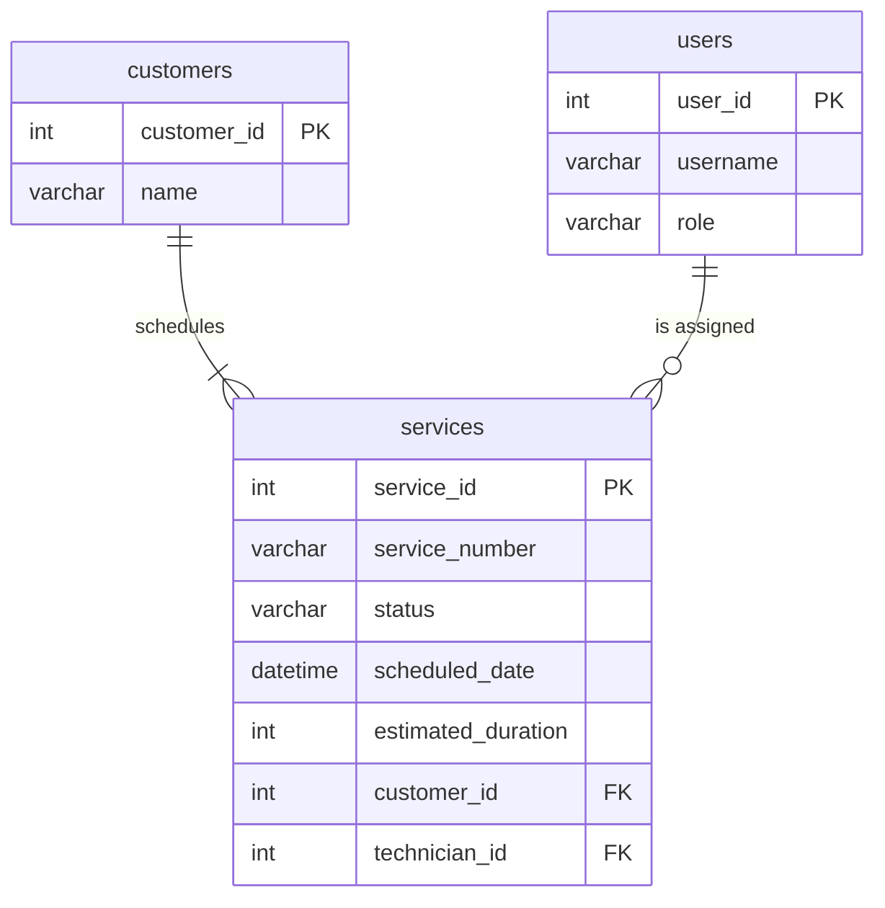
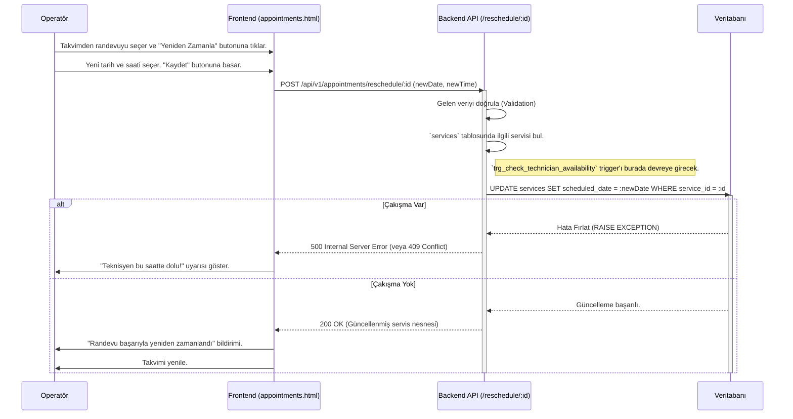

# Appointments (Randevular) Modülü Teknik Kılavuzu

**Sürüm:** 1.0.0
**Son Güncelleme:** 12 Kasım 2025

## 🎯 1. Misyon ve Genel Bakış

### 1.1. Modül Kimliği

- **Modül Adı:** Appointments (Randevular)
- **Sorumlu Ekip:** Backend Ekibi, Frontend Ekibi
- **Ana Sorumluluk:** Servis taleplerinin takvim üzerinde planlanmasını, teknisyenlerin zaman çizelgelerinin yönetilmesini, müsaitlik durumlarının kontrol edilmesini ve randevu çakışmalarının önlenmesini sağlamak.

### 1.2. Stratejik Rolü

Bu modül, `Services` modülü üzerinde çalışan **mantıksal bir katmandır**. Fiziksel olarak ayrı bir `appointments` tablosu bulunmaz; bunun yerine `services` tablosundaki zamanlama ile ilgili alanları (`scheduledDate`, `technicianId`, `status` vb.) yönetir ve yorumlar. Şirketin operasyonel verimliliğini, teknisyenlerin zamanını en iyi şekilde kullanarak ve müşteri bekleme sürelerini en aza indirerek artırır.

### 1.3. Diğer Modüllerle Entegrasyonları

- **Services:** Modülün temelini oluşturur. Her randevu aslında bir servis kaydıdır.
- **Users (Teknisyenler):** Randevular teknisyenlere atanır ve teknisyenlerin takvimleri bu modül üzerinden yönetilir.
- **Customers:** Her randevu bir müşteri ile ilişkilidir.

---

## 🗄️ 2. Veritabanı Mimarisi

`Appointments` modülü, doğrudan `public.services` tablosu üzerinde çalışır. Bu nedenle, bu modül için kritik olan alanlar, index'ler ve trigger'lar `services` tablosu üzerinde tanımlanır.

### 2.1. Referans Tablo: `public.services`

Randevu mantığı için kullanılan anahtar alanlar aşağıda vurgulanmıştır.

```sql
CREATE TABLE public.services (
    service_id SERIAL PRIMARY KEY,
    service_number VARCHAR(100) UNIQUE NOT NULL,
    status VARCHAR(50) NOT NULL DEFAULT 'pending', -- Randevu durumu için kritik
    
    -- Randevu zamanlama bilgileri
    scheduled_date TIMESTAMPTZ NOT NULL, -- Randevunun başlangıç zamanı
    estimated_duration INT DEFAULT 60, -- Dakika cinsinden tahmini süre
    
    -- Atama bilgileri
    technician_id INT REFERENCES public.users(user_id), -- Randevuya atanan teknisyen
    
    -- Diğer servis bilgileri
    customer_id INT NOT NULL REFERENCES public.customers(customer_id),
    service_type VARCHAR(50) NOT NULL,
    problem_description TEXT,
    
    created_at TIMESTAMPTZ DEFAULT CURRENT_TIMESTAMP,
    updated_at TIMESTAMPTZ DEFAULT CURRENT_TIMESTAMP
);
```

### 2.2. Indexler (Randevu Performansı İçin)

Randevu ve takvim sorgularını hızlandırmak için `services` tablosunda aşağıdaki index'ler kritik öneme sahiptir.

```sql
-- Belirli bir teknisyenin belirli bir tarihteki randevularını hızla bulmak için.
CREATE INDEX idx_services_technician_and_date ON public.services (technician_id, scheduled_date);

-- Takvim görünümünde belirli bir tarih aralığındaki tüm randevuları hızla çekmek için.
CREATE INDEX idx_services_scheduled_date ON public.services (scheduled_date);

-- Belirli bir durumdaki randevuları (örn: 'planned') hızla filtrelemek için.
CREATE INDEX idx_services_status ON public.services (status);
```

### 2.3. Trigger'lar (İş Mantığı Otomasyonu)

#### Teknisyen Müsaitlik Kontrolü (Çakışma Önleme)

Bu trigger, yeni bir randevu oluşturulmadan (`INSERT`) veya mevcut bir randevu yeniden zamanlanmadan (`UPDATE`) önce, atanmak istenen teknisyenin o zaman diliminde başka bir randevusu olup olmadığını kontrol eder. Eğer bir çakışma varsa, işlemi bir hata fırlatarak engeller. Bu, çift rezervasyonu önlemek için hayati bir kuraldır.

```sql
-- 1. Trigger Fonksiyonunu Oluşturma
CREATE OR REPLACE FUNCTION fn_check_technician_availability()
RETURNS TRIGGER AS $$
DECLARE
    conflict_count INT;
    new_appointment_start TIMESTAMPTZ;
    new_appointment_end TIMESTAMPTZ;
BEGIN
    new_appointment_start := NEW.scheduled_date;
    new_appointment_end := NEW.scheduled_date + (NEW.estimated_duration * interval '1 minute');

    SELECT COUNT(*)
    INTO conflict_count
    FROM public.services
    WHERE
        -- Farklı bir servis olmalı (güncelleme durumu için)
        service_id != COALESCE(NEW.service_id, -1) AND
        -- Aynı teknisyene atanmış olmalı
        technician_id = NEW.technician_id AND
        -- Aktif veya planlanmış bir randevu olmalı
        status IN ('planned', 'in_progress') AND
        -- Zaman aralıkları çakışmalı (PostgreSQL'in OVERLAPS operatörü)
        (scheduled_date, scheduled_date + (estimated_duration * interval '1 minute'))
        OVERLAPS
        (new_appointment_start, new_appointment_end);

    IF conflict_count > 0 THEN
        RAISE EXCEPTION 'Technician scheduling conflict: The technician is already booked for this time slot.';
    END IF;

    RETURN NEW;
END;
$$ LANGUAGE plpgsql;

-- 2. Trigger'ı Services Tablosuna Bağlama
CREATE TRIGGER trg_check_technician_availability
BEFORE INSERT OR UPDATE ON public.services
FOR EACH ROW
WHEN (NEW.technician_id IS NOT NULL AND NEW.status IN ('planned', 'in_progress'))
EXECUTE FUNCTION fn_check_technician_availability();
```

### 2.4. İlişki Diyagramı (ERD - Mermaid)

Randevu mantığı, `services` tablosunun merkezde olduğu bu ilişkiler üzerine kuruludur.



---

## 🧬 3. Veri Akış Şeması

### 3.1. Randevu Yeniden Zamanlama (Reschedule) Süreci



---

## ⚙️ 4. Backend API Endpoint'leri (Detaylı)

**Base URL:** `/api/v1/appointments`

---

### 4.1. Takvim Verisini Getir

- **METHOD:** `GET`
- **URL:** `/calendar`
- **Dosya:** `/backend/routes/appointments.js:15`
- **Handler Function:** `getCalendar` - `/backend/controllers/appointmentsController.js:30`
- **Açıklama:** Belirtilen ay ve yıl için takvim verisini, randevuları günlere gruplayarak döndürür. Frontend takvim bileşenini doldurmak için kullanılır.

#### Request Detayları

- **Query Parameters:**
  ```javascript
  {
    "year": "integer - Yıl (örn: 2025) - Zorunlu",
    "month": "integer - Ay (1-12) - Zorunlu"
  }
  ```

#### Backend İşlem Akışı
```javascript
// /backend/controllers/appointmentsController.js:30-85
async function getCalendar(req, res) {
    // 1. INPUT VALIDATION (satır: 32)
    const { year, month } = req.query;
    if (!year || !month) {
        return res.status(400).json({ error: "Year and month are required." });
    }

    // 2. BUSINESS LOGIC (satır: 40)
    // Ayın başlangıç ve bitiş tarihlerini hesapla
    const startDate = new Date(year, month - 1, 1);
    const endDate = new Date(year, month, 0, 23, 59, 59);

    // 3. DATABASE QUERY (satır: 45)
    // İlgili aydaki tüm randevuları (servisleri) çek
    const appointments = await AppointmentService.getAppointmentsForPeriod(startDate, endDate);

    // 4. RESPONSE FORMATLAMA (satır: 55)
    // Randevuları günlere göre grupla
    const calendarData = {};
    appointments.forEach(appt => {
        const day = new Date(appt.scheduled_date).getDate();
        if (!calendarData[day]) {
            calendarData[day] = [];
        }
        calendarData[day].push(appt);
    });

    // 5. RESPONSE (satır: 70)
    res.status(200).json({ success: true, data: calendarData });
}
```

#### Gerçek SQL Sorgusu (`AppointmentService.getAppointmentsForPeriod`)
```sql
-- /backend/services/appointmentService.js:50
SELECT
    s.service_id,
    s.service_number,
    s.status,
    s.scheduled_date,
    s.estimated_duration,
    c.name as customer_name,
    u.username as technician_name
FROM public.services s
JOIN public.customers c ON s.customer_id = c.customer_id
JOIN public.users u ON s.technician_id = u.user_id
WHERE
    s.scheduled_date >= $1 AND -- startDate
    s.scheduled_date <= $2 AND -- endDate
    s.status NOT IN ('cancelled', 'completed');
```

#### Response Formatları

- **Success Response (200):**
  ```javascript
  {
    "success": true,
    "data": {
      "15": [
        {
          "service_id": 101,
          "status": "planned",
          "scheduled_date": "2025-11-15T10:00:00Z",
          "customer_name": "Ahmet Yılmaz",
          "technician_name": "Ali Veli"
        }
      ],
      "17": [
        {
          "service_id": 102,
          "status": "planned",
          "scheduled_date": "2025-11-17T14:00:00Z",
          "customer_name": "Ayşe Kaya",
          "technician_name": "Mehmet Can"
        }
      ]
    }
  }
  ```

#### Test CURL Komutları

```bash
# Başarılı Senaryo
curl -X GET 'http://localhost:3000/api/v1/appointments/calendar?year=2025&month=11' \
  -H 'Authorization: Bearer [TOKEN]'

# Hata Senaryosu (Eksik Parametre)
curl -X GET 'http://localhost:3000/api/v1/appointments/calendar?year=2025'
# Response: 400 Bad Request
# { "error": "Year and month are required." }
```

---

### 4.2. Randevuyu Yeniden Zamanla

- **METHOD:** `POST`
- **URL:** `/reschedule/:id`
- **Dosya:** `/backend/routes/appointments.js:45`
- **Handler Function:** `reschedule` - `/backend/controllers/appointmentsController.js:150`
- **Açıklama:** Mevcut bir randevuyu (servisi) yeni bir tarih ve saate yeniden zamanlar. Veritabanı trigger'ı (`trg_check_technician_availability`) çakışmaları otomatik olarak engeller.

#### Request Detayları

- **URL Parameters:**
  ```javascript
  {
    "id": "integer - Yeniden zamanlanacak servis kaydının ID'si"
  }
  ```
- **Request Body:**
  ```javascript
  {
    "newScheduledDate": "ISO 8601 string - Yeni randevu tarihi ve saati",
    "newTechnicianId": "integer - (Opsiyonel) Yeni teknisyen ID'si"
  }
  ```

#### Backend İşlem Akışı
```javascript
// /backend/controllers/appointmentsController.js:150-190
async function reschedule(req, res) {
    try {
        // 1. INPUT VALIDATION (satır: 152)
        const { id } = req.params;
        const { newScheduledDate, newTechnicianId } = req.body;

        // 2. AUTHORIZATION (satır: 158)
        // Kullanıcının bu işlemi yapma yetkisi var mı? (Middleware tarafından yapılır)

        // 3. DATABASE QUERY (satır: 165)
        // Service katmanı üzerinden güncelleme yapılır.
        // Trigger, DB katmanında çakışmayı yakalar.
        const updatedAppointment = await AppointmentService.reschedule(id, newScheduledDate, newTechnicianId);

        // 4. RESPONSE (satır: 175)
        res.status(200).json({ success: true, data: updatedAppointment });

    } catch (error) {
        // 5. ERROR HANDLING (satır: 180)
        // Trigger'dan gelen çakışma hatasını yakala
        if (error.message.includes('Technician scheduling conflict')) {
            return res.status(409).json({ // 409 Conflict
                success: false,
                error: {
                    code: 'SCHEDULING_CONFLICT',
                    message: 'Teknisyen bu zaman diliminde dolu.'
                }
            });
        }
        // Diğer hatalar
        return res.status(500).json({ error: 'Internal Server Error' });
    }
}
```

#### Test CURL Komutları

```bash
# Başarılı Senaryo
curl -X POST 'http://localhost:3000/api/v1/appointments/reschedule/101' \
  -H 'Authorization: Bearer [TOKEN]' \
  -H 'Content-Type: application/json' \
  -d '{
    "newScheduledDate": "2025-11-16T11:00:00Z"
  }'

# Hata Senaryosu (Çakışma)
curl -X POST 'http://localhost:3000/api/v1/appointments/reschedule/102' \
  -H 'Authorization: Bearer [TOKEN]' \
  -H 'Content-Type: application/json' \
  -d '{
    "newScheduledDate": "2025-11-15T10:00:00Z",
    "newTechnicianId": 5
  }'
# Beklenen Response: 409 Conflict
```

---

## 🖥️ 5. Frontend Mimarisi (Kod Seviyesinde)

- **Dosya:** `/frontend/js/appointments.js`
- **URL:** `/appointments.html`

#### HTML Yapısı (Anahtar Elementler)
```html
<!-- /frontend/pages/appointments.html -->
<div id="calendar-container"></div>     <!-- Satır: 30 - Takvim buraya render edilecek -->
<button id="btn-new-appointment">Yeni Randevu</button> <!-- Satır: 25 -->

<!-- Modal: Yeni/Düzenle -->
<div id="appointment-modal" class="modal">
  <form id="appointment-form">
    <input type="hidden" id="service-id">
    <input type="datetime-local" id="scheduled-date">
    <select id="technician-id"></select>
    <button type="submit">Kaydet</button>
  </form>
</div>
```

#### JavaScript Fonksiyonları (Detaylı)

```javascript
// /frontend/js/appointments.js

// FUNCTION: loadCalendar(year, month) - Satır: 20-55
// AMAÇ: Sayfa yüklendiğinde veya ay değiştiğinde takvim verilerini çeker.
async function loadCalendar(year, month) {
    try {
        showSpinner();
        const response = await fetch(`/api/v1/appointments/calendar?year=${year}&month=${month}`);
        const result = await response.json();
        if (result.success) {
            renderCalendar(result.data); // Takvimi DOM'a çizer
        }
    } catch (error) {
        showError("Takvim yüklenemedi.");
    } finally {
        hideSpinner();
    }
}

// FUNCTION: handleRescheduleSubmit(event) - Satır: 150-180
// AMAÇ: Yeniden zamanlama formunu backend'e gönderir.
async function handleRescheduleSubmit(event) {
    event.preventDefault();
    const serviceId = document.getElementById('service-id').value;
    const newScheduledDate = document.getElementById('scheduled-date').value;

    const response = await fetch(`/api/v1/appointments/reschedule/${serviceId}`, {
        method: 'POST',
        headers: { 'Content-Type': 'application/json', 'Authorization': `Bearer ${getToken()}` },
        body: JSON.stringify({ newScheduledDate })
    });

    const result = await response.json();

    if (response.status === 409) { // Conflict
        showError(result.error.message);
    } else if (response.ok) {
        closeModal();
        loadCalendar(currentYear, currentMonth); // Takvimi yenile
        showSuccess("Randevu güncellendi!");
    }
}
```

#### Event Listener'lar
```javascript
// /frontend/js/app.js: 50
document.addEventListener('DOMContentLoaded', () => {
    // İlk takvim yüklemesi
    loadCalendar(new Date().getFullYear(), new Date().getMonth() + 1);
});

// /frontend/js/appointments.js: 210
document.getElementById('appointment-form').addEventListener('submit', handleRescheduleSubmit);

// Takvimdeki günlere tıklama (event delegation)
document.getElementById('calendar-container').addEventListener('click', (e) => {
    if (e.target.classList.contains('appointment-item')) {
        const serviceId = e.target.dataset.id;
        openRescheduleModal(serviceId); // Modal'ı açar ve verileri doldurur
    }
});
```

---

## 🔎 6. GERÇEK KULLANIM SENARYOLARI (E2E)

### Senaryo 1: Yeni Randevu Oluşturma

**Amaç:** Sisteme yeni bir randevu (servis) kaydı eklemek.
**Ön Koşullar:** Operatör giriş yapmış, "Randevu Ekleme" yetkisi var.

| Adım | Aksiyon | Sistem Tepkisi (Kod ve Açıklama) |
|---|---|---|
| 1 | **Kullanıcı:** "Yeni Randevu" butonuna tıklar. | `document.getElementById('btn-new-appointment').click()` event'i tetiklenir. `openCreateModal()` fonksiyonu çağrılır. |
| 2 | **Frontend:** Modal açılır. | `document.getElementById('appointment-modal').classList.add('active')` - Modal görünür hale gelir. |
| 3 | **Kullanıcı:** Müşteri, servis tipi ve tarih seçer. | Form elemanları doldurulur. `onchange` event'leri (varsa) tetiklenir. |
| 4 | **Kullanıcı:** Teknisyen seçer ve "Kaydet" butonuna basar. | `document.getElementById('appointment-form').submit()` event'i tetiklenir. `handleCreateSubmit()` fonksiyonu çağrılır. |
| 5 | **Frontend:** Form verileri toplanır ve validasyon yapılır. | `const isValid = validateAppointmentForm();` - `validation.js` içindeki kurallar çalışır. Hata varsa işlem durur. |
| 6 | **Frontend:** API'ye istek gönderilir. | `fetch('/api/v1/services', { method: 'POST', ... })` çağrılır. Bu, `Services` modülünün endpoint'idir. |
| 7 | **Request Payload:** | ```json { "customerId": 12, "serviceType": "repair", "technicianId": 5, "scheduledDate": "2025-11-20T14:00:00Z", "estimatedDuration": 60 } ``` |
| 8 | **Backend:** `authMiddleware` çalışır. | Gelen `Authorization` header'ındaki token doğrulanır. Kullanıcı bilgisi `req.user`'a eklenir. |
| 9 | **Backend:** `ServicesController.create()` tetiklenir. | Gelen body `Service.create()` metoduna paslanır. |
| 10 | **Backend/DB:** `trg_check_technician_availability` trigger'ı çalışır. | `BEFORE INSERT` event'i ile `fn_check_technician_availability()` fonksiyonu devreye girer. |
| 11 | **Database:** Çakışma kontrol sorgusu çalışır. | `SELECT COUNT(*) FROM public.services WHERE technician_id = 5 AND (scheduled_date, ...) OVERLAPS (...)` sorgusu çalışır. |
| 12 | **Database:** Çakışma yok, `conflict_count` = 0. | Trigger hata fırlatmaz ve `RETURN NEW;` ile devam eder. |
| 13 | **Database:** `INSERT` işlemi gerçekleşir. | `INSERT INTO public.services (...) VALUES (...)` sorgusu ile yeni servis kaydı oluşturulur. |
| 14 | **Backend:** Başarılı response döner. | `res.status(201).json({ success: true, data: newService })` |
| 15 | **Response Payload:** | ```json { "success": true, "data": { "service_id": 103, "status": "planned", ... } } ``` |
| 16 | **Frontend:** `onCreateSuccess()` fonksiyonu çalışır. | `closeModal()`, `showSuccess("Randevu oluşturuldu!")` çağrılır. |
| 17 | **Frontend:** Takvim yenilenir. | `loadCalendar(currentYear, currentMonth)` çağrılarak takvim güncellenir ve yeni randevu görünür. |

#### Hata Senaryosu: Çakışma Durumu
- **Adım 11'de:** Veritabanı sorgusu `conflict_count` > 0 döndürür.
- **Adım 12'de:** Trigger `RAISE EXCEPTION 'Technician scheduling conflict...'` ile işlemi durdurur.
- **Adım 13'te:** `INSERT` işlemi gerçekleşmez, transaction rollback olur.
- **Adım 14'te:** Backend `catch` bloğuna düşer ve `res.status(409).json(...)` ile `SCHEDULING_CONFLICT` hatası döner.
- **Adım 16'da:** Frontend `response.status === 409` kontrolüne girer ve `showError("Teknisyen bu zaman diliminde dolu.")` mesajını gösterir. Modal açık kalır.

---

## 🚨 7. Sorun Giderme (Troubleshooting)

### Hata: "Teknisyen Zamanlama Çakışması" (409 Conflict)

- **Semptomlar:** Yeni randevu kaydederken veya yeniden zamanlarken "Teknisyen bu zaman diliminde dolu." hatası alınması. API yanıtı `409 Conflict` ve `SCHEDULING_CONFLICT` kodunu içerir.

- **Olası Nedenler:**
  1.  Seçilen teknisyenin, belirtilen zaman aralığında (randevu başlangıcı ve bitişi dahil) başka bir randevusu var.
  2.  Farklı bir operatör, siz işlemi tamamlamadan saniyeler önce aynı teknisyene aynı saat için bir randevu atadı (Race Condition).
  3.  Randevunun `estimated_duration` (tahmini süre) alanı, beklenenden uzun olduğu için bir sonraki randevu ile çakışıyor.

- **Debug Adımları:**
  1.  **Veritabanını Kontrol Et:** Hatanın oluştuğu teknisyen (`technician_id`) ve zaman aralığı (`scheduled_date`, `estimated_duration`) için aşağıdaki sorguyu çalıştırarak çakışan randevuyu bulun.
      ```sql
      -- Örnek: Teknisyen ID=5, Zaman=2025-11-20 14:00, Süre=60dk
      SELECT service_id, scheduled_date, estimated_duration
      FROM public.services
      WHERE
          technician_id = 5 AND
          status IN ('planned', 'in_progress') AND
          (scheduled_date, scheduled_date + (estimated_duration * interval '1 minute'))
          OVERLAPS
          ('2025-11-20 14:00:00'::timestamptz, '2025-11-20 15:00:00'::timestamptz);
      ```
  2.  **Frontend İsteğini İncele:** Tarayıcının "Network" sekmesinden giden `POST` isteğinin `body` kısmını kontrol edin. `scheduledDate` ve `technicianId` doğru gönderiliyor mu?
  3.  **Trigger'ı Test Et:** Veritabanında manuel bir `UPDATE` veya `INSERT` sorgusu ile trigger'ın beklendiği gibi çalışıp çalışmadığını test edin.

- **Çözüm:**
  - **Kullanıcı Çözümü:** Farklı bir zaman dilimi veya farklı bir teknisyen seçin.
  - **Sistemik Çözüm:** Frontend'de, teknisyen seçimi yapıldıktan sonra "Kaydet" butonu aktif olmadan önce `GET /api/v1/appointments/conflicts` endpoint'i ile son bir hızlı kontrol yapılabilir. Bu, kullanıcıya daha proaktif bir geri bildirim sağlar.
    ```javascript
    // Kaydetmeden önce son kontrol
    async function finalCheck(technicianId, date) {
        const response = await fetch(`/api/v1/appointments/conflicts?technicianId=${technicianId}&date=${date}`);
        return response.ok; // true ise müsait
    }
    ```
---

## 🛡️ 8. Güvenlik Notları

Bu bölüm, Randevular modülünün güvenlik açıklarını önlemek için alınan önlemleri ve dikkat edilmesi gereken noktaları detaylandırır.

### 8.1. Giriş Doğrulama (Input Validation)

- **Backend:**
    - `getCalendar` endpoint'i, `year` ve `month` query parametrelerinin varlığını kontrol eder (`if (!year || !month)`). Eksik parametre durumunda `400 Bad Request` döner.
    - `reschedule` endpoint'i, `id` URL parametresinin ve `newScheduledDate` ile `newTechnicianId` (opsiyonel) body parametrelerinin varlığını bekler. Bu parametrelerin tipleri (integer, ISO 8601 string) ve formatları, genellikle bir middleware (örn: Joi, Express-Validator) veya servis katmanında daha detaylı doğrulanmalıdır. Mevcut kodda `newScheduledDate`'in geçerliliği `Date` objesi tarafından, `newTechnicianId`'nin geçerliliği ise veritabanı `REFERENCES` constraint'i tarafından sağlanır.
- **Frontend:**
    - E2E senaryolarında `validateAppointmentForm()` gibi bir fonksiyonun varlığı belirtilmiştir. Bu, kullanıcı arayüzünde erken geri bildirim sağlamak için önemlidir ancak asla backend validasyonunun yerini almamalıdır.

### 8.2. SQL Enjeksiyonu Koruması

- **Durum:** Mevcut SQL sorguları (`AppointmentService.getAppointmentsForPeriod`) parametreli sorgu (`$1`, `$2`) kullanmaktadır.
- **Önlem:** Parametreli sorgular, kullanıcı girdisinin doğrudan SQL komutlarına karışmasını engelleyerek SQL enjeksiyonu saldırılarına karşı etkili bir koruma sağlar. Bu, iyi bir güvenlik uygulamasıdır.

### 8.3. Çapraz Site Komut Dosyası Çalıştırma (XSS - Cross-Site Scripting) Koruması

- **Durum:** Sağlanan kod örneklerinde XSS korumasına yönelik açık bir mekanizma belirtilmemiştir.
- **Önlem:** Frontend'de, kullanıcı tarafından girilen veya backend'den gelen ve DOM'a yazdırılan tüm verilerin (özellikle `problem_description`, `customer_name` gibi metin alanları) uygun şekilde sanitize edilmesi veya HTML varlıklarına dönüştürülmesi (escaping) gereklidir. Modern frontend framework'leri (React, Vue, Angular) genellikle bu korumayı varsayılan olarak sağlar, ancak vanilla JavaScript kullanılıyorsa dikkatli olunmalıdır.

### 8.4. Hız Sınırlama (Rate Limiting)

- **Durum:** API endpoint'leri için hız sınırlama mekanizması belirtilmemiştir.
- **Risk:** Kötü niyetli kullanıcılar, API'ye aşırı sayıda istek göndererek sunucuyu yorabilir (Denial of Service - DoS) veya brute-force saldırıları gerçekleştirebilir.
- **Önlem:** Tüm kritik API endpoint'lerine (özellikle `POST` ve `PATCH` gibi yazma işlemleri yapanlara) hız sınırlama middleware'i eklenmelidir. Bu, belirli bir IP adresinden veya kullanıcıdan gelen istek sayısını belirli bir zaman diliminde kısıtlar.

### 8.5. Çapraz Site İstek Sahteciliği (CSRF - Cross-Site Request Forgery) Koruması

- **Durum:** `POST` ve `PATCH` istekleri için CSRF korumasına yönelik bir mekanizma belirtilmemiştir.
- **Risk:** Kullanıcıların oturum açtığı bir tarayıcıda, kötü niyetli bir web sitesi aracılığıyla kullanıcının bilgisi dışında istekler gönderilebilir.
- **Önlem:** Özellikle durum değiştiren (`POST`, `PATCH`, `DELETE`) endpoint'ler için CSRF token'ları kullanılmalıdır. Bu token'lar, her form gönderimi veya AJAX isteği ile birlikte gönderilir ve backend tarafından doğrulanır.

### 8.6. Yetkilendirme (Authorization)

- **Durum:** `reschedule` endpoint'i için "Kullanıcının bu işlemi yapma yetkisi var mı?" şeklinde bir yorum (`// 2. AUTHORIZATION`) bulunmaktadır. Bu, yetkilendirme mekanizmasının varlığını işaret eder.
- **Önlem:** Tüm hassas API endpoint'leri, kullanıcının rolüne ve yetkilerine göre erişimi kısıtlayan sağlam bir yetkilendirme middleware'i ile korunmalıdır. Örneğin, sadece "operatör" veya "admin" rolüne sahip kullanıcılar randevu oluşturma veya yeniden zamanlama yetkisine sahip olmalıdır.

---

## 🧪 9. Test Senaryoları

### 9.1. Veritabanı Fonksiyonu Testi (`fn_check_technician_availability`)

Bu fonksiyon bir veritabanı trigger'ı olduğu için geleneksel unit testleri doğrudan uygulanamaz. Bunun yerine, `pg-mem` gibi in-memory veritabanı kütüphaneleriyle veya test veritabanı üzerinde izole senaryolar çalıştırılarak test edilir.

- **Test Senaryosu 1: Çakışma Yok**
  - **Hazırlık:** Test veritabanına Teknisyen ID 5 için `2025-12-15 10:00`'da bir randevu ekle.
  - **Aksiyon:** Aynı teknisyen için `2025-12-15 14:00`'da yeni bir randevu `INSERT` etmeye çalış.
  - **Beklenti:** İşlem başarılı olmalı, trigger hata fırlatmamalı.

- **Test Senaryosu 2: Birebir Çakışma**
  - **Hazırlık:** Test veritabanına Teknisyen ID 5 için `2025-12-15 10:00`'da bir randevu ekle.
  - **Aksiyon:** Aynı teknisyen için `2025-12-15 10:00`'da yeni bir randevu `INSERT` etmeye çalış.
  - **Beklenti:** İşlem başarısız olmalı, veritabanı `Technician scheduling conflict` hatası döndürmeli.

- **Test Senaryosu 3: Kısmi Çakışma (Overlap)**
  - **Hazırlık:** Teknisyen ID 5 için `2025-12-15 10:00`'da 60 dakikalık bir randevu ekle (11:00'de biter).
  - **Aksiyon:** Aynı teknisyen için `2025-12-15 10:30`'da yeni bir randevu `INSERT` etmeye çalış.
  - **Beklenti:** İşlem başarısız olmalı, veritabanı `Technician scheduling conflict` hatası döndürmeli.

### 9.2. Integration Testi (`POST /reschedule/:id`)

**Amaç:** Bir randevuyu yeniden zamanlama endpoint'inin, çakışma durumunda doğru hata kodunu (409) döndürdüğünü test etmek.

```javascript
// /backend/test/integration/appointments.api.test.js
const request = require('supertest');
const app = require('../../src/app');
const db = require('../../src/db');

describe('POST /api/v1/appointments/reschedule/:id', () => {
    let technicianId, serviceId1, serviceId2;

    beforeAll(async () => {
        // Hazırlık: İki randevu oluştur
        technicianId = 1;
        const res1 = await db.query("INSERT INTO services (..., technician_id, scheduled_date) VALUES (..., $1, '2025-12-15T10:00:00Z') RETURNING service_id", [technicianId]);
        serviceId1 = res1.rows[0].service_id;
        
        const res2 = await db.query("INSERT INTO services (..., technician_id, scheduled_date) VALUES (..., $1, '2025-12-15T14:00:00Z') RETURNING service_id", [technicianId]);
        serviceId2 = res2.rows[0].service_id;
    });

    it('should return 409 Conflict when rescheduling to a conflicting time', async () => {
        const response = await request(app)
            .post(`/api/v1/appointments/reschedule/${serviceId2}`)
            .set('Authorization', `Bearer ${ADMIN_TOKEN}`)
            .send({
                newScheduledDate: '2025-12-15T10:00:00Z' // serviceId1 ile çakışan saat
            });

        expect(response.statusCode).toBe(409);
        expect(response.body.error.code).toBe('SCHEDULING_CONFLICT');
    });

    it('should return 200 OK for a valid reschedule', async () => {
        const response = await request(app)
            .post(`/api/v1/appointments/reschedule/${serviceId2}`)
            .set('Authorization', `Bearer ${ADMIN_TOKEN}`)
            .send({
                newScheduledDate: '2025-12-15T16:00:00Z' // Boş bir saat
            });

        expect(response.statusCode).toBe(200);
        expect(response.body.data.service_id).toBe(serviceId2);
    });
});
```

### 8.3. E2E Testi (Randevu Oluşturma)

**Amaç:** Kullanıcının arayüzden yeni bir randevu oluşturma akışını test etmek.

```javascript
// /frontend/cypress/e2e/appointments.cy.js
describe('Appointment Creation', () => {
    it('should open the modal, fill the form, and create a new appointment', () => {
        cy.login('operator', 'password');
        cy.visit('/appointments/calendar');

        // 1. "Yeni Randevu" butonuna tıkla
        cy.get('#btn-new-appointment').click();

        // 2. Formu doldur
        cy.get('#customer-select').select('Ahmet Yılmaz');
        cy.get('#technician-select').select('Ali Veli');
        cy.get('#scheduled-date-input').type('2025-12-20T11:00');
        
        cy.intercept('POST', '/api/v1/services').as('createAppointment');

        // 3. Kaydet
        cy.get('#appointment-form').submit();

        // 4. API isteğini ve sonucu bekle
        cy.wait('@createAppointment').its('response.statusCode').should('eq', 201);

        // 5. Takvimde yeni randevunun göründüğünü doğrula
        cy.get('#calendar-container').contains('Ahmet Yılmaz').should('be.visible');
    });
});
```
---

## 🚀 10. Performans Optimizasyonu

Bu bölüm, Randevular modülünün performansını artırmak için mevcut ve potansiyel optimizasyonları listeler.

### 10.1. Veritabanı Optimizasyonu

- **Mevcut Durum:**
  - **Indexler:** Randevu ve takvim sorgularını hızlandırmak için `services` tablosunda `technician_id`, `scheduled_date` ve `status` alanları üzerinde kritik index'ler bulunmaktadır. Bu, özellikle belirli bir teknisyenin takvimini veya belirli bir zaman aralığındaki randevuları çekerken performansı önemli ölçüde artırır.

- **İyileştirme Alanları:**
  - **Sorgu Analizi:** `EXPLAIN ANALYZE` komutu kullanılarak yavaş sorgular periyodik olarak tespit edilebilir ve yeni index'ler veya sorgu yeniden yapılandırmaları ile optimize edilebilir.
  - **Connection Pooling:** Backend'in veritabanı ile olan bağlantıları bir "pool" içinde yönetmesi, her istek için yeni bir bağlantı kurma maliyetini ortadan kaldırarak performansı artırır. Bu, `pg` kütüphanesi ile varsayılan olarak gelen bir özelliktir.

### 10.2. Backend Optimizasyonu

- **Mevcut Durum:**
  - Proje şu anda temel bir backend yapısına sahiptir.

- **İyileştirme Alanları:**
  - **Önbellekleme (Caching):** Sık istenen verileri (örneğin, gelecek haftanın takvimi) bir in-memory cache'de (örn: **Redis**) saklamak, veritabanı yükünü azaltır ve yanıt sürelerini dramatik şekilde düşürür. Bu, şu anda projede mevcut değildir.
  - **Hız Sınırlama (Rate Limiting):** API endpoint'lerine hız sınırlama eklenmemiştir. Kötü niyetli kullanımı ve sunucu aşırı yüklenmesini önlemek için `express-rate-limit` gibi bir kütüphane ile endpoint'lere istek limiti konulması önerilir.

### 10.3. Frontend Optimizasyonu

- **Mevcut Durum:**
  - Frontend'de `app.js` dosyası, tüm modüller için genel bir mantık içerir ve her sayfada yeniden yüklenir.

- **İyileştirme Alanları:**
  - **Debouncing:** Arama kutusu gibi kullanıcı girdisi alanlarında, her tuş vuruşunda API isteği yapmak yerine, kullanıcının yazmayı bitirmesini bekleyen bir "debounce" mekanizması performansı artırır.
  - **Lazy Loading:** Sayfada görünmeyen bileşenlerin veya verilerin sadece gerektiğinde yüklenmesi (lazy loading), ilk açılış süresini kısaltır.
  - **Kod Bölümleme (Code Splitting):** Her sayfanın sadece kendi JavaScript kodunu yüklemesi, `app.js` gibi büyük ve tek bir dosyanın yüklenme zorunluluğunu ortadan kaldırır.

---

## 📦 11. Bağımlılıklar ve Paketler

Bu bölüm, projenin çalışması için gerekli olan ana kütüphaneleri, paketleri ve ortam değişkenlerini listeler.

### 11.1. Backend Bağımlılıkları (`backend/package.json`)

```json
{
  "dependencies": {
    "express": "^4.18.2",
    "pg": "^8.11.3",
    "cors": "^2.8.5",
    "bcrypt": "^5.1.1",
    "jsonwebtoken": "^9.0.2",
    "dotenv": "^16.3.1"
  },
  "devDependencies": {
    "nodemon": "^3.0.2"
  }
}
```

### 11.2. Frontend (Desktop) Bağımlılıkları (`desktop/package.json`)

```json
{
  "devDependencies": {
    "electron": "^28.0.0",
    "electron-builder": "^24.9.1"
  },
  "dependencies": {
    "chart.js": "^4.5.1"
  }
}
```

### 11.3. Ortam Değişkenleri (`backend/.env.example`)

Backend sunucusunun çalışması için aşağıdaki değişkenlerin `.env` dosyasında tanımlanması gerekmektedir.

```bash
# Sunucu Portu ve Ortamı
PORT=3000
NODE_ENV=production

# PostgreSQL Veritabanı Bağlantısı
DB_HOST=your-lightsail-db-endpoint.amazonaws.com
DB_PORT=5432
DB_NAME=akinkombi
DB_USER=postgres
DB_PASSWORD=your-secure-password

# JWT (JSON Web Token) Ayarları
JWT_SECRET=your-super-secret-jwt-key-change-this
JWT_EXPIRES_IN=7d
```

---

## 🗺️ 12. Fonksiyon Bağlantı Haritası

Bu bölüm, modül içindeki ana fonksiyonların birbirleriyle olan ilişkisini ve çağrı hiyerarşisini gösterir.

### 12.1. Frontend Çağrı Grafiği (Call Graph)
```
KULLANICI ETKİLEŞİMİ
│
├─ event: DOMContentLoaded (app.js)
│  └─ loadCalendar(year, month) (appointments.js)
│     ├─ showSpinner() (ui.js)
│     ├─ fetch('/api/v1/appointments/calendar')
│     ├─ renderCalendar(data) (appointments.js)
│     ├─ showError(message) (ui.js)
│     └─ hideSpinner() (ui.js)
│
├─ event: click (calendar-container)
│  └─ openRescheduleModal(serviceId) (appointments.js)
│     └─ (Modal'ı açar ve formu doldurur)
│
└─ event: submit (appointment-form)
   └─ handleRescheduleSubmit(event) (appointments.js)
      ├─ fetch('/api/v1/appointments/reschedule/:id')
      ├─ showError(message) (ui.js)
      ├─ closeModal() (ui.js)
      ├─ loadCalendar(year, month) (appointments.js)
      │  └─ (Yukarıdaki `loadCalendar` akışını tekrar tetikler)
      └─ showSuccess(message) (ui.js)
```

### 12.2. Backend Çağrı Grafiği (Call Graph)
```
API İSTEĞİ (Request)
│
├─ GET /api/v1/appointments/calendar
│  └─ Controller: getCalendar(req, res) (appointmentsController.js)
│     └─ Service: AppointmentService.getAppointmentsForPeriod(start, end) (appointmentService.js)
│        └─ Veritabanı: SELECT ... FROM public.services ...
│
└─ POST /api/v1/appointments/reschedule/:id
   └─ Controller: reschedule(req, res) (appointmentsController.js)
      └─ Service: AppointmentService.reschedule(id, date, techId) (appointmentService.js)
         └─ Veritabanı: UPDATE public.services SET ...
            └─ TRIGGER: trg_check_technician_availability
               └─ FUNCTION: fn_check_technician_availability()
```
---

## 🗺️ 13. Sayfa Navigasyon Haritası

Bu bölüm, Randevular modülü içindeki kullanıcı akışını ve sayfalar (veya sayfa içi görünümler) arasındaki geçişleri açıklar.

### 13.1. Sayfa Akış Diyagramı

Randevular modülü, temel olarak tek bir sayfa üzerinde çalışan ve modal pencerelerle zenginleştirilmiş bir arayüze sahiptir.

```
             ┌──────────────────────────┐
             │   Randevu Takvimi        │
(Başlangıç) ──>│   /appointments.html   │
             └──────────┬─────────────┘
                        │
  ┌─────────────────────┴─────────────────────┐
  │                                           │
  ▼                                           ▼
[Yeni Randevu] Butonu                   [Randevuya Tıkla]
  │                                           │
  │                                           │
  ▼                                           ▼
┌─────────────────────────────────────────────────┐
│   Randevu Ekle/Düzenle Modalı (#appointment-modal) │
│   (Aynı Sayfa /appointments.html)                 │
└───────────────────┬─────────────────────────────┘
                    │
                    ▼
              [Kaydet] Butonu
                    │
                    ▼
(API Çağrısı & Takvimi Yenileme)
```

### 13.2. Veri Transfer Mekanizmaları

- **URL Parametreleri:** Bu modülün temel görünümünde sayfa geçişi için URL parametreleri aktif olarak kullanılmaz. Takvimin ay ve yıl bilgisi JavaScript değişkenlerinde (`currentYear`, `currentMonth`) tutulur.
- **localStorage / sessionStorage:** Navigasyon veya veri transferi için kullanılmaz. Oturum yönetimi için `localStorage`'da tutulan `auth_token` kullanılır.
- **Client-Side State (JavaScript Değişkenleri):** Sayfa içi durum yönetimi (seçili ay, yıl vb.) tamamen JavaScript değişkenleri ile sağlanır.

### 13.3. Geçiş Tablosu

| Başlangıç Noktası | Aksiyon | Bitiş Noktası | Veri Transferi | Açıklama |
|---|---|---|---|---|
| `/appointments.html` | Sayfa Yüklenmesi (`DOMContentLoaded`) | `/appointments.html` (Takvim dolu) | **JS Değişkenleri:** `currentYear`, `currentMonth` ayarlanır. | Sayfa ilk açıldığında mevcut ayın takvimini yükler. |
| `/appointments.html` | "Yeni Randevu" butonuna tıklama | `/appointments.html` (Modal açık) | **Yok** | Yeni randevu eklemek için boş bir modal açılır. |
| `/appointments.html` | Takvimdeki bir randevuya tıklama | `/appointments.html` (Modal açık) | **JS Değişkeni/DOM:** Tıklanan randevunun `serviceId`'si alınır ve modal içindeki gizli bir input'a (`#service-id`) yazılır. | Mevcut bir randevuyu düzenlemek/yeniden zamanlamak için dolu bir modal açılır. |
| Modal (`#appointment-modal`) | "Kaydet" butonuna tıklama | `/appointments.html` (Modal kapalı, takvim güncel) | **API Call:** Form verileri `fetch` ile backend'e gönderilir. | İşlem başarılı olursa modal kapanır ve `loadCalendar()` fonksiyonu ile takvim verisi yenilenir. |
| Modal (`#appointment-modal`) | "Kapat" (X) butonuna tıklama | `/appointments.html` (Modal kapalı) | **Yok** | Modal kapatılır, herhangi bir değişiklik yapılmaz. |
