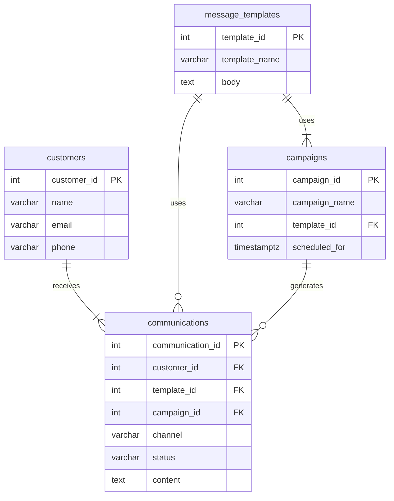
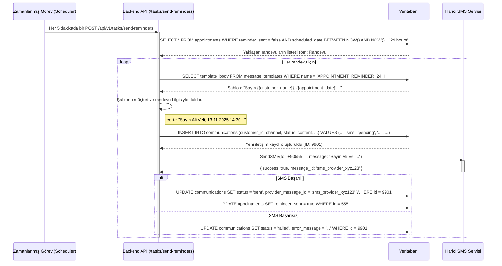

# Communications (İletişim) Modülü Teknik Kılavuzu

**Sürüm:** 1.0.0
**Son Güncelleme:** 12 Kasım 2025

## 🎯 1. Misyon ve Genel Bakış

### 1.1. Modül Kimliği

- **Modül Adı:** Communications (İletişim)
- **Sorumlu Ekip:** Backend Ekibi, Altyapı Ekibi
- **Ana Sorumluluk:** Müşterilerle SMS, e-posta ve anlık sistem bildirimleri üzerinden kurulan tüm iletişimi yönetmek, otomatikleştirmek, kaydetmek ve raporlamak.

### 1.2. Stratejik Rolü

Bu modül, müşteri etkileşiminin son halkasıdır. Servis ve randevu hatırlatmaları gibi operasyonel verimliliği artıran otomasyonları sağlar, pazarlama kampanyaları ile müşteri bağlılığını güçlendirir ve tüm iletişim geçmişini merkezi bir yerde toplayarak yasal uyumluluk ve müşteri hizmetleri kalitesi için sağlam bir temel oluşturur. Manuel iletişimin getirdiği zaman kaybını ve insan hatasını ortadan kaldırır.

### 1.3. Diğer Modüllerle Entegrasyonları

- **Customers:** Her iletişim bir müşteriye yöneliktir. Müşterinin iletişim tercihleri (SMS/e-posta izni) bu modül tarafından kullanılır.
- **Services:** "Servisiniz tamamlandı" veya "Servisiniz yola çıktı" gibi duruma bağlı otomatik bildirimler gönderir.
- **Appointments:** Randevudan 24 saat önce ve 2 saat önce otomatik hatırlatma SMS/e-postaları gönderir.
- **Finance:** "Faturanız oluşturuldu" veya "Son ödeme tarihiniz yaklaşıyor" gibi finansal bildirimler gönderir.

---

## 🗄️ 2. Veritabanı Mimarisi

Modül; `communications` (gönderilen her bir mesajın kaydı), `message_templates` (tekrar kullanılabilir mesaj içerikleri) ve `campaigns` (toplu gönderim görevleri) tabloları üzerine kuruludur.

### 2.1. Tablo Yapıları

#### `public.communications`
Gönderilen veya gönderilmesi planlanan her bir tekil mesajın (SMS, e-posta vb.) kaydını tutar.

```sql
CREATE TABLE public.communications (
    communication_id SERIAL PRIMARY KEY,
    customer_id INT NOT NULL REFERENCES public.customers(customer_id),
    channel VARCHAR(20) NOT NULL CHECK (channel IN ('sms', 'email', 'push_notification')), -- İletişim kanalı
    status VARCHAR(20) NOT NULL DEFAULT 'pending' CHECK (status IN ('pending', 'sent', 'failed', 'delivered', 'read')),
    recipient VARCHAR(255) NOT NULL, -- a@b.com veya +90555...
    subject VARCHAR(255), -- E-posta başlığı
    content TEXT NOT NULL, -- Mesaj içeriği
    template_id INT REFERENCES public.message_templates(template_id),
    campaign_id INT REFERENCES public.campaigns(campaign_id),
    provider_message_id VARCHAR(255), -- SMS/E-posta sağlayıcısından dönen ID
    error_message TEXT, -- Gönderim hatası detayı
    scheduled_for TIMESTAMPTZ, -- Planlanan gönderim zamanı
    sent_at TIMESTAMPTZ, -- Gerçekleşen gönderim zamanı
    created_at TIMESTAMPTZ DEFAULT CURRENT_TIMESTAMP
);
```

#### `public.message_templates`
Sistemde tekrar tekrar kullanılan mesaj içeriklerini (örn: randevu hatırlatma) dinamik değişkenlerle birlikte saklar.

```sql
CREATE TABLE public.message_templates (
    template_id SERIAL PRIMARY KEY,
    template_name VARCHAR(100) UNIQUE NOT NULL, -- Örn: 'APPOINTMENT_REMINDER_24H'
    channel VARCHAR(20) NOT NULL,
    subject VARCHAR(255),
    body TEXT NOT NULL, -- "Sayın {{customer_name}}, {{appointment_date}} tarihindeki randevunuzu hatırlatırız."
    variables JSONB, -- ["customer_name", "appointment_date"]
    is_active BOOLEAN DEFAULT TRUE,
    created_at TIMESTAMPTZ DEFAULT CURRENT_TIMESTAMP
);
```

#### `public.campaigns`
Toplu SMS veya e-posta gönderim kampanyalarını tanımlar.

```sql
CREATE TABLE public.campaigns (
    campaign_id SERIAL PRIMARY KEY,
    campaign_name VARCHAR(255) NOT NULL,
    template_id INT NOT NULL REFERENCES public.message_templates(template_id),
    target_audience_query TEXT, -- "SELECT customer_id FROM customers WHERE city = 'Ankara'"
    status VARCHAR(20) NOT NULL DEFAULT 'draft' CHECK (status IN ('draft', 'scheduled', 'in_progress', 'completed', 'cancelled')),
    scheduled_for TIMESTAMPTZ NOT NULL,
    completed_at TIMESTAMPTZ,
    total_recipients INT,
    sent_count INT,
    failed_count INT,
    created_by_id INT REFERENCES public.users(user_id),
    created_at TIMESTAMPTZ DEFAULT CURRENT_TIMESTAMP
);
```

### 2.2. Indexler

```sql
-- Müşterinin iletişim geçmişini hızla sorgulamak için.
CREATE INDEX idx_communications_customer_id ON public.communications (customer_id);

-- Gönderim durumuna göre (örn: 'failed') mesajları hızla bulmak için.
CREATE INDEX idx_communications_status ON public.communications (status);

-- Planlanmış gönderimleri (cron job için) hızla çekmek için.
CREATE INDEX idx_communications_scheduled_for ON public.communications (scheduled_for) WHERE status = 'pending';

-- Kampanya bazlı gönderim istatistikleri için.
CREATE INDEX idx_communications_campaign_id ON public.communications (campaign_id);
```

### 2.3. İlişki Diyagramı (ERD - Mermaid)



---

## 🧬 3. Veri Akış Şeması

### Senaryo: Otomatik Randevu Hatırlatma SMS'i Gönderme

Bu şema, bir cron job'un yaklaşan randevuları kontrol edip ilgili müşterilere nasıl hatırlatma SMS'i gönderdiğini gösterir.



---

## ⚙️ 4. Backend API Endpoint'leri (Detaylı)

**Base URL:** `/api/v1/communications`

### 4.1. Manuel Tekil Mesaj Gönder

- **METHOD:** `POST`
- **URL:** `/send`
- **Handler Function:** `sendSingleMessage` - `/backend/controllers/commController.js:50`
- **Açıklama:** Belirli bir müşteriye anlık olarak SMS veya e-posta gönderir.

#### Request Detayları
- **Request Body:**
  ```json
  {
    "customer_id": "integer - Alıcı müşteri ID'si - Zorunlu",
    "channel": "string - 'sms' veya 'email' - Zorunlu",
    "content": "string - Gönderilecek mesaj metni - Zorunlu",
    "subject": "string - Kanal 'email' ise zorunlu"
  }
  ```

#### Test CURL Komutları
```bash
# Başarılı SMS Gönderme
curl -X POST 'http://localhost:3000/api/v1/communications/send' \
  -H 'Authorization: Bearer [TOKEN]' \
  -H 'Content-Type: application/json' \
  -d '{
    "customer_id": 12,
    "channel": "sms",
    "content": "Sayın müşterimiz, aracınız servise alınmıştır."
  }'
```

### 4.2. Müşterinin İletişim Geçmişini Listele

- **METHOD:** `GET`
- **URL:** `/customer/:customerId`
- **Handler Function:** `getCustomerCommunications` - `/backend/controllers/commController.js:120`
- **Açıklama:** Belirli bir müşteriye gönderilmiş tüm iletişim kayıtlarını listeler.

#### Request Detayları
- **URL Parameters:** `{ "customerId": "integer - Müşteri ID'si" }`
- **Query Parameters:** `{ "channel": "sms", "page": 1, "limit": 20 }`

#### Gerçek SQL Sorgusu
```sql
SELECT
    communication_id,
    channel,
    status,
    content,
    sent_at
FROM public.communications
WHERE
    customer_id = $1
    AND ($2::text IS NULL OR channel = $2::text)
ORDER BY sent_at DESC
LIMIT $3 OFFSET $4;
```

---

## 🖥️ 5. Frontend Mimarisi (Kod Seviyesinde)

- **Dosya:** `/frontend/js/customer-communications.js`
- **URL:** `/customers/detail.html` (İletişim sekmesi)

#### HTML Yapısı (Anahtar Elementler)
```html
<!-- /frontend/pages/customers/detail.html -->
<div id="comm-history-tab">
  <h4>İletişim Geçmişi</h4>
  <form id="send-message-form"> <!-- Satır: 50 -->
    <textarea id="message-content" placeholder="Yeni mesaj yazın..."></textarea>
    <select id="message-channel"> <!-- Satır: 52 -->
      <option value="sms">SMS</option>
      <option value="email">E-posta</option>
    </select>
    <button type="submit">Gönder</button>
  </form>
  <table id="comm-history-table"> <!-- Satır: 60 -->
    <!-- Geçmiş iletişim kayıtları -->
  </table>
</div>
```

#### JavaScript Fonksiyonları (Detaylı)
```javascript
// /frontend/js/customer-communications.js

// FUNCTION: loadCommHistory(customerId) - Satır: 15-40
// AMAÇ: Müşterinin iletişim geçmişini API'den çeker.
async function loadCommHistory(customerId) {
    const response = await fetch(`/api/v1/communications/customer/${customerId}`);
    const result = await response.json();
    if (result.success) {
        renderCommHistory(result.data); // Tabloyu doldur
    }
}

// FUNCTION: handleSendMessage(event) - Satır: 80-110
// AMAÇ: Yeni mesaj gönderme formunu yönetir.
async function handleSendMessage(event) {
    event.preventDefault();
    const customerId = document.getElementById('customer-id-hidden').value;
    const content = document.getElementById('message-content').value;
    const channel = document.getElementById('message-channel').value;

    const response = await fetch('/api/v1/communications/send', {
        method: 'POST',
        headers: { 'Content-Type': 'application/json', 'Authorization': `Bearer ${getToken()}` },
        body: JSON.stringify({ customer_id: customerId, channel, content })
    });

    if (response.ok) {
        showSuccess("Mesaj gönderim sırasına alındı!");
        loadCommHistory(customerId); // Geçmişi yenile
    } else {
        showError("Mesaj gönderilemedi.");
    }
}
```

#### Event Listener'lar
```javascript
// Sayfa yüklendiğinde müşteri ID'si ile geçmişi yükle
document.addEventListener('DOMContentLoaded', () => { // Satır: 5
    const customerId = new URLSearchParams(window.location.search).get('id');
    if (customerId) {
        loadCommHistory(customerId);
    }
});

// Form gönderimini dinle
document.getElementById('send-message-form').addEventListener('submit', handleSendMessage); // Satır: 12
```

---

## 🔎 6. Gerçek Kullanım Senaryoları (E2E)

### Senaryo 1: Manuel SMS Gönderme
1. **Kullanıcı:** "Müşteriler" listesinden "Ayşe Yılmaz"ı seçer.
2. **Frontend:** `/customers/detail.html?id=42` sayfasına yönlenir.
3. **Frontend:** `loadCommHistory(42)` fonksiyonunu çağırır.
4. **Backend:** `GET /api/v1/communications/customer/42` isteği alınır.
5. **Database:** `SELECT * FROM communications WHERE customer_id = 42` sorgusu çalışır.
6. **Backend:** Sonuçları JSON olarak frontend'e döner.
7. **Frontend:** Gelen verilerle iletişim geçmişi tablosu doldurulur.
8. **Kullanıcı:** "Yeni mesaj" alanına "Kombinizin montajı tamamlanmıştır." yazar.
9. **Kullanıcı:** Kanal olarak "SMS" seçili olduğundan emin olur ve "Gönder" butonuna tıklar.
10. **Frontend:** `handleSendMessage` fonksiyonu tetiklenir.
11. **Frontend:** `POST /api/v1/communications/send` isteği atar. Payload: `{ "customer_id": 42, "channel": "sms", "content": "..." }`.
12. **Backend:** `sendSingleMessage` controller'ı çalışır.
13. **Backend:** `communications` tablosuna `status: 'pending'` olarak yeni bir kayıt ekler.
14. **Backend:** Harici SMS servisine (örn: Twilio) isteği gönderir.
15. **Backend:** SMS servisinden başarılı yanıt alınca `communications` kaydını `status: 'sent'` olarak günceller.
16. **Frontend:** `200 OK` yanıtı alır, "Mesaj gönderildi" bildirimi gösterir.
17. **Frontend:** `loadCommHistory(42)` fonksiyonunu tekrar çağırarak tabloyu günceller ve yeni gönderilen mesaj en üstte görünür.

---

## 🚨 7. Sorun Giderme (Troubleshooting)

### Hata 1: SMS Gönderilemedi (Durum: 'failed')
- **Semptom:** Gönderilen SMS, iletişim geçmişinde "Başarısız" olarak görünüyor.
- **Debug Adımları:**
  1. `communications` tablosunda ilgili kaydın `error_message` alanını kontrol et.
     ```sql
     SELECT error_message FROM communications WHERE communication_id = [ID];
     ```
  2. Hata mesajı "Invalid phone number" ise, `customers` tablosundaki telefon numarasının formatını kontrol et.
  3. Hata mesajı "Insufficient funds" ise, SMS sağlayıcı (Twilio, Vonage vb.) hesabının bakiyesini kontrol et.
- **Çözüm:** Hata nedenine göre müşteri numarasını düzelt veya SMS sağlayıcı hesabına bakiye yükle.

### Hata 2: E-posta 'Spam' Klasörüne Düşüyor
- **Semptom:** Müşteriler e-postaları almadıklarını, spam'e düştüğünü bildiriyor.
- **Neden:** Alan adınız için SPF, DKIM veya DMARC kayıtları eksik veya yanlış yapılandırılmış olabilir. E-posta içeriği spam filtrelerine takılıyor olabilir.
- **Çözüm:** DNS ayarlarını kontrol et. E-posta şablonlarındaki kelimeleri ve linkleri gözden geçir.

### Hata 3: Randevu Hatırlatmaları Gönderilmiyor
- **Semptom:** Müşteriler randevu hatırlatmalarını almadıklarını söylüyor.
- **Debug Adımları:**
  1. Sunucudaki cron job'un (`/tasks/send-reminders`) düzenli çalışıp çalışmadığını kontrol et. Cron loglarına bak.
  2. `appointments` tablosunda `reminder_sent` kolonunun `false` olduğundan ve `scheduled_date`'in doğru olduğundan emin ol.
- **Çözüm:** Cron job'u düzelt veya manuel olarak tetikle.

### Hata 4: Mesaj Şablonu Değişkenleri Çalışmıyor
- **Semptom:** Müşteriye giden mesajda "Sayın {{customer_name}}" gibi ifadeler görünüyor.
- **Neden:** Mesajı gönderen backend servisi, şablondaki değişkenleri doğru veriyle değiştiremiyor.
- **Çözüm:** İlgili servisin (örn: `AppointmentReminderService`) şablonu doldurma mantığını (`template.body.replace('{{customer_name}}', customer.name)`) kontrol et. Değişken isimlerinin şablondaki (`variables` JSON alanı) ile kodda aynı olduğundan emin ol.

### Hata 5: Toplu Kampanya Gönderimi Takılıyor
- **Semptom:** Oluşturulan kampanya `status: 'in_progress'` durumunda kalıyor ve ilerlemiyor.
- **Neden:** Kampanyayı işleyen arkaplan görevi (background worker) bir hatayla karşılaşmış veya çökmüş olabilir. Veritabanı sorgusu (`target_audience_query`) çok yavaş çalışıyor olabilir.
- **Çözüm:** Arkaplan görevinin loglarını incele. `EXPLAIN ANALYZE` ile kampanya sorgusunun performansını analiz et ve gerekirse optimize et.

---

## 🛡️ 8. Güvenlik Notları

### 8.1. Giriş Doğrulama ve Sanitization
- **Risk:** `content` veya `subject` alanlarına girilen veriler, eğer başka arayüzlerde gösteriliyorsa, XSS saldırılarına açık olabilir.
- **Önlem:** Mesaj içeriği veritabanına kaydedilmeden önce veya harici servise gönderilmeden önce HTML ve script etiketlerinden arındırılmalıdır (sanitization).

### 8.2. Hız Sınırlama (Rate Limiting)
- **Risk:** `POST /send` endpoint'i, kötü niyetli bir kullanıcı tarafından tekrar tekrar çağrılarak SMS/e-posta sağlayıcılarında yüksek maliyetlere ve sistemin spam olarak işaretlenmesine neden olabilir.
- **Önlem:** Bu endpoint'e kullanıcı veya IP bazlı katı bir hız sınırlama (örn: dakikada 5 istek) uygulanmalıdır.

### 8.3. Yetkilendirme
- **Risk:** Yetkisiz bir kullanıcının tüm müşterilere kampanya başlatması veya başka bir müşteri adına mesaj göndermesi.
- **Önlem:** Kampanya oluşturma (`POST /campaigns`) ve manuel mesaj gönderme (`POST /send`) endpoint'leri, sadece `admin` veya `marketing_manager` gibi belirli rollere sahip kullanıcılar tarafından erişilebilir olmalıdır.

### 8.4. Kişisel Verilerin Korunması (PII)
- **Risk:** İletişim geçmişini listeleyen API'lerin, gereğinden fazla kişisel veri (adres, T.C. kimlik no vb.) sızdırması.
- **Önlem:** API response'ları sadece gerekli verileri içermelidir. Telefon numarası ve e-posta gibi hassas veriler, loglarda veya hata mesajlarında maskelenmelidir.

---

## 🧪 9. Test Senaryoları

### 9.1. Veritabanı Testi (Template Fonksiyonu)
- **Amaç:** Mesaj şablonu motorunun değişkenleri doğru doldurduğunu test etmek.
- **Senaryo:**
  1. `message_templates` tablosuna bir test şablonu ekle: `body: 'Merhaba {{name}}!'`, `variables: '["name"]'`.
  2. Bir fonksiyon ile bu şablonu ve `{ name: 'Ahmet' }` verisini al.
  3. Fonksiyonun çıktısının `'Merhaba Ahmet!'` olduğunu doğrula.

### 9.2. Integration Testi (SMS Servisi Mocking)
```javascript
// /backend/test/integration/comm.api.test.js
const smsService = require('../../src/services/smsService');

// Harici SMS servisini mock'la
jest.mock('../../src/services/smsService');

it('should call the SMS service and update status to "sent" on success', async () => {
    // Mock'un başarılı bir yanıt dönmesini sağla
    smsService.send.mockResolvedValue({ success: true, message_id: 'mock_sms_id' });

    // API endpoint'ini çağır
    const response = await request(app)
        .post('/api/v1/communications/send')
        .set('Authorization', `Bearer ${OPERATOR_TOKEN}`)
        .send({ customer_id: 1, channel: 'sms', content: 'Test' });

    // Beklentiler
    expect(response.statusCode).toBe(200);
    expect(smsService.send).toHaveBeenCalledWith(expect.anything(), 'Test'); // Servisin çağrıldığını doğrula
    
    // Veritabanından kaydın durumunu kontrol et
    const comm = await db.query('SELECT status FROM communications WHERE ...');
    expect(comm.rows[0].status).toBe('sent');
});
```

### 9.3. E2E Testi (Hatırlatma E-postası)
```javascript
// /frontend/cypress/e2e/communication.cy.js
describe('Appointment Reminders', () => {
    it('should generate a reminder email when an appointment is created for tomorrow', () => {
        // 1. Test için bir müşteri ve yarın için bir randevu oluştur
        cy.createCustomer({ name: 'E2E Test Müşterisi' });
        cy.createAppointment({ customerId: ..., date: 'tomorrow' });

        // 2. Backend'deki zamanlanmış görevi manuel tetikle (test endpoint'i ile)
        cy.request('POST', '/api/v1/tasks/send-reminders/trigger');

        // 3. İletişim geçmişini kontrol et
        cy.visit('/customers/detail/...');
        cy.get('#comm-history-table').contains('td', 'Randevu Hatırlatma').should('be.visible');
        cy.get('#comm-history-table').contains('td', 'email').should('be.visible');
        cy.get('#comm-history-table').contains('td', 'Sent').should('be.visible');
    });
});
```