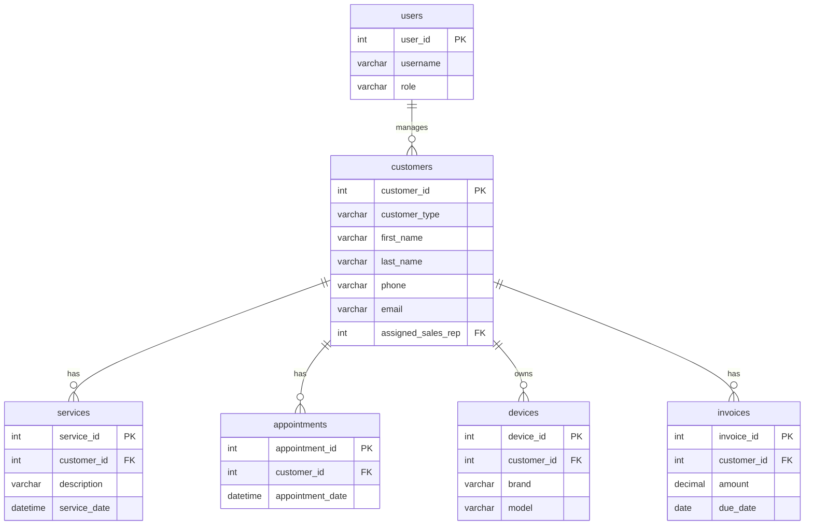
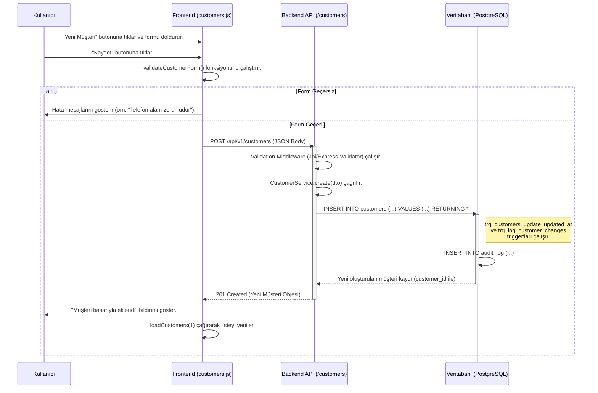

# Müşteriler Modülü Teknik Kılavuzu

**Sürüm:** 2.0.0
**Son Güncelleme:** 12 Kasım 2025

## 🎯 1. Misyon ve Genel Bakış

### 1.1. Modül Kimliği

- **Modül Adı:** Customers (Müşteriler)
- **Sorumlu Ekip:** Backend Ekibi, Frontend Ekibi
- **Ana Sorumluluk:** Müşteri verilerinin (bireysel, kurumsal), iletişim bilgilerinin, adreslerinin, cihazlarının, servis geçmişinin ve finansal özetlerinin merkezi olarak yönetilmesi.

### 1.2. Stratejik Rolü

Bu modül, Akın Kombi servis yönetim sisteminin CRM (Müşteri İlişkileri Yönetimi) çekirdeğidir. Tüm servis, randevu ve finansal işlemlerin temelini oluşturan müşteri verilerini yönetir. Müşteri bilgilerinin dağınık olmasını engelleyerek, servis süreçlerinin kişiselleştirilmesini ve müşteri memnuniyetinin artırılmasını sağlar.

### 1.3. Diğer Modüllerle Entegrasyonları

- **Services:** Müşteriye ait servis kayıtları.
- **Appointments:** Müşteriye oluşturulan randevular.
- **Finance:** Müşteriye ait faturalar ve ödemeler.
- **Communications:** Müşteri ile yapılan tüm iletişim (SMS, e-posta vb.).
- **Users:** Müşteri kayıtlarını yöneten veya müşteriye atanan kullanıcılar (örn: satış temsilcisi).

---

## 🗄️ 2. Veritabanı Mimarisi

Bu bölümde `public.customers` tablosunun yapısı, optimizasyonları ve otomasyonları detaylandırılmıştır.

### 2.1. Tablo Yapısı (`public.customers`)

```sql
CREATE TABLE public.customers (
    customer_id SERIAL PRIMARY KEY,
    customer_type VARCHAR(20) NOT NULL CHECK (customer_type IN ('individual', 'corporate')),
    first_name VARCHAR(100),
    last_name VARCHAR(100),
    company_name VARCHAR(200),
    tax_number VARCHAR(50),
    tax_office VARCHAR(100),
    phone VARCHAR(20) NOT NULL,
    email VARCHAR(100) UNIQUE,
    address TEXT,
    city VARCHAR(100),
    district VARCHAR(100),
    postal_code VARCHAR(10),
    customer_segment VARCHAR(50),
    notes TEXT,
    status VARCHAR(20) DEFAULT 'active' CHECK (status IN ('active', 'inactive')),
    assigned_sales_rep INTEGER REFERENCES public.users(user_id),
    created_at TIMESTAMPTZ DEFAULT CURRENT_TIMESTAMP,
    updated_at TIMESTAMPTZ DEFAULT CURRENT_TIMESTAMP,
    deleted_at TIMESTAMPTZ
);

-- Not: Orijinal tablodaki bazı sütunlar (örn: loyalty_points, total_spent) basitleştirme amacıyla çıkarılmıştır.
-- TIMESTAMPTZ kullanımı, zaman dilimi yönetimini kolaylaştırır.
```

### 2.2. Indexler (Performans Optimizasyonu)

Indexler, `SELECT` sorgularının performansını dramatik şekilde artıran veritabanı nesneleridir.

```sql
-- Sıkça yapılan aramalarda tam ad eşleşmesi ve sıralama için kullanılır.
CREATE INDEX idx_customers_full_name ON public.customers (last_name, first_name);

-- Telefon numarasına göre müşteri aramalarını hızlandırır.
CREATE INDEX idx_customers_phone ON public.customers (phone);

-- E-posta zaten UNIQUE constraint'e sahip olduğu için otomatik olarak indexlenir,
-- ancak belirtmekte fayda var.
-- CREATE UNIQUE INDEX idx_customers_email ON public.customers (email);

-- Şehir ve ilçe bazlı müşteri raporları veya filtrelemeler için kullanılır.
CREATE INDEX idx_customers_location ON public.customers (city, district);

-- Müşteri segmentasyonuna dayalı analiz ve pazarlama sorgularını hızlandırır.
CREATE INDEX idx_customers_segment ON public.customers (customer_segment);

-- Atanmış satış temsilcisine göre müşterileri listelemek için kullanılır.
CREATE INDEX idx_customers_sales_rep ON public.customers (assigned_sales_rep);

-- Soft-delete edilen kayıtların sorgulardan verimli bir şekilde dışlanmasını sağlar.
CREATE INDEX idx_customers_deleted_at ON public.customers (deleted_at);
```

### 2.3. Trigger'lar (Veri Bütünlüğü ve Otomasyon)

Trigger'lar, tablo üzerinde belirli bir olay (INSERT, UPDATE, DELETE) gerçekleştiğinde otomatik olarak çalışan fonksiyonlardır.

#### 1. `updated_at` Zaman Damgasını Otomatik Güncelleme

Bu trigger, bir müşteri kaydı her güncellendiğinde `updated_at` alanını otomatik olarak mevcut zamanla doldurur.

```sql
-- 1. Trigger Fonksiyonunu Oluşturma
CREATE OR REPLACE FUNCTION fn_update_updated_at()
RETURNS TRIGGER AS $$
BEGIN
    NEW.updated_at = NOW();
    RETURN NEW;
END;
$$ LANGUAGE plpgsql;

-- 2. Trigger'ı Tabloya Bağlama
CREATE TRIGGER trg_customers_update_updated_at
BEFORE UPDATE ON public.customers
FOR EACH ROW
EXECUTE FUNCTION fn_update_updated_at();
```

#### 2. Müşteri Değişikliklerini Loglama (Audit Trail)

Bu trigger, `customers` tablosundaki her değişikliği (yeni kayıt, güncelleme, silme) `audit_log` adlı bir denetim tablosuna kaydeder. Bu, "kim, neyi, ne zaman değiştirdi?" sorusuna yanıt verir.

```sql
-- 1. Denetim Tablosunu Oluşturma
CREATE TABLE public.audit_log (
    log_id SERIAL PRIMARY KEY,
    table_name VARCHAR(100) NOT NULL,
    record_id VARCHAR(255),
    operation_type VARCHAR(10) NOT NULL, -- INSERT, UPDATE, DELETE
    changed_by INTEGER REFERENCES public.users(user_id),
    changed_at TIMESTAMPTZ DEFAULT CURRENT_TIMESTAMP,
    old_data JSONB,
    new_data JSONB
);

-- 2. Genel Trigger Fonksiyonunu Oluşturma
CREATE OR REPLACE FUNCTION fn_log_changes()
RETURNS TRIGGER AS $$
DECLARE
    v_old_data JSONB;
    v_new_data JSONB;
BEGIN
    IF (TG_OP = 'UPDATE') THEN
        v_old_data := to_jsonb(OLD);
        v_new_data := to_jsonb(NEW);
        INSERT INTO public.audit_log (table_name, record_id, operation_type, changed_by, old_data, new_data)
        VALUES (TG_TABLE_NAME, OLD.customer_id, TG_OP, NEW.assigned_sales_rep, v_old_data, v_new_data);
        RETURN NEW;
    ELSIF (TG_OP = 'DELETE') THEN
        v_old_data := to_jsonb(OLD);
        INSERT INTO public.audit_log (table_name, record_id, operation_type, changed_by, old_data)
        VALUES (TG_TABLE_NAME, OLD.customer_id, TG_OP, OLD.assigned_sales_rep, v_old_data);
        RETURN OLD;
    ELSIF (TG_OP = 'INSERT') THEN
        v_new_data := to_jsonb(NEW);
        INSERT INTO public.audit_log (table_name, record_id, operation_type, changed_by, new_data)
        VALUES (TG_TABLE_NAME, NEW.customer_id, TG_OP, NEW.assigned_sales_rep, v_new_data);
        RETURN NEW;
    END IF;
    RETURN NULL;
END;
$$ LANGUAGE plpgsql;

-- 3. Trigger'ı Customers Tablosuna Bağlama
CREATE TRIGGER trg_log_customer_changes
AFTER INSERT OR UPDATE OR DELETE ON public.customers
FOR EACH ROW
EXECUTE FUNCTION fn_log_changes();
```

### 2.4. İlişki Diyagramı (ERD - Mermaid)

Bu diyagram, `customers` tablosunun sistemdeki diğer ana tablolarla olan ilişkisini görselleştirir.



---

## 🧬 3. Veri Akış Şemaları

### 3.1. Yeni Müşteri Ekleme Süreci (Detaylı)



---

## ⚙️ 4. Backend API Endpoint'leri (Detaylı)

**Base URL:** `/api/v1/customers`

---

### 4.1. Müşterileri Listele ve Ara

- **METHOD:** `GET`
- **URL:** `/`
- **Dosya:** `/backend/routes/customers.js:12`
- **Handler Function:** `getAllCustomers` - `/backend/controllers/customerController.js:25`
- **Açıklama:** Müşterileri arama, filtreleme ve sayfalama özellikleriyle listeler.

#### Request Detayları

- **Query Parameters:**
  ```javascript
  {
    "search": "string - Ad, soyad, telefon veya e-postada arama yapar.",
    "city": "string - Belirli bir şehre göre filtreler.",
    "status": "string - 'active' veya 'inactive' durumuna göre filtreler.",
    "page": "integer - Sayfa numarası (default: 1)",
    "limit": "integer - Sayfa başına kayıt sayısı (default: 10)"
  }
  ```

#### Backend İşlem Akışı
```javascript
// /backend/controllers/customerController.js:25-60
async function getAllCustomers(req, res) {
    try {
        // 1. QUERY PARAMS AL (satır: 27)
        const filters = req.query; // { search, city, status, page, limit }

        // 2. BUSINESS LOGIC (satır: 30)
        // Service katmanına filtreleri gönder
        const result = await CustomerService.findAll(filters);

        // 3. RESPONSE (satır: 35)
        res.status(200).json({
            success: true,
            data: result.customers,
            pagination: result.pagination
        });
    } catch (error) {
        res.status(500).json({ success: false, error: 'Server Error' });
    }
}
```

#### Gerçek SQL Sorgusu (`CustomerService.findAll`)
```sql
-- /backend/services/customerService.js:40
-- Dinamik olarak oluşturulan sorgu örneği:
SELECT
    customer_id,
    first_name,
    last_name,
    phone,
    email,
    city,
    status
FROM public.customers
WHERE
    deleted_at IS NULL
    AND status = $1 -- 'active'
    AND (
        first_name ILIKE $2 OR
        last_name ILIKE $2 OR
        phone ILIKE $2 OR
        email ILIKE $2
    )
ORDER BY last_name, first_name
LIMIT $3 OFFSET $4;

-- Parametreler: ['active', '%ahmet%', 10, 0]
```

#### Response Formatları

- **Success Response (200):**
  ```javascript
  {
    "success": true,
    "data": [
      {
        "customer_id": 15,
        "first_name": "Ahmet",
        "last_name": "Yılmaz",
        "phone": "5551234567",
        "email": "ahmet.yilmaz@example.com",
        "city": "İstanbul",
        "status": "active"
      }
    ],
    "pagination": {
      "totalRecords": 1,
      "totalPages": 1,
      "currentPage": 1,
      "limit": 10
    }
  }
  ```

#### Test CURL Komutları

```bash
# Arama ve sayfalama ile listeleme
curl -X GET 'http://localhost:3000/api/v1/customers?search=ahmet&page=1&limit=10' \
  -H 'Authorization: Bearer [TOKEN]'

# Sadece aktif olanları ve İstanbul'dakileri listeleme
curl -X GET 'http://localhost:3000/api/v1/customers?status=active&city=İstanbul' \
  -H 'Authorization: Bearer [TOKEN]'
```

---

### 4.2. Yeni Müşteri Oluştur

- **METHOD:** `POST`
- **URL:** `/`
- **Dosya:** `/backend/routes/customers.js:18`
- **Handler Function:** `createCustomer` - `/backend/controllers/customerController.js:80`
- **Açıklama:** Yeni bir müşteri kaydı oluşturur.

#### Request Detayları

- **Request Body:**
  ```javascript
  {
    "customer_type": "'individual' veya 'corporate' - Zorunlu",
    "first_name": "string - Bireysel ise zorunlu",
    "last_name": "string - Bireysel ise zorunlu",
    "company_name": "string - Kurumsal ise zorunlu",
    "phone": "string - Zorunlu",
    "email": "string (email format) - Opsiyonel, ama unique olmalı",
    "address": "string - Opsiyonel"
  }
  ```

#### Backend İşlem Akışı
```javascript
// /backend/controllers/customerController.js:80-110
async function createCustomer(req, res) {
    try {
        // 1. VALIDATION (Middleware tarafından yapıldı)
        const customerData = req.body;

        // 2. BUSINESS LOGIC (satır: 85)
        // E-posta veya telefonun daha önce kullanılıp kullanılmadığını kontrol et
        const existing = await CustomerService.findByEmailOrPhone(customerData.email, customerData.phone);
        if (existing) {
            return res.status(409).json({
                success: false,
                error: { code: 'DUPLICATE_CUSTOMER', message: 'Bu e-posta veya telefon zaten kayıtlı.' }
            });
        }

        // 3. DATABASE QUERY (satır: 95)
        const newCustomer = await CustomerService.create(customerData);

        // 4. RESPONSE (satır: 100)
        res.status(201).json({ success: true, data: newCustomer });

    } catch (error) {
        res.status(500).json({ success: false, error: 'Server Error' });
    }
}
```

#### Test CURL Komutları

```bash
# Başarılı Senaryo
curl -X POST 'http://localhost:3000/api/v1/customers' \
  -H 'Authorization: Bearer [TOKEN]' \
  -H 'Content-Type: application/json' \
  -d '{
    "customer_type": "individual",
    "first_name": "Zeynep",
    "last_name": "Demir",
    "phone": "5559876543",
    "email": "zeynep.demir@example.com",
    "address": "Yeni Mah. No:5 D:3, Ankara"
  }'

# Hata Senaryosu (Validasyon)
curl -X POST 'http://localhost:3000/api/v1/customers' \
  -H 'Authorization: Bearer [TOKEN]' \
  -H 'Content-Type: application/json' \
  -d '{ "first_name": "Zeynep" }'
# Response: 400 Bad Request
```

---

## 🖥️ 5. Frontend Mimarisi (Kod Seviyesinde)

- **Dosya:** `/frontend/js/customers.js`
- **URL:** `/customers.html`

#### HTML Yapısı (Anahtar Elementler)
```html
<!-- /frontend/pages/customers.html -->
<input type="text" id="search-input" placeholder="Müşteri ara..."> <!-- Satır: 20 -->
<table id="customers-table">...</table> <!-- Satır: 45 -->
<div id="pagination-controls">...</div> <!-- Satır: 150 -->
<button id="btn-new-customer">Yeni Müşteri</button> <!-- Satır: 18 -->

<!-- Modal: Yeni/Düzenle -->
<div id="customer-modal" class="modal">
  <form id="customer-form">
    <input type="text" id="first-name" required>
    <input type="text" id="last-name" required>
    <input type="tel" id="phone" required>
    <button type="submit">Kaydet</button>
  </form>
</div>
```

#### JavaScript Fonksiyonları (Detaylı)

```javascript
// /frontend/js/customers.js

let currentPage = 1;
let currentSearch = '';

// FUNCTION: loadCustomers(page, search) - Satır: 30-65
// AMAÇ: Müşterileri API'den çeker ve tabloyu günceller.
async function loadCustomers(page = 1, search = '') {
    currentPage = page;
    currentSearch = search;
    
    const query = new URLSearchParams({ page, search, limit: 10 }).toString();
    
    try {
        showLoading();
        const response = await fetch(`/api/v1/customers?${query}`);
        const result = await response.json();
        
        if (result.success) {
            renderTable(result.data); // Tabloyu DOM'a çizer
            renderPagination(result.pagination); // Sayfalama kontrollerini çizer
        }
    } catch (error) {
        showError("Müşteriler yüklenemedi.");
    } finally {
        hideLoading();
    }
}

// FUNCTION: handleFormSubmit(event) - Satır: 180-210
// AMAÇ: Yeni müşteri formunu backend'e gönderir.
async function handleFormSubmit(event) {
    event.preventDefault();
    const formData = new FormData(event.target);
    const customerData = Object.fromEntries(formData.entries());

    // Basit frontend validasyonu
    if (!customerData.phone) {
        showError("Telefon alanı zorunludur.");
        return;
    }

    const response = await fetch('/api/v1/customers', {
        method: 'POST',
        headers: { 'Content-Type': 'application/json', 'Authorization': `Bearer ${getToken()}` },
        body: JSON.stringify(customerData)
    });

    if (response.ok) {
        closeModal();
        loadCustomers(1, ''); // Listeyi yenile
        showSuccess("Müşteri kaydedildi!");
    } else {
        const errorResult = await response.json();
        showError(errorResult.error.message);
    }
}
```

#### Event Listener'lar
```javascript
// /frontend/js/app.js: 60
document.addEventListener('DOMContentLoaded', () => {
    loadCustomers(1, ''); // İlk müşteri listesi yüklemesi
});

// /frontend/js/customers.js: 250
document.getElementById('customer-form').addEventListener('submit', handleFormSubmit);

// Arama için debounce tekniği
let searchTimeout;
document.getElementById('search-input').addEventListener('input', (e) => {
    clearTimeout(searchTimeout);
    searchTimeout = setTimeout(() => {
        loadCustomers(1, e.target.value);
    }, 300); // Kullanıcı yazmayı bıraktıktan 300ms sonra ara
});

// Sayfalama butonları için event delegation
document.getElementById('pagination-controls').addEventListener('click', (e) => {
    if (e.target.tagName === 'BUTTON' && e.target.dataset.page) {
        loadCustomers(parseInt(e.target.dataset.page), currentSearch);
    }
});
```

---

## 🔎 6. GERÇEK KULLANIM SENARYOSU (E2E)

### Senaryo: Yeni Bireysel Müşteri Ekleme

**Amaç:** Sisteme yeni bir bireysel müşteri kaydı eklemek ve bu değişikliğin denetim günlüğüne (audit log) kaydedilmesi.
**Ön Koşullar:** Kullanıcı giriş yapmış, "Müşteri Yönetimi" yetkisi var.

| Adım | Aksiyon | Sistem Tepkisi (Kod ve Açıklama) |
|---|---|---|
| 1 | **Kullanıcı:** "Yeni Müşteri" butonuna tıklar. | `openCreateModal()` fonksiyonu çağrılır, müşteri formu modal içinde açılır. |
| 2 | **Kullanıcı:** Formu doldurur (Ad: "Ayşe", Soyad: "Kaya", Tel: "5551112233") ve "Kaydet"e basar. | `customer-form` üzerinde `submit` event'i tetiklenir. `handleFormSubmit()` çalışır. |
| 3 | **Frontend:** Form verileri toplanır ve `POST /api/v1/customers` isteği gönderilir. | `fetch` API'si ile istek atılır. `body` içinde müşteri bilgileri JSON olarak yer alır. |
| 4 | **Request Payload:** | ```json { "customer_type": "individual", "first_name": "Ayşe", "last_name": "Kaya", "phone": "5551112233" } ``` |
| 5 | **Backend:** `createCustomer` controller fonksiyonu tetiklenir. | `CustomerService.findByEmailOrPhone()` ile "5551112233" numarasının daha önce kayıtlı olup olmadığı kontrol edilir. |
| 6 | **Backend:** Müşteri daha önce kayıtlı değil. | `CustomerService.create()` fonksiyonu çağrılır. |
| 7 | **Database:** `INSERT INTO customers` sorgusu çalışır. | `INSERT INTO public.customers (customer_type, first_name, last_name, phone) VALUES ('individual', 'Ayşe', 'Kaya', '5551112233') RETURNING *;` |
| 8 | **Database:** `trg_log_customer_changes` trigger'ı `AFTER INSERT` ile tetiklenir. | `fn_log_changes()` fonksiyonu çalışır. `TG_OP` değeri `'INSERT'`'dir. |
| 9 | **Database:** `audit_log` tablosuna yeni bir kayıt eklenir. | `INSERT INTO public.audit_log (table_name, record_id, operation_type, new_data) VALUES ('customers', [yeni_customer_id], 'INSERT', '{"first_name": "Ayşe", ...}');` |
| 10 | **Database:** `INSERT` işlemi tamamlanır ve yeni müşteri verisi `RETURNING *` ile Backend'e döner. | `customer_id` artık bellidir (örn: 42). |
| 11 | **Backend:** Başarılı response döner. | `res.status(201).json({ success: true, data: { customer_id: 42, ... } })` |
| 12 | **Frontend:** `response.ok` true döner. | `closeModal()` ve `showSuccess()` çağrılır. |
| 13 | **Frontend:** Müşteri listesi yenilenir. | `loadCustomers(1, '')` çağrılır. Yeni müşteri "Ayşe Kaya" listenin en başında (veya sıralamaya göre) görünür. |

---

## 🛡️ 7. Güvenlik Notları

Bu bölüm, Müşteriler modülünün güvenlik açıklarını önlemek için alınan önlemleri ve dikkat edilmesi gereken noktaları detaylandırır.

### 7.1. Giriş Doğrulama (Input Validation)

- **Backend:**
    - `createCustomer` endpoint'i için "Validation Middleware (Joi/Express-Validator) çalışır" ifadesi, kapsamlı bir sunucu tarafı doğrulamasının varlığını gösterir. Ayrıca, e-posta veya telefonun daha önce kullanılıp kullanılmadığı kontrolü (`CustomerService.findByEmailOrPhone`) ile iş mantığı düzeyinde bir doğrulama daha mevcuttur.
    - `getAllCustomers` endpoint'i, `search`, `city`, `status`, `page`, `limit` gibi query parametrelerini alır. Bu parametrelerin `CustomerService.findAll` fonksiyonunda dinamik SQL sorgusu oluşturulurken doğru şekilde sanitize edilmesi ve tiplerinin doğrulanması kritik öneme sahiptir. Mevcut örnekte parametreli sorgular kullanılması (`$1`, `$2`) SQL enjeksiyonuna karşı koruma sağlar, ancak filtre anahtarlarının (örn: `city`, `status`) doğrudan sorguya eklenmesi durumunda beyaz liste (whitelisting) kontrolü yapılmalıdır.
- **Frontend:**
    - `handleFormSubmit` fonksiyonunda basit bir frontend validasyonu (`!customerData.phone`) bulunmaktadır. Bu, kullanıcı deneyimi için iyi olsa da, güvenlik için her zaman backend validasyonuna güvenilmelidir.

### 7.2. SQL Enjeksiyonu Koruması

- **Durum:** `CustomerService.findAll` fonksiyonunda gösterilen örnek SQL sorgusu (`WHERE deleted_at IS NULL AND status = $1 AND (...) ILIKE $2`) parametreli sorgu yapısını kullanmaktadır. `INSERT` işlemleri için de benzer şekilde parametreli sorguların kullanıldığı varsayılmaktadır.
- **Önlem:** Parametreli sorgular, kullanıcı girdisinin doğrudan SQL komutlarına karışmasını engelleyerek SQL enjeksiyonu saldırılarına karşı etkili bir koruma sağlar. Bu, veritabanı etkileşimlerinde kritik bir güvenlik uygulamasıdır.

### 7.3. Çapraz Site Komut Dosyası Çalıştırma (XSS - Cross-Site Scripting) Koruması

- **Durum:** Sağlanan kod örneklerinde XSS korumasına yönelik açık bir mekanizma belirtilmemiştir. Müşteri adı, soyadı, şirket adı, adres ve notlar gibi kullanıcı tarafından girilen metin alanları, kötü niyetli script'ler içerebilir.
- **Risk:** Bu tür veriler frontend'de doğrudan DOM'a yazdırıldığında, XSS saldırılarına yol açabilir.
- **Önlem:** Frontend'de, kullanıcı tarafından girilen veya backend'den gelen ve HTML içeriği olarak yorumlanabilecek tüm verilerin (örn: `first_name`, `last_name`, `company_name`, `address`, `notes`) uygun şekilde sanitize edilmesi veya HTML varlıklarına dönüştürülmesi (escaping) gereklidir. Modern frontend framework'leri genellikle bu korumayı varsayılan olarak sağlar, ancak vanilla JavaScript veya özel renderlama durumlarında dikkatli olunmalıdır.

### 7.4. Hız Sınırlama (Rate Limiting)

- **Durum:** API endpoint'leri için hız sınırlama mekanizması belirtilmemiştir.
- **Risk:** `POST /api/v1/customers` gibi endpoint'ler, kötü niyetli kullanıcılar tarafından aşırı sayıda istek gönderilerek (örneğin, sahte müşteri hesapları oluşturmak için) kötüye kullanılabilir veya sunucuya DoS (Denial of Service) saldırıları düzenlenebilir.
- **Önlem:** Tüm kritik API endpoint'lerine (özellikle yeni kaynak oluşturan veya durum değiştiren `POST`, `PUT`, `PATCH`, `DELETE` işlemleri yapanlara) hız sınırlama middleware'i eklenmelidir. Bu, belirli bir IP adresinden veya kullanıcıdan gelen istek sayısını belirli bir zaman diliminde kısıtlar.

### 7.5. Çapraz Site İstek Sahteciliği (CSRF - Cross-Site Request Forgery) Koruması

- **Durum:** `POST /api/v1/customers` gibi durum değiştiren istekler için CSRF korumasına yönelik bir mekanizma belirtilmemiştir.
- **Risk:** Kullanıcıların oturum açtığı bir tarayıcıda, kötü niyetli bir web sitesi aracılığıyla kullanıcının bilgisi dışında istekler gönderilerek müşteri verileri üzerinde istenmeyen değişiklikler yapılabilir.
- **Önlem:** Özellikle durum değiştiren (`POST`, `PUT`, `PATCH`, `DELETE`) endpoint'ler için CSRF token'ları kullanılmalıdır. Bu token'lar, her form gönderimi veya AJAX isteği ile birlikte gönderilir ve backend tarafından doğrulanır.

### 7.6. Yetkilendirme (Authorization)

- **Durum:** E2E senaryosunda "Kullanıcı giriş yapmış, 'Müşteri Yönetimi' yetkisi var" ifadesi, yetkilendirme mekanizmasının varlığını ve işlevselliğini göstermektedir.
- **Önlem:** Tüm hassas API endpoint'leri ve frontend arayüzleri, kullanıcının rolüne ve yetkilerine göre erişimi kısıtlayan sağlam bir yetkilendirme middleware'i ile korunmalıdır. Örneğin, sadece belirli rollere sahip kullanıcılar müşteri oluşturma, düzenleme veya silme yetkisine sahip olmalıdır.

### 7.7. Hassas Veri İşleme

- **Durum:** `customers` tablosu `phone`, `email`, `address`, `tax_number` gibi hassas müşteri bilgilerini içerir. `audit_log` tablosu da `old_data` ve `new_data` alanlarında bu hassas verileri JSONB formatında saklayabilir.
- **Önlem:**
    - **Veri Şifreleme:** Hassas veriler (özellikle `tax_number` gibi çok özel bilgiler) veritabanında şifrelenerek saklanmalıdır (encryption at rest).
    - **Erişim Kontrolleri:** Veritabanı ve uygulama düzeyinde hassas verilere erişim, en az ayrıcalık prensibiyle sıkı bir şekilde kontrol edilmelidir.
    - **Loglama:** `audit_log` gibi denetim kayıtları, hassas verileri doğrudan içermemeli veya bu veriler maskelenmelidir. Eğer hassas veri loglanması gerekiyorsa, bu logların erişimi ve saklanması da aynı güvenlik standartlarına tabi olmalıdır.
    - **Veri Saklama Politikaları:** Hassas verilerin ne kadar süreyle saklanacağı ve ne zaman imha edileceği konusunda net politikalar belirlenmelidir.

---

## 🧪 8. Test Senaryoları

### 7.1. Unit Test (Validation)

**Amaç:** Müşteri verilerini doğrulayan bir yardımcı fonksiyonu test etmek.

```javascript
// /backend/test/utils/customer-validator.test.js

const { validateCustomerData } = require('../../src/utils/customer-validator');

describe('Customer Validator', () => {
    it('should return no errors for valid individual customer data', () => {
        const customer = { customer_type: 'individual', first_name: 'Ali', last_name: 'Veli', phone: '5551234567' };
        const errors = validateCustomerData(customer);
        expect(errors.length).toBe(0);
    });

    it('should return an error if phone is missing', () => {
        const customer = { customer_type: 'individual', first_name: 'Ali', last_name: 'Veli' };
        const errors = validateCustomerData(customer);
        expect(errors).toContain('Telefon alanı zorunludur.');
    });

    it('should return an error for corporate customer without company_name', () => {
        const customer = { customer_type: 'corporate', phone: '5551234567' };
        const errors = validateCustomerData(customer);
        expect(errors).toContain('Kurumsal müşteriler için şirket adı zorunludur.');
    });
});
```

### 7.2. Integration Test (`POST /customers`)

**Amaç:** Yeni müşteri oluşturma endpoint'inin, özellikle daha önce kullanılmış bir telefon numarası ile kayıt oluşturmaya çalışıldığında doğru hata kodunu (409) döndürdüğünü test etmek.

```javascript
// /backend/test/integration/customers.api.test.js
const request = require('supertest');
const app = require('../../src/app');
const db = require('../../src/db');

describe('POST /api/v1/customers', () => {
    beforeAll(async () => {
        // Hazırlık: Test veritabanına bir müşteri ekle
        await db.query("INSERT INTO customers (..., phone) VALUES (..., '5559998877')");
    });

    it('should return 409 Conflict when using a duplicate phone number', async () => {
        const duplicateCustomer = {
            customer_type: 'individual',
            first_name: 'Mehmet',
            last_name: 'Çelik',
            phone: '5559998877' // Daha önce eklenen numara
        };

        const response = await request(app)
            .post('/api/v1/customers')
            .set('Authorization', `Bearer ${ADMIN_TOKEN}`)
            .send(duplicateCustomer);

        expect(response.statusCode).toBe(409);
        expect(response.body.error.code).toBe('DUPLICATE_CUSTOMER');
    });

    it('should create a customer with a unique phone number and return 201', async () => {
        const uniqueCustomer = {
            customer_type: 'individual',
            first_name: 'Fatma',
            last_name: 'Öz',
            phone: '5551112233' // Benzersiz numara
        };

        const response = await request(app)
            .post('/api/v1/customers')
            .set('Authorization', `Bearer ${ADMIN_TOKEN}`)
            .send(uniqueCustomer);

        expect(response.statusCode).toBe(201);
        expect(response.body.data).toHaveProperty('customer_id');
    });
});
```

### 7.3. E2E Testi (Müşteri Arama)

**Amaç:** Kullanıcının arama kutusuna bir isim yazdığında listenin doğru şekilde filtrelendiğini test etmek.

```javascript
// /frontend/cypress/e2e/customers.cy.js
describe('Customer Search', () => {
    it('should filter the customer list when user types in the search box', () => {
        cy.login('operator', 'password');
        cy.visit('/customers');

        // Başlangıçta birden fazla müşteri olduğunu varsayalım
        cy.get('#customers-table tbody tr').should('have.length.greaterThan', 1);

        // Arama kutusuna "Ahmet" yaz
        cy.get('#search-input').type('Ahmet');

        // Arama sonrası listenin güncellenmesini bekle (debounce süresi kadar)
        cy.wait(500); 

        // Sadece "Ahmet" içeren satırların kaldığını doğrula
        cy.get('#customers-table tbody tr').should('have.length', 1);
        cy.get('#customers-table tbody tr').first().contains('td', 'Ahmet Yılmaz');
    });
});
```
---

## 🗺️ 8. Fonksiyon Bağlantı Haritası

Bu bölüm, modül içindeki ana fonksiyonların birbirleriyle olan ilişkisini ve çağrı hiyerarşisini gösterir.

### 8.1. Frontend Çağrı Grafiği (Call Graph)

```
KULLANICI ETKİLEŞİMİ
│
├─ event: DOMContentLoaded (app.js)
│  └─ loadCustomers(page, search) (customers.js)
│     ├─ showLoading() (ui.js)
│     ├─ fetch('/api/v1/customers?...')
│     ├─ renderTable(data) (customers.js)
│     ├─ renderPagination(pagination) (customers.js)
│     ├─ showError(message) (ui.js)
│     └─ hideLoading() (ui.js)
│
├─ event: input (search-input)
│  └─ (debounce) -> loadCustomers(1, searchValue)
│     └─ (Yukarıdaki `loadCustomers` akışını tetikler)
│
├─ event: click (pagination-controls)
│  └─ loadCustomers(pageNum, currentSearch)
│     └─ (Yukarıdaki `loadCustomers` akışını tetikler)
│
└─ event: submit (customer-form)
   └─ handleFormSubmit(event) (customers.js)
      ├─ fetch('/api/v1/customers')
      ├─ showError(message) (ui.js)
      ├─ closeModal() (ui.js)
      ├─ loadCustomers(1, '') (customers.js)
      └─ showSuccess(message) (ui.js)
```

### 8.2. Backend Çağrı Grafiği (Call Graph)

```
API İSTEĞİ (Request)
│
├─ GET /api/v1/customers
│  └─ Controller: getAllCustomers(req, res) (customerController.js)
│     └─ Service: CustomerService.findAll(filters) (customerService.js)
│        └─ Veritabanı: SELECT ... FROM public.customers ...
│
└─ POST /api/v1/customers
   └─ Controller: createCustomer(req, res) (customerController.js)
      ├─ Service: CustomerService.findByEmailOrPhone(email, phone) (customerService.js)
      │  └─ Veritabanı: SELECT ... FROM public.customers WHERE email=... OR phone=...
      │
      └─ Service: CustomerService.create(customerData) (customerService.js)
         └─ Veritabanı: INSERT INTO public.customers ...
            ├─ TRIGGER: trg_log_customer_changes
            │  └─ FUNCTION: fn_log_changes()
            └─ TRIGGER: trg_customers_update_updated_at
               └─ FUNCTION: fn_update_updated_at()
```
---

## 🗺️ 9. Sayfa Navigasyon Haritası

Bu bölüm, Müşteriler modülü içindeki kullanıcı akışını ve sayfalar (veya sayfa içi görünümler) arasındaki geçişleri açıklar.

### 9.1. Sayfa Akış Diyagramı

Müşteriler modülü, temel olarak tek bir sayfa üzerinde çalışan ve modal pencerelerle zenginleştirilmiş bir arayüze sahiptir. Ana görünüm, filtrelenebilir ve sayfalanabilir bir müşteri listesidir.

```
             ┌──────────────────────────┐
             │   Müşteri Listesi        │
(Başlangıç) ──>│   /customers.html      │
             └──────────┬─────────────┘
                        │
  ┌─────────────────────┴────────────────────────────────┐
  │                     │                                │
  ▼                     ▼                                ▼
[Arama Yap]         [Sayfa Değiştir]                  [Yeni/Düzenle Butonu]
  │                     │                                │
  │                     │                                │
  ▼                     ▼                                ▼
┌──────────────────┐  ┌──────────────────┐  ┌──────────────────────────────────┐
│ /customers.html? │  │ /customers.html? │  │ Müşteri Ekle/Düzenle Modalı      │
│ search=...       │  │ page=...         │  │ (#customer-modal)                │
└──────────────────┘  └──────────────────┘  └──────────────────────────────────┘
```

### 9.2. Veri Transfer Mekanizmaları

- **URL Query Parametreleri:** Sayfalama (`page`) ve arama (`search`) durumu, sayfanın yeniden yüklenebilir ve paylaşılabilir olması için URL query parametreleri ile yönetilir. `loadCustomers` fonksiyonu, sayfa yüklendiğinde bu parametreleri okur.
- **localStorage / sessionStorage:** Bu modülde navigasyon amaçlı kullanılmaz.
- **Client-Side State (JavaScript Değişkenleri):** `currentPage` ve `currentSearch` gibi değişkenler, anlık durumu tutmak için kullanılır ancak sayfanın asıl durumu URL tarafından belirlenir.
- **DOM `data-*` Attributeları:** Bir müşteriyi düzenlerken, ilgili satırdaki `data-customer-id` gibi bir attribute, modal'ı doğru veriyle doldurmak için kullanılır. Bu, tamamen client-side bir işlemdir.

### 9.3. Geçiş Tablosu

| Başlangıç Noktası | Aksiyon | Bitiş Noktası | Veri Transferi | Açıklama |
|---|---|---|---|---|
| `/customers.html` | Sayfa Yüklenmesi (`DOMContentLoaded`) | `/customers.html` (Liste dolu) | **URL Query:** `page` ve `search` parametreleri okunur. | Sayfa ilk açıldığında URL'deki duruma göre müşteri listesini yükler. |
| `/customers.html` | Arama kutusuna yazı yazma | `/customers.html?search=...` | **URL Query:** `search` parametresi güncellenir. | Arama terimine göre müşteri listesi filtrelenir ve URL güncellenir. |
| `/customers.html` | Sayfalama kontrolüne tıklama | `/customers.html?page=...` | **URL Query:** `page` parametresi güncellenir. | İstenen sayfadaki müşteri listesi yüklenir ve URL güncellenir. |
| `/customers.html` | "Yeni Müşteri" butonuna tıklama | `/customers.html` (Modal açık) | **Yok** | Yeni müşteri eklemek için boş bir modal açılır. |
| `/customers.html` | "Düzenle" butonuna tıklama | `/customers.html` (Modal açık) | **DOM `data-*`:** Tıklanan satırın `data-customer-id`'si alınır. | Mevcut bir müşteriyi düzenlemek için dolu bir modal açılır. |
| Modal (`#customer-modal`) | "Kaydet" butonuna tıklama | `/customers.html` (Modal kapalı, liste güncel) | **API Call:** Form verileri `fetch` ile backend'e gönderilir. | İşlem başarılı olursa modal kapanır ve `loadCustomers()` ile liste yenilenir. |
