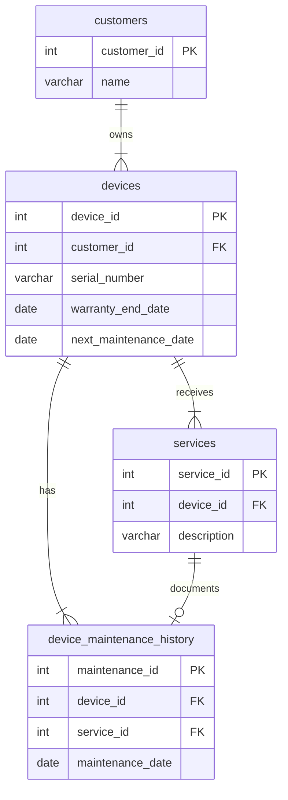
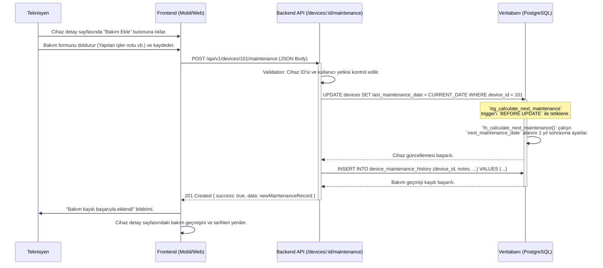

# Cihazlar Modülü Teknik Kılavuzu

**Sürüm:** 1.0.0
**Son Güncelleme:** 12 Kasım 2025

## 🎯 1. Misyon ve Genel Bakış

### 1.1. Modül Kimliği

- **Modül Adı:** Devices (Cihazlar)
- **Sorumlu Ekip:** Backend Ekibi, Frontend Ekibi
- **Ana Sorumluluk:** Müşterilere ait kombi, kazan ve ısıtma cihazlarının kaydını tutmak, modellerini, seri numaralarını, kurulum tarihlerini, garanti bilgilerini ve bakım geçmişini yönetmek.

### 1.2. Stratejik Rolü

Bu modül, müşteri ilişkileri yönetimi (CRM) ve saha servis operasyonları (FSM) arasında bir köprü görevi görür. Müşterilerin sahip olduğu varlıkları (cihazları) sisteme kaydederek, bu varlıklar etrafında şekillenen tüm servis, bakım ve randevu süreçlerinin temelini oluşturur. Cihaz bazlı servis geçmişi ve garanti takibi gibi kritik iş problemlerini çözer.

### 1.3. Diğer Modüllerle Entegrasyonları

- **Customers:** Her cihaz bir müşteriye aittir. Cihazlar, müşteri detay sayfasında listelenir.
- **Services:** Bir cihaza yapılan tüm onarım ve kurulum işlemleri, `services` tablosunda bu cihaza referans verir.
- **Parts:** Bir servis sırasında cihazda kullanılan yedek parçalar `service_parts` üzerinden izlenir.
- **Appointments:** Cihaz bazlı periyodik bakım veya onarım randevuları oluşturulur.

---

## 🗄️ 2. Veritabanı Mimarisi

Modül, `devices` (ana cihaz kayıtları), `device_models` (cihazların statik özellikleri) ve `device_maintenance_history` (bakım geçmişi) tabloları üzerine kuruludur.

### 2.1. Tablo Yapıları

#### `public.devices`
Müşteriye ait her bir fiziksel cihazın kaydını tutar.

```sql
CREATE TABLE public.devices (
    device_id SERIAL PRIMARY KEY,
    customer_id INT NOT NULL REFERENCES public.customers(customer_id),
    device_type VARCHAR(50) NOT NULL CHECK (device_type IN ('combi', 'boiler', 'heater')), -- Cihaz tipi: 'kombi', 'kazan', 'ısıtıcı'
    brand VARCHAR(100) NOT NULL,
    model VARCHAR(100) NOT NULL,
    serial_number VARCHAR(100) UNIQUE,
    installation_date DATE,
    warranty_end_date DATE,
    last_maintenance_date DATE,
    next_maintenance_date DATE,
    power_rating VARCHAR(50), -- Örn: '24 kW'
    fuel_type VARCHAR(50), -- Örn: 'natural_gas', 'lpg', 'electric'
    location VARCHAR(255), -- Cihazın konumu: 'Mutfak', 'Balkon'
    notes TEXT,
    is_active BOOLEAN DEFAULT TRUE,
    created_at TIMESTAMPTZ DEFAULT CURRENT_TIMESTAMP,
    updated_at TIMESTAMPTZ DEFAULT CURRENT_TIMESTAMP
);
```

#### `public.device_models` (Varsayımsal)
Cihazların marka ve modeline göre statik teknik özelliklerini tutar. Bu, `devices` tablosundaki veri tekrarını azaltır.

```sql
CREATE TABLE public.device_models (
    model_id SERIAL PRIMARY KEY,
    brand VARCHAR(100) NOT NULL,
    model_name VARCHAR(100) NOT NULL,
    device_type VARCHAR(50) NOT NULL,
    technical_specs JSONB, -- { "power": "24kW", "flow_rate": "11 l/min" }
    manual_url VARCHAR(255),
    UNIQUE (brand, model_name)
);
```

#### `public.device_maintenance_history` (Varsayımsal)
Bir cihaza yapılan tüm bakım işlemlerinin geçmişini kaydeder.

```sql
CREATE TABLE public.device_maintenance_history (
    maintenance_id SERIAL PRIMARY KEY,
    device_id INT NOT NULL REFERENCES public.devices(device_id),
    service_id INT REFERENCES public.services(service_id), -- Bakımın yapıldığı servis kaydı
    maintenance_date DATE NOT NULL,
    technician_id INT REFERENCES public.users(user_id),
    notes TEXT, -- Yapılan işlemler
    created_at TIMESTAMPTZ DEFAULT CURRENT_TIMESTAMP
);
```

### 2.2. Indexler (Performans Optimizasyonu)

```sql
-- Bir müşterinin tüm cihazlarını hızla listelemek için.
CREATE INDEX idx_devices_customer_id ON public.devices (customer_id);

-- Seri numarası ile cihazı tekil olarak ve hızla bulmak için.
CREATE INDEX idx_devices_serial_number ON public.devices (serial_number);

-- Garantisi bitmek üzere olan cihazları raporlamak için.
CREATE INDEX idx_devices_warranty_end ON public.devices (warranty_end_date);

-- Bakım zamanı gelen cihazları periyodik olarak sorgulamak için.
CREATE INDEX idx_devices_next_maintenance ON public.devices (next_maintenance_date);
```

### 2.3. Trigger'lar (Veri Bütünlüğü ve Otomasyon)

#### 1. Sonraki Bakım Tarihini Otomatik Hesaplama
Bu trigger, bir cihaza yeni bir bakım tarihi (`last_maintenance_date`) girildiğinde veya güncellendiğinde, bir sonraki periyodik bakım tarihini (`next_maintenance_date`) otomatik olarak 1 yıl sonrasına ayarlar.

```sql
-- 1. Trigger Fonksiyonunu Oluşturma
CREATE OR REPLACE FUNCTION fn_calculate_next_maintenance()
RETURNS TRIGGER AS $$
BEGIN
    -- Sadece last_maintenance_date alanı değiştiyse veya yeni kayıt ise çalış
    IF (TG_OP = 'INSERT' OR NEW.last_maintenance_date IS DISTINCT FROM OLD.last_maintenance_date) AND NEW.last_maintenance_date IS NOT NULL THEN
        NEW.next_maintenance_date := NEW.last_maintenance_date + INTERVAL '1 year';
    END IF;
    RETURN NEW;
END;
$$ LANGUAGE plpgsql;

-- 2. Trigger'ı Devices Tablosuna Bağlama
CREATE TRIGGER trg_calculate_next_maintenance
BEFORE INSERT OR UPDATE ON public.devices
FOR EACH ROW
EXECUTE FUNCTION fn_calculate_next_maintenance();
```

### 2.4. İlişki Diyagramı (ERD - Mermaid)



---

## 🧬 3. Veri Akış Şeması

### 3.1. Cihaza Bakım Kaydı Ekleme Süreci

Bu şema, bir teknisyenin tamamladığı bir servis sonrası cihaza bakım kaydı eklemesini ve bu işlemin ilgili tarihleri nasıl güncellediğini gösterir.



---

## ⚙️ 4. Backend API Endpoint'leri (Detaylı)

**Base URL:** `/api/v1/devices`

---

### 4.1. Yeni Cihaz Kaydet

- **METHOD:** `POST`
- **URL:** `/`
- **Handler Function:** `createDevice` - `/backend/controllers/deviceController.js:30`
- **Açıklama:** Müşteriye yeni bir cihaz ekler.

#### Request Detayları
- **Request Body:**
  ```json
  {
    "customer_id": "integer - Cihazın ait olduğu müşteri ID'si - Zorunlu",
    "device_type": "string - 'combi', 'boiler', 'heater' - Zorunlu",
    "brand": "string - Marka - Zorunlu",
    "model": "string - Model - Zorunlu",
    "serial_number": "string - Seri numarası - Opsiyonel, ama unique olmalı",
    "installation_date": "date (YYYY-MM-DD) - Opsiyonel",
    "warranty_end_date": "date (YYYY-MM-DD) - Opsiyonel"
  }
  ```

#### Backend İşlem Akışı
```javascript
// /backend/controllers/deviceController.js:30-70
async function createDevice(req, res) {
    try {
        // 1. VALIDATION (Middleware)
        const deviceData = req.body;

        // 2. AUTHORIZATION: Kullanıcının cihaz ekleme yetkisi var mı? (Middleware)

        // 3. BUSINESS LOGIC: Seri numarası zaten var mı?
        if (deviceData.serial_number) {
            const existing = await DeviceService.findBySerial(deviceData.serial_number);
            if (existing) {
                return res.status(409).json({ error: "Bu seri numarası zaten kayıtlı." });
            }
        }

        // 4. DATABASE QUERY
        const newDevice = await DeviceService.create(deviceData);

        // 5. RESPONSE
        res.status(201).json({ success: true, data: newDevice });
    } catch (error) {
        res.status(500).json({ success: false, error: 'Server Error' });
    }
}
```

---

### 4.2. Bakım Zamanı Gelen Cihazları Listele

- **METHOD:** `GET`
- **URL:** `/maintenance-due`
- **Handler Function:** `getMaintenanceDueDevices` - `/backend/controllers/deviceController.js:200`
- **Açıklama:** Bir sonraki bakım tarihi yaklaşan veya geçmiş olan cihazları listeler. Periyodik hatırlatmalar için kullanılır.

#### Request Detayları
- **Query Parameters:**
  ```javascript
  {
    "days": "integer - Kaç gün içinde bakım zamanı geleceği. Örn: 30 (varsayılan).",
    "page": "integer",
    "limit": "integer"
  }
  ```

#### Gerçek SQL Sorgusu (`DeviceService.findMaintenanceDue`)
```sql
-- 'days' parametresi 30 ise:
SELECT
    d.device_id,
    d.brand,
    d.model,
    d.next_maintenance_date,
    c.first_name,
    c.last_name,
    c.phone
FROM public.devices d
JOIN public.customers c ON d.customer_id = c.customer_id
WHERE
    d.is_active = TRUE
    AND d.next_maintenance_date <= (CURRENT_DATE + INTERVAL '30 days')
ORDER BY d.next_maintenance_date ASC
LIMIT $1 OFFSET $2;
```

---

## 🖥️ 5. Frontend Mimarisi (Kod Seviyesinde)

- **Dosya:** `/frontend/js/devices.js`
- **URL:** `/devices.html`

#### HTML Yapısı (Anahtar Elementler)
```html
<!-- /frontend/pages/devices.html -->
<a href="/devices/new.html" class="btn btn-primary">Yeni Cihaz Ekle</a>
<input type="text" id="device-search" placeholder="Seri no, marka veya model ara...">
<table id="devices-table">
  <thead>
    <tr>
      <th>Marka</th>
      <th>Model</th>
      <th>Seri No</th>
      <th>Müşteri</th>
      <th>Sonraki Bakım</th>
      <th>Aksiyon</th>
    </tr>
  </thead>
  <tbody>
    <!-- Cihaz satırları JS ile doldurulacak -->
  </tbody>
</table>
```

#### JavaScript Fonksiyonları (Detaylı)
```javascript
// /frontend/js/devices.js

// FUNCTION: loadDevices(searchQuery)
// AMAÇ: API'den cihazları çeker ve tabloyu doldurur.
async function loadDevices(search = '') {
    try {
        const response = await fetch(`/api/v1/devices?search=${search}`);
        const result = await response.json();
        if (result.success) {
            renderDevicesTable(result.data);
        }
    } catch (error) {
        showError("Cihazlar yüklenemedi.");
    }
}

// FUNCTION: renderDevicesTable(devices)
// AMAÇ: Gelen cihaz verisiyle HTML tablosunu oluşturur.
function renderDevicesTable(devices) {
    const tbody = document.querySelector('#devices-table tbody');
    tbody.innerHTML = '';
    devices.forEach(device => {
        const row = `
            <tr data-id="${device.device_id}">
                <td>${device.brand}</td>
                <td>${device.model}</td>
                <td>${device.serial_number}</td>
                <td>${device.customer_name}</td>
                <td>${formatDate(device.next_maintenance_date)}</td>
                <td><a href="/devices/detail.html?id=${device.device_id}">Detay</a></td>
            </tr>
        `;
        tbody.innerHTML += row;
    });
}
```

---

## 🔎 6. GERÇEK KULLANIM SENARYOSU (E2E)

### Senaryo: Yeni Cihaz Kaydı

**Amaç:** Müşteriye yeni bir kombi cihazı eklemek.
**Ön Koşullar:** Kullanıcı "Operatör" rolüyle giriş yapmış. Müşteri (ID: 55, Adı: Zeynep Kaya) sistemde mevcut.

| Adım | Aksiyon | Sistem Tepkisi (Kod ve Açıklama) |
|---|---|---|
| 1 | **Kullanıcı:** Müşteri Zeynep Kaya'nın detay sayfasındaki "Yeni Cihaz Ekle" butonuna tıklar. | `window.location.href = '/devices/new.html?customerId=55'` yönlendirmesi yapılır. |
| 2 | **Frontend:** Yeni cihaz formu yüklenir. Müşteri alanı "Zeynep Kaya" olarak dolu ve kilitlidir. | `customerId` query parametresi okunur ve ilgili input'a set edilir. |
| 3 | **Kullanıcı:** Formu doldurur: Marka: "Baymak", Model: "Lambert", Seri No: "BYM-LMB-987654". | Form input'ları `onChange` event'leri ile state'i günceller. |
| 4 | **Kullanıcı:** "Kaydet" butonuna basar. | `handleDeviceSubmit()` fonksiyonu tetiklenir. |
| 5 | **Frontend:** `POST /api/v1/devices` isteği gönderilir. | `fetch` API'si ile istek atılır. |
| 6 | **Request Payload:** | ```json { "customer_id": 55, "brand": "Baymak", "model": "Lambert", "serial_number": "BYM-LMB-987654", ... } ``` |
| 7 | **Backend:** `createDevice` controller'ı çalışır. | `DeviceService.findBySerial()` ile seri no kontrolü yapılır. |
| 8 | **Database:** `SELECT * FROM devices WHERE serial_number = 'BYM-LMB-987654'` sorgusu çalışır. | Sonuç boş döner, seri no'nun unique olduğu doğrulanır. |
| 9 | **Backend:** `DeviceService.create()` çağrılır. | `INSERT INTO devices (...) VALUES (...)` sorgusu hazırlanır. |
| 10 | **Database:** Yeni cihaz kaydı `devices` tablosuna eklenir. | `device_id` (örn: 102) auto-increment ile oluşturulur. |
| 11 | **Backend:** Başarılı response döner. | `201 Created` durumu ile yeni cihaz nesnesi döndürülür. |
| 12 | **Frontend:** `response.ok` true döner. | `showSuccess("Cihaz başarıyla eklendi!")` mesajı gösterilir. |
| 13 | **Frontend:** Kullanıcı müşteri detay sayfasına yönlendirilir. | `window.location.href = '/customers/detail.html?id=55'` |
| 14 | **Sonuç:** Zeynep Kaya'nın sayfasında yeni eklenen Baymak kombi görünür. | Sayfa yüklendiğinde yapılan `GET /api/v1/devices/customer/55` isteği yeni cihazı içerir. |

---

## 🛡️ 7. Güvenlik Notları

### 7.1. Giriş Doğrulama (Input Validation)
- **Seri Numarası:** `serial_number` alanı, formatı ve uzunluğu açısından backend'de doğrulanmalıdır. Olası enjeksiyon denemelerine karşı sanitize edilmelidir.
- **Tarih Formatları:** `installation_date` ve `warranty_end_date` gibi tarih alanlarının geçerli `YYYY-MM-DD` formatında olduğu kontrol edilmelidir.

### 7.2. SQL Enjeksiyonu Koruması
- Tüm API endpoint'lerinde, özellikle `GET /devices` gibi filtreleme yapılan sorgularda, kullanıcıdan gelen veriler (örn: `search` query parametresi) doğrudan SQL'e eklenmemeli, parametreli sorgular kullanılmalıdır.

### 7.3. Yetkilendirme (Authorization)
- **Veri Sahipliği:** Bir kullanıcı (müşteri), sadece kendisine ait cihazları görebilmelidir. `GET /api/v1/devices/:id` endpoint'i, isteği yapan kullanıcının cihazın sahibi olup olmadığını kontrol etmelidir.
- **Rol Bazlı Erişim:** Cihaz silme veya kritik bilgileri güncelleme gibi işlemler sadece `admin` veya `operator` rolündeki kullanıcılara açık olmalıdır.

### 7.4. Hassas Veri Güvenliği
- **Seri Numarası:** Cihaz seri numaraları, cihazın kimliği için kritik olduğundan, loglarda veya hata mesajlarında gereksiz yere ifşa edilmemelidir.
- **Müşteri Bilgisi:** Cihaz listeleme endpoint'leri, cihaz bilgisiyle birlikte aşırı miktarda müşteri kişisel verisi (adres, T.C. kimlik no vb.) döndürmemelidir. Sadece gerekli olan `customer_id` ve `customer_name` gibi bilgiler yer almalıdır.

---

## 🚨 8. Sorun Giderme (Troubleshooting)

### Hata 1: "Duplicate Serial Number" (409 Conflict)
- **Semptom:** Yeni cihaz eklerken "Bu seri numarası zaten kayıtlı" hatası alınır.
- **Neden:** `serial_number` kolonunda `UNIQUE` constraint'i vardır. Başka bir cihaza atanmış bir seri numarası tekrar kullanılamaz.
- **Çözüm:** Kullanıcıdan seri numarasını kontrol etmesini isteyin. Eğer numara doğruysa ve sistemdeki eski kayıt hatalıysa, admin arayüzünden eski kaydın düzeltilmesi veya silinmesi gerekir.

### Hata 2: "Bakım Tarihi Hesaplanamadı"
- **Semptom:** Cihaza `last_maintenance_date` eklendiği halde `next_maintenance_date` güncellenmez.
- **Neden:** `fn_calculate_next_maintenance` trigger'ı çalışmıyor veya hatalı yapılandırılmış olabilir. `last_maintenance_date` alanı `NULL` olarak gönderilmiş olabilir.
- **Çözüm:** Veritabanında trigger'ın `devices` tablosuna doğru şekilde bağlı olup olmadığını kontrol edin. Fonksiyonun `UPDATE` ve `INSERT` operasyonları için aktif olduğundan emin olun.

---

## 🧪 9. Test Senaryoları

### 9.1. Unit Test (Trigger Fonksiyonu)
```sql
-- /db/tests/test_maintenance_trigger.sql
-- 1. Hazırlık: Bir cihaz oluştur
INSERT INTO devices (customer_id, device_type, brand, model) VALUES (1, 'combi', 'TestBrand', 'TestModel') RETURNING device_id;
-- 2. Aksiyon: Cihazın son bakım tarihini güncelle
UPDATE devices SET last_maintenance_date = '2024-01-15' WHERE device_id = [dönen_id];
-- 3. Beklenti: Sonraki bakım tarihinin '2025-01-15' olduğunu doğrula
SELECT next_maintenance_date FROM devices WHERE device_id = [dönen_id];
-- Sonuç '2025-01-15' olmalı.
```

### 9.2. Integration Testi (`POST /devices`)
```javascript
// /backend/test/integration/devices.api.test.js
it('should return 409 Conflict when creating a device with a duplicate serial number', async () => {
    // 1. İlk cihazı oluştur
    await request(app)
        .post('/api/v1/devices')
        .set('Authorization', `Bearer ${OPERATOR_TOKEN}`)
        .send({ customer_id: 1, ..., serial_number: 'DUP-123' });
    
    // 2. Aynı seri numarasıyla ikinci cihazı oluşturmayı dene
    const response = await request(app)
        .post('/api/v1/devices')
        .set('Authorization', `Bearer ${OPERATOR_TOKEN}`)
        .send({ customer_id: 2, ..., serial_number: 'DUP-123' });

    // 3. 409 hatası bekle
    expect(response.statusCode).toBe(409);
    expect(response.body.error).toContain('Bu seri numarası zaten kayıtlı');
});
```

---

## 🗺️ 10. Fonksiyon Bağlantı Haritası

### 10.1. Backend Çağrı Grafiği (Call Graph)
```
API İSTEĞİ (Request)
│
├─ POST /api/v1/devices
│  └─ Controller: createDevice(req, res)
│     ├─ Service: DeviceService.findBySerial(serial)
│     │  └─ Veritabanı: SELECT ... FROM devices WHERE serial_number=...
│     └─ Service: DeviceService.create(data)
│        └─ Veritabanı: INSERT INTO devices ...
│           └─ TRIGGER: trg_calculate_next_maintenance
│              └─ FUNCTION: fn_calculate_next_maintenance()
│
└─ GET /api/v1/devices/maintenance-due
   └─ Controller: getMaintenanceDueDevices(req, res)
      └─ Service: DeviceService.findMaintenanceDue(filters)
         └─ Veritabanı: SELECT ... FROM devices WHERE next_maintenance_date <= ...
```
