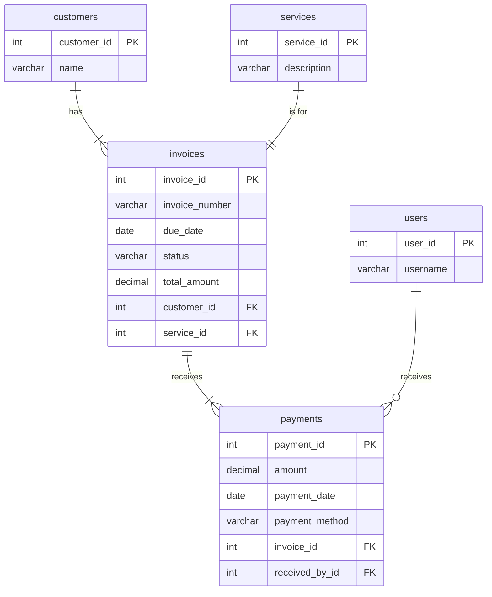
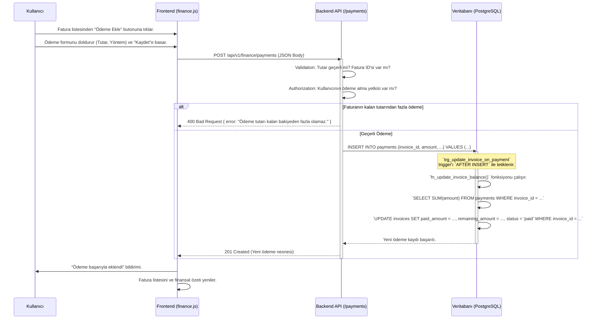

# Finans Modülü Teknik Kılavuzu

**Sürüm:** 2.0.0
**Son Güncelleme:** 12 Kasım 2025

## 🎯 1. Misyon ve Genel Bakış

### 1.1. Modül Kimliği

- **Modül Adı:** Finance (Finans)
- **Sorumlu Ekip:** Backend Ekibi, Frontend Ekibi
- **Ana Sorumluluk:** Şirketin tüm finansal hareketlerini (gelir ve giderler) kaydetmek, faturaları yönetmek, ödemeleri takip etmek ve şirketin finansal sağlığı hakkında özet ve detaylı raporlar sunmak.

### 1.2. Stratejik Rolü

Bu modül, operasyonel faaliyetlerin (servis, parça satışı) finansal sonuçlarını somutlaştırır. Bir servisin ne zaman faturalandırıldığını, faturanın ödenip ödenmediğini ve şirketin genel karlılığını gösteren merkezi modüldür. Tahsilat takibi, gelir-gider dengesi ve raporlama gibi kritik iş problemlerini çözer.

### 1.3. Diğer Modüllerle Entegrasyonları

- **Customers:** Her fatura bir müşteriye aittir. Müşteri karlılık analizleri bu modüle dayanır.
- **Services:** Tamamlanan servisler faturalandırılır.
- **Users:** Ödemeyi alan personel gibi denetim bilgileri için `Users` modülüne bağlanır.

---

## 🗄️ 2. Veritabanı Mimarisi

Modül, `invoices` (faturalar) ve `payments` (ödemeler) olmak üzere iki ana tablo üzerine kuruludur. Bu yapı, veri bütünlüğünü ve performansını sağlamak için index'ler ve trigger'lar ile desteklenmiştir.

### 2.1. Tablo Yapıları

#### `public.invoices`
Müşterilere kesilen hizmet veya ürün faturalarının tüm detaylarını tutar.

```sql
CREATE TABLE public.invoices (
    invoice_id SERIAL PRIMARY KEY,
    invoice_number VARCHAR(100) UNIQUE NOT NULL,
    invoice_date DATE NOT NULL DEFAULT CURRENT_DATE,
    due_date DATE NOT NULL,
    status VARCHAR(20) NOT NULL DEFAULT 'pending' CHECK (status IN ('pending', 'paid', 'partial', 'overdue', 'cancelled')),
    subtotal NUMERIC(10, 2) NOT NULL,
    tax_rate NUMERIC(5, 2) DEFAULT 20.00,
    tax_amount NUMERIC(10, 2) NOT NULL,
    discount_amount NUMERIC(10, 2) DEFAULT 0,
    total_amount NUMERIC(10, 2) NOT NULL,
    paid_amount NUMERIC(10, 2) DEFAULT 0,
    remaining_amount NUMERIC(10, 2) NOT NULL,
    notes TEXT,
    is_e_invoice BOOLEAN DEFAULT FALSE,
    customer_id INT NOT NULL REFERENCES public.customers(customer_id),
    service_id INT REFERENCES public.services(service_id),
    created_at TIMESTAMPTZ DEFAULT CURRENT_TIMESTAMP,
    updated_at TIMESTAMPTZ DEFAULT CURRENT_TIMESTAMP,
    deleted_at TIMESTAMPTZ
);
```

#### `public.payments`
Faturalara karşılık yapılan ödemeleri tek tek kaydeder.

```sql
CREATE TABLE public.payments (
    payment_id SERIAL PRIMARY KEY,
    payment_number VARCHAR(100) UNIQUE NOT NULL,
    amount NUMERIC(10, 2) NOT NULL,
    payment_method VARCHAR(50) NOT NULL CHECK (payment_method IN ('cash', 'credit_card', 'bank_transfer')),
    payment_date DATE NOT NULL DEFAULT CURRENT_DATE,
    transaction_id VARCHAR(255),
    notes TEXT,
    invoice_id INT NOT NULL REFERENCES public.invoices(invoice_id),
    received_by_id INT REFERENCES public.users(user_id),
    created_at TIMESTAMPTZ DEFAULT CURRENT_TIMESTAMP,
    updated_at TIMESTAMPTZ DEFAULT CURRENT_TIMESTAMP
);
```

### 2.2. Indexler (Performans Optimizasyonu)

```sql
-- Faturaları müşteriye göre hızla bulmak için.
CREATE INDEX idx_invoices_customer_id ON public.invoices (customer_id);

-- Faturaları durumlarına göre (örn: vadesi geçmiş) filtrelemek için.
CREATE INDEX idx_invoices_status ON public.invoices (status);

-- Belirli bir faturaya ait ödemeleri hızla listelemek için.
CREATE INDEX idx_payments_invoice_id ON public.payments (invoice_id);

-- Belirli bir tarihteki veya tarih aralığındaki ödemeleri raporlamak için.
CREATE INDEX idx_payments_payment_date ON public.payments (payment_date);
```

### 2.3. Trigger'lar (Veri Bütünlüğü ve Otomasyon)

#### 1. Fatura Bakiyesini ve Durumunu Otomatik Güncelleme

Bu trigger, `payments` tablosuna yeni bir kayıt eklendiğinde veya mevcut bir kayıt güncellendiğinde/silindiğinde, ilişkili faturanın `paid_amount`, `remaining_amount` ve `status` alanlarını otomatik olarak yeniden hesaplar. Bu, sistemin en kritik otomasyonlarından biridir.

```sql
-- 1. Trigger Fonksiyonunu Oluşturma
CREATE OR REPLACE FUNCTION fn_update_invoice_balance()
RETURNS TRIGGER AS $$
DECLARE
    v_total_paid NUMERIC;
    v_total_amount NUMERIC;
BEGIN
    IF (TG_OP = 'DELETE') THEN
        SELECT totalAmount INTO v_total_amount FROM public.invoices WHERE invoice_id = OLD.invoice_id;
        SELECT COALESCE(SUM(amount), 0) INTO v_total_paid FROM public.payments WHERE invoice_id = OLD.invoice_id;
    ELSE
        SELECT totalAmount INTO v_total_amount FROM public.invoices WHERE invoice_id = NEW.invoice_id;
        SELECT COALESCE(SUM(amount), 0) INTO v_total_paid FROM public.payments WHERE invoice_id = NEW.invoice_id;
    END IF;

    UPDATE public.invoices
    SET
        paid_amount = v_total_paid,
        remaining_amount = v_total_amount - v_total_paid,
        status = CASE
            WHEN v_total_paid >= v_total_amount THEN 'paid'
            WHEN v_total_paid > 0 AND v_total_paid < v_total_amount THEN 'partial'
            ELSE 'pending'
        END,
        updated_at = NOW()
    WHERE invoice_id = COALESCE(NEW.invoice_id, OLD.invoice_id);

    RETURN COALESCE(NEW, OLD);
END;
$$ LANGUAGE plpgsql;

-- 2. Trigger'ı Payments Tablosuna Bağlama
CREATE TRIGGER trg_update_invoice_on_payment
AFTER INSERT OR UPDATE OR DELETE ON public.payments
FOR EACH ROW
EXECUTE FUNCTION fn_update_invoice_balance();
```

#### 2. `updated_at` Zaman Damgasını Otomatik Güncelleme
Bu trigger, bir kayıt her güncellendiğinde `updated_at` alanını otomatik olarak doldurur.
```sql
CREATE OR REPLACE FUNCTION fn_update_updated_at() RETURNS TRIGGER AS $$
BEGIN
    NEW.updated_at = NOW();
    RETURN NEW;
END;
$$ LANGUAGE plpgsql;

-- Invoices tablosu için
CREATE TRIGGER trg_invoices_update_at
BEFORE UPDATE ON public.invoices FOR EACH ROW EXECUTE FUNCTION fn_update_updated_at();

-- Payments tablosu için
CREATE TRIGGER trg_payments_update_at
BEFORE UPDATE ON public.payments FOR EACH ROW EXECUTE FUNCTION fn_update_updated_at();
```

### 2.4. İlişki Diyagramı (ERD - Mermaid)



---

## 🧬 3. Veri Akış Şeması


### 3.1. Yeni Ödeme Ekleme Süreci (Detaylı)


Bu şema, bir faturaya yeni bir ödeme eklendiğinde sistemin nasıl tepki verdiğini ve veritabanı trigger'ının kritik rolünü gösterir.





---


## ⚙️ 4. Backend API Endpoint'leri (Detaylı)


**Base URL:** `/api/v1/finance`


---


### 4.1. Faturaları Listele


- **METHOD:** `GET`

- **URL:** `/invoices`

- **Handler Function:** `getInvoices` - `/backend/controllers/financeController.js:40`

- **Açıklama:** Faturaları durum, müşteri veya tarih aralığına göre filtreleyerek listeler.


#### Request Detayları

- **Query Parameters:**

  ```javascript

  {

    "status": "string - 'pending', 'paid', 'overdue'",

    "customerId": "integer - Müşteri ID'si",

    "startDate": "date (YYYY-MM-DD)",

    "endDate": "date (YYYY-MM-DD)",

    "page": "integer",

    "limit": "integer"

  }

  ```


#### Gerçek SQL Sorgusu (`FinanceService.findAllInvoices`)

```sql

-- Dinamik olarak oluşturulan sorgu örneği (sadece status ile):

SELECT

    i.invoice_id,

    i.invoice_number,

    i.due_date,

    i.total_amount,

    i.remaining_amount,

    i.status,

    c.first_name,

    c.last_name

FROM public.invoices i

JOIN public.customers c ON i.customer_id = c.customer_id

WHERE

    i.deleted_at IS NULL

    AND i.status = 
 -- 'overdue'

ORDER BY i.due_date DESC

LIMIT $2 OFFSET $3;

```


#### Test CURL Komutları

```bash

# Vadesi geçmiş faturaları listele

curl -X GET 'http://localhost:3000/api/v1/finance/invoices?status=overdue' \

  -H 'Authorization: Bearer [TOKEN]'

```


---


### 4.2. Yeni Ödeme Ekle


- **METHOD:** `POST`

- **URL:** `/payments`

- **Handler Function:** `addPayment` - `/backend/controllers/financeController.js:120`

- **Açıklama:** Bir faturaya yeni bir ödeme ekler. Veritabanı trigger'ı faturanın bakiyesini ve durumunu otomatik olarak günceller.


#### Request Detayları

- **Request Body:**

  ```javascript

  {

    "invoice_id": "integer - Ödemenin yapıldığı fatura ID'si - Zorunlu",

    "amount": "numeric - Ödeme tutarı - Zorunlu",

    "payment_method": "string - 'cash', 'credit_card', 'bank_transfer' - Zorunlu",

    "payment_date": "date (YYYY-MM-DD) - Opsiyonel",

    "notes": "string - Opsiyonel"

  }

  ```


#### Backend İşlem Akışı

```javascript

// /backend/controllers/financeController.js:120-165

async function addPayment(req, res) {

    try {

        // 1. VALIDATION (Middleware)

        const paymentData = req.body;

        const received_by_id = req.user.id; // Token'dan gelen kullanıcı


        // 2. BUSINESS LOGIC (satır: 128)

        // Faturanın varlığını ve kalan tutarını kontrol et

        const invoice = await FinanceService.findInvoiceById(paymentData.invoice_id);

        if (!invoice) {

            return res.status(404).json({ error: "Fatura bulunamadı." });

        }

        if (paymentData.amount > invoice.remaining_amount) {

            return res.status(400).json({ error: "Ödeme tutarı kalan bakiyeden fazla olamaz." });

        }


        // 3. DATABASE QUERY (satır: 145)

        // Ödemeyi oluştur. Trigger gerisini halleder.

        const newPayment = await FinanceService.createPayment({ ...paymentData, received_by_id });


        // 4. RESPONSE (satır: 155)

        res.status(201).json({ success: true, data: newPayment });


    } catch (error) {

        res.status(500).json({ success: false, error: 'Server Error' });

    }

}

```


#### Test CURL Komutları

```bash

# Başarılı Senaryo

curl -X POST 'http://localhost:3000/api/v1/finance/payments' \

  -H 'Authorization: Bearer [TOKEN]' \

  -H 'Content-Type: application/json' \

  -d '{

    "invoice_id": 25,

    "amount": 150.75,

    "payment_method": "credit_card"

  }'

```


---


## 🖥️ 5. Frontend Mimarisi (Kod Seviyesinde)


- **Dosya:** `/frontend/js/finance.js`

- **URL:** `/finance.html`


#### HTML Yapısı (Anahtar Elementler)

```html

<!-- /frontend/pages/finance.html -->

<select id="invoice-status-filter">

  <option value="">Tümü</option>

  <option value="pending">Bekleyen</option>

  <option value="overdue">Vadesi Geçmiş</option>

  <option value="paid">Ödenmiş</option>

</select>

<table id="invoices-table">

  <!-- Fatura satırları, her satırda "Ödeme Ekle" butonu -->

</table>


<!-- Ödeme Ekleme Modalı -->

<div id="payment-modal" class="modal">

  <form id="payment-form">

    <input type="hidden" id="invoice-id-for-payment">

    <input type="number" id="payment-amount" required>

    <select id="payment-method" required>...</select>

    <button type="submit">Ödemeyi Kaydet</button>

  </form>

</div>

```


#### JavaScript Fonksiyonları (Detaylı)

```javascript

// /frontend/js/finance.js


// FUNCTION: loadInvoices(status) - Satır: 40-70

// AMAÇ: Faturaları durumlarına göre API'den çeker.

async function loadInvoices(status = '') {

    const query = new URLSearchParams({ status }).toString();

    try {

        showLoading();

        const response = await fetch(`/api/v1/finance/invoices?${query}`);

        const result = await response.json();

        if (result.success) {

            renderInvoicesTable(result.data);

        }

    } catch (error) {

        showError("Faturalar yüklenemedi.");

    } finally {

        hideLoading();

    }

}


// FUNCTION: handlePaymentSubmit(event) - Satır: 150-180

// AMAÇ: Yeni ödeme formunu backend'e gönderir.

async function handlePaymentSubmit(event) {

    event.preventDefault();

    const paymentData = {

        invoice_id: document.getElementById('invoice-id-for-payment').value,

        amount: document.getElementById('payment-amount').value,

        payment_method: document.getElementById('payment-method').value

    };


    const response = await fetch('/api/v1/finance/payments', {

        method: 'POST',

        headers: { 'Content-Type': 'application/json', 'Authorization': `Bearer ${getToken()}` },

        body: JSON.stringify(paymentData)

    });


    if (response.ok) {

        closeModal();

        loadInvoices(document.getElementById('invoice-status-filter').value); // Listeyi yenile

        showSuccess("Ödeme kaydedildi!");

    } else {

        const errorResult = await response.json();

        showError(errorResult.error);

    }

}

```


#### Event Listener'lar

```javascript

// /frontend/js/app.js: 70

document.addEventListener('DOMContentLoaded', () => {

    loadInvoices(); // Sayfa yüklendiğinde tüm faturaları getir.

});


// /frontend/js/finance.js: 200

document.getElementById('invoice-status-filter').addEventListener('change', (e) => {

    loadInvoices(e.target.value);

});


document.getElementById('payment-form').addEventListener('submit', handlePaymentSubmit);

```


---


## 🔎 6. GERÇEK KULLANIM SENARYOSU (E2E)


### Senaryo: Kısmi Ödeme Alma ve Fatura Durumunun Otomatik Güncellenmesi


**Amaç:** Bir faturaya kısmi ödeme almak ve faturanın durumunun `pending`'den `partial`'a otomatik olarak değiştiğini doğrulamak.

**Ön Koşullar:** 500 TL tutarında, `pending` durumunda bir fatura (ID: 33) sistemde mevcut.


| Adım | Aksiyon | Sistem Tepkisi (Kod ve Açıklama) |

|---|---|---|

| 1 | **Kullanıcı:** Fatura ID 33'ün satırındaki "Ödeme Ekle" butonuna tıklar. | `openPaymentModal(33)` fonksiyonu çağrılır. Modal açılır, `invoice-id-for-payment` input'unun değeri `33` olarak ayarlanır. |

| 2 | **Kullanıcı:** Ödeme formuna tutar olarak "200" girer ve "Kaydet"e basar. | `payment-form` üzerinde `submit` event'i tetiklenir. `handlePaymentSubmit()` çalışır. |

| 3 | **Frontend:** `POST /api/v1/finance/payments` isteği gönderilir. | `fetch` API'si ile istek atılır. |

| 4 | **Request Payload:** | ```json { "invoice_id": 33, "amount": 200, "payment_method": "cash" } ``` |

| 5 | **Backend:** `addPayment` controller fonksiyonu tetiklenir. | `FinanceService.findInvoiceById(33)` ile fatura bulunur. Kalan tutar (500 TL) ile ödeme tutarı (200 TL) karşılaştırılır. `200 <= 500` olduğu için işlem devam eder. |

| 6 | **Backend:** `FinanceService.createPayment()` çağrılır. | `INSERT INTO payments` sorgusu veritabanına gönderilir. |

| 7 | **Database:** `trg_update_invoice_on_payment` trigger'ı `AFTER INSERT` ile tetiklenir. | `fn_update_invoice_balance()` fonksiyonu çalışır. |

| 8 | **Database (Trigger içi):** | 1. `SELECT COALESCE(SUM(amount), 0) FROM payments WHERE invoice_id = 33;` -> `v_total_paid` = 200 olur. <br> 2. `v_total_amount` = 500. |

| 9 | **Database (Trigger içi):** | `UPDATE public.invoices SET paid_amount = 200, remaining_amount = 300, status = 'partial' WHERE invoice_id = 33;` sorgusu çalışır. `CASE` ifadesi `v_total_paid > 0 AND v_total_paid < v_total_amount` koşulunu sağladığı için `status` 'partial' olur. |

| 10 | **Backend:** `createPayment` başarılı olur ve `201 Created` yanıtı döner. | Response body'sinde yeni oluşturulan ödeme nesnesi yer alır. |

| 11 | **Frontend:** `response.ok` true döner. | `closeModal()` ve `showSuccess()` çağrılır. |

| 12 | **Frontend:** Fatura listesi yenilenir. | `loadInvoices()` çağrılır. Yeni listede Fatura ID 33'ün durumu artık "Kısmi Ödendi" (`partial`) olarak görünür ve kalan tutar 300 TL'dir. |


---


## 🛡️ 7. Güvenlik Notları

Bu bölüm, Finans modülünün, barındırdığı hassas veriler (faturalar, ödemeler, müşteri finansal bilgileri) nedeniyle özellikle dikkat edilmesi gereken güvenlik önlemlerini detaylandırır.

### 7.1. Giriş Doğrulama (Input Validation)

- **Backend:**
    - `addPayment` endpoint'inde, ödeme tutarının (`amount`) faturanın kalan tutarından büyük olamayacağı kontrolü (`paymentData.amount > invoice.remaining_amount`) kritik bir iş mantığı doğrulamasıdır. Ayrıca, `amount`'ın negatif bir değer olamayacağı ve `payment_method`'un beklenen değerlerden biri olduğu (`'cash', 'credit_card', 'bank_transfer'`) sunucu tarafında mutlaka doğrulanmalıdır.
    - `getInvoices` endpoint'indeki filtreleme parametreleri (`status`, `customerId`, `startDate`, `endDate`) tipleri, formatları ve olası değer aralıkları açısından doğrulanmalıdır.
- **Frontend:**
    - Frontend'deki form validasyonu (örn: `required` attribute'ları) kullanıcı deneyimini iyileştirir ancak güvenliği sağlamaz. Tüm güvenlik kontrolleri mutlaka backend'de yapılmalıdır.

### 7.2. SQL Enjeksiyonu Koruması

- **Durum:** `FinanceService.findAllInvoices` fonksiyonunda gösterilen dinamik sorgu oluşturma mantığı, parametreli sorgular (`LIMIT $2 OFFSET $3`) kullanarak enjeksiyon riskini azaltır. `INSERT` ve `UPDATE` işlemleri için de aynı şekilde ORM veya parametreli sorgu kütüphaneleri kullanılmalıdır.
- **Önlem:** Kullanıcıdan gelen hiçbir veri doğrudan SQL sorgu string'ine eklenmemelidir. Tüm dinamik değerler sorgu parametreleri olarak geçirilmelidir. Bu, modülün en temel güvenlik gereksinimidir.

### 7.3. Çapraz Site Komut Dosyası Çalıştırma (XSS - Cross-Site Scripting) Koruması

- **Risk:** Fatura veya ödeme notları (`notes` alanı) gibi metin alanlarına girilen kötü niyetli JavaScript kodları, bu notları görüntüleyen başka bir kullanıcının (örn: muhasebe personeli) tarayıcısında çalışabilir.
- **Önlem:**
    - **Backend:** Kullanıcıdan gelen metin verileri veritabanına kaydedilmeden önce sanitize edilebilir.
    - **Frontend:** Daha güvenilir bir yöntem olarak, veritabanından gelen ve HTML içinde gösterilecek tüm veriler (özellikle `notes` gibi alanlar) frontend'de render edilmeden önce uygun şekilde "escape" edilmelidir (örn: `<` karakterini `&lt;` olarak değiştirmek). Modern frontend kütüphaneleri (React, Vue vb.) bunu genellikle otomatik yapar, ancak `innerHTML` gibi tehlikeli özellikler kullanılırken manuel olarak yapılmalıdır.

### 7.4. Hız Sınırlama (Rate Limiting)

- **Risk:** `POST /api/v1/finance/payments` endpoint'i, bir saldırgan tarafından çok sayıda küçük ödeme isteği gönderilerek veya `GET /invoices` endpoint'i sürekli çağrılarak sistem kaynaklarının tüketilmesi (DoS saldırısı) için kullanılabilir.
- **Önlem:** Tüm finans API endpoint'lerine, özellikle kaynak oluşturan (`POST`) veya yoğun sorgulama yapan (`GET`) endpoint'lere, IP adresi veya kullanıcı bazlı hız sınırlama (rate limiting) uygulanmalıdır. Örneğin, bir kullanıcının dakikada 10'dan fazla ödeme oluşturamaması gibi.

### 7.5. Çapraz Site İstek Sahteciliği (CSRF - Cross-Site Request Forgery) Koruması

- **Risk:** Oturum açmış bir finans yöneticisi, farkında olmadan kötü niyetli bir web sitesini ziyaret ederse, o site arka planda `/api/v1/finance/payments` adresine istek göndererek sahte bir ödeme oluşturabilir.
- **Önlem:** `POST`, `PUT`, `DELETE` gibi durum değiştiren tüm endpoint'ler CSRF token'ları ile korunmalıdır. Sunucu, her oturum için benzersiz bir token üretir ve bu token'ın her istekte gönderilmesini bekler.

### 7.6. Yetkilendirme (Authorization)

- **Durum:** Kılavuzda "Kullanıcının ödeme alma yetkisi var mı?" ve "rol tabanlı yetkilendirme" gibi ifadelerle yetkilendirmenin önemi vurgulanmıştır.
- **Önlem:**
    - **Endpoint Seviyesi:** `addPayment`, `cancelInvoice` gibi hassas işlemler sadece belirli rollerdeki (örn: `finance_manager`, `admin`) kullanıcılara açık olmalıdır. Bu kontrol, bir middleware katmanında yapılmalıdır.
    - **Nesne/Veri Seviyesi:** Bir kullanıcının sadece kendi sorumlu olduğu şubenin veya bölgenin faturalarını görmesi gibi daha granüler yetkilendirme kuralları da iş mantığı katmanında uygulanmalıdır.

### 7.7. Hassas Veri İşleme ve Güvenliği

- **Risk:** `invoices` ve `payments` tabloları, müşteri finansal bilgileri, vergi numaraları, işlem ID'leri gibi son derece hassas veriler içerir. Bu verilerin sızması ciddi yasal ve finansal sonuçlar doğurur.
- **Önlem:**
    - **Veri Şifreleme:**
        - **Aktarımda Şifreleme (In-Transit):** Tüm API iletişimi sadece HTTPS üzerinden yapılmalıdır.
        - **Durağan Halde Şifreleme (At-Rest):** Veritabanındaki hassas alanlar (eğer varsa, kredi kartı bilgisi gibi - ki bu asla saklanmamalıdır, bunun yerine ödeme işlemcisi kullanılmalıdır) veya tüm veritabanı diski şifrelenmelidir.
    - **Veri Maskeleme:** Raporlama arayüzlerinde veya loglarda, tam kredi kartı numarası veya diğer hassas detaylar yerine maskelenmiş veriler (`**** **** **** 1234`) gösterilmelidir.
    - **Erişim Loglaması:** Hassas finansal verilere kimin, ne zaman eriştiğini kaydeden detaylı bir denetim (audit) logu tutulmalıdır. `payments` tablosundaki `received_by_id` alanı bu amaca hizmet eden iyi bir başlangıçtır.

---

## 🧪 8. Test Senaryoları

### 8.1. Veritabanı Trigger Testi (`fn_update_invoice_balance`)

Bu test, `payments` tablosuna kayıt eklendiğinde `invoices` tablosunun durumunun doğru güncellenip güncellenmediğini doğrular. Genellikle bir test veritabanı üzerinde SQL script'leri ile yapılır.

- **Test Senaryosu 1: Kısmi Ödeme**
  - **Hazırlık:** `total_amount`'u 1000 TL olan, `status`'u 'pending' olan bir fatura (ID: 99) oluştur.
  - **Aksiyon:** `payments` tablosuna `invoice_id: 99`, `amount: 400` olan bir kayıt `INSERT` et.
  - **Beklenti:** `invoices` tablosundaki 99 ID'li faturanın `status`'u 'partial', `paid_amount`'ı 400, `remaining_amount`'ı 600 olarak güncellenmelidir.

- **Test Senaryosu 2: Tam Ödeme**
  - **Hazırlık:** `total_amount`'u 1000 TL, `paid_amount`'ı 400, `status`'u 'partial' olan bir fatura (ID: 99) mevcut.
  - **Aksiyon:** `payments` tablosuna `invoice_id: 99`, `amount: 600` olan ikinci bir kayıt `INSERT` et.
  - **Beklenti:** `invoices` tablosundaki 99 ID'li faturanın `status`'u 'paid', `paid_amount`'ı 1000, `remaining_amount`'ı 0 olarak güncellenmelidir.

### 8.2. Integration Testi (`POST /payments`)

**Amaç:** Yeni bir ödeme eklendiğinde, hem ödemenin oluşturulduğunu hem de ilgili faturanın durumunun (trigger aracılığıyla) doğru güncellendiğini API seviyesinde test etmek.

```javascript
// /backend/test/integration/finance.api.test.js
const request = require('supertest');
const app = require('../../src/app');
const db = require('../../src/db');

describe('POST /api/v1/finance/payments', () => {
    let invoiceId;

    beforeAll(async () => {
        // Hazırlık: 1000 TL'lik bir fatura oluştur
        const res = await db.query("INSERT INTO invoices (..., total_amount, remaining_amount) VALUES (..., 1000.00, 1000.00) RETURNING invoice_id");
        invoiceId = res.rows[0].invoice_id;
    });

    it('should create a payment and update the invoice status to partial', async () => {
        // 1. 400 TL'lik bir ödeme yap
        const response = await request(app)
            .post('/api/v1/finance/payments')
            .set('Authorization', `Bearer ${FINANCE_MANAGER_TOKEN}`)
            .send({
                invoice_id: invoiceId,
                amount: 400.00,
                payment_method: 'cash'
            });

        expect(response.statusCode).toBe(201);
        expect(response.body.data.amount).toBe('400.00');

        // 2. Faturanın durumunu kontrol et
        const invoiceRes = await db.query('SELECT status, paid_amount, remaining_amount FROM invoices WHERE invoice_id = $1', [invoiceId]);
        const updatedInvoice = invoiceRes.rows[0];

        expect(updatedInvoice.status).toBe('partial');
        expect(updatedInvoice.paid_amount).toBe('400.00');
        expect(updatedInvoice.remaining_amount).toBe('600.00');
    });
});
```

### 8.3. E2E Testi (Ödeme Yapma)

**Amaç:** Kullanıcının arayüzden bir faturaya ödeme yapma sürecini baştan sona test etmek.

```javascript
// /frontend/cypress/e2e/finance.cy.js
describe('Payment Creation', () => {
    it('should allow a user to add a payment to an invoice and see the status change', () => {
        cy.login('finance_manager', 'password');
        cy.visit('/finance/invoices');

        // 1. "pending" durumundaki bir faturayı bul ve "Ödeme Ekle" butonuna tıkla
        cy.get('tr[data-invoice-status="pending"]').first().within(() => {
            cy.get('.btn-add-payment').click();
        });

        // 2. Modal'ın açıldığını ve formun doldurulduğunu doğrula
        cy.get('#payment-modal').should('be.visible');
        cy.get('#payment-amount').type('250.00');
        cy.get('#payment-method').select('credit_card');

        cy.intercept('POST', '/api/v1/finance/payments').as('addPayment');

        // 3. Formu gönder
        cy.get('#payment-form').submit();

        // 4. API isteğini ve sonucu bekle
        cy.wait('@addPayment').its('response.statusCode').should('eq', 201);

        // 5. Faturanın durumunun "Kısmi Ödendi" (partial) olarak güncellendiğini doğrula
        cy.get('tr[data-invoice-status="partial"]').should('exist');
    });
});
```
---

## 🗺️ 9. Fonksiyon Bağlantı Haritası

Bu bölüm, modül içindeki ana fonksiyonların birbirleriyle olan ilişkisini ve çağrı hiyerarşisini gösterir.

### 9.1. Frontend Çağrı Grafiği (Call Graph)

```
KULLANICI ETKİLEŞİMİ
│
├─ event: DOMContentLoaded (app.js)
│  └─ loadInvoices() (finance.js)
│     ├─ showLoading() (ui.js)
│     ├─ fetch('/api/v1/finance/invoices')
│     ├─ renderInvoicesTable(data) (finance.js)
│     ├─ showError(message) (ui.js)
│     └─ hideLoading() (ui.js)
│
├─ event: change (invoice-status-filter)
│  └─ loadInvoices(status)
│     └─ (Yukarıdaki `loadInvoices` akışını tetikler)
│
└─ event: submit (payment-form)
   └─ handlePaymentSubmit(event) (finance.js)
      ├─ fetch('/api/v1/finance/payments')
      ├─ showError(message) (ui.js)
      ├─ closeModal() (ui.js)
      ├─ loadInvoices(status) (finance.js)
      └─ showSuccess(message) (ui.js)
```

### 9.2. Backend Çağrı Grafiği (Call Graph)

```
API İSTEĞİ (Request)
│
├─ GET /api/v1/finance/invoices
│  └─ Controller: getInvoices(req, res) (financeController.js)
│     └─ Service: FinanceService.findAllInvoices(filters) (financeService.js)
│        └─ Veritabanı: SELECT ... FROM public.invoices ...
│
└─ POST /api/v1/finance/payments
   └─ Controller: addPayment(req, res) (financeController.js)
      ├─ Service: FinanceService.findInvoiceById(id) (financeService.js)
      │  └─ Veritabanı: SELECT ... FROM public.invoices WHERE invoice_id=...
      │
      └─ Service: FinanceService.createPayment(paymentData) (financeService.js)
         └─ Veritabanı: INSERT INTO public.payments ...
            └─ TRIGGER: trg_update_invoice_on_payment
               └─ FUNCTION: fn_update_invoice_balance()
                  ├─ Veritabanı: SELECT SUM(amount) FROM public.payments ...
                  └─ Veritabanı: UPDATE public.invoices SET status=...
```
