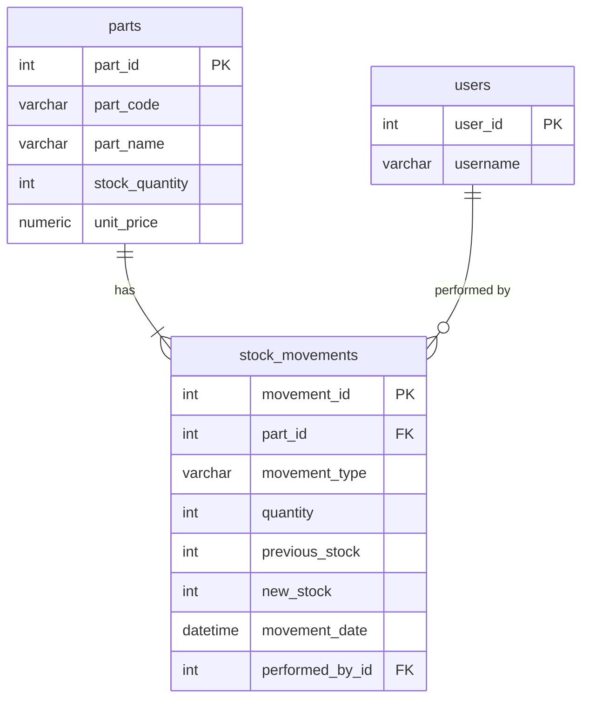
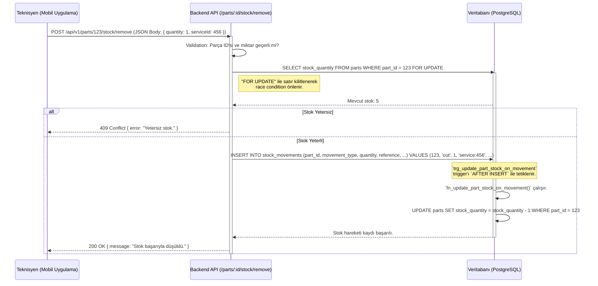

# Parts (Stok) Modülü Teknik Kılavuzu

**Sürüm:** 2.0.0
**Son Güncelleme:** 12 Kasım 2025

## 🎯 1. Misyon ve Genel Bakış

### 1.1. Modül Kimliği

- **Modül Adı:** Parts / Inventory (Yedek Parça / Stok)
- **Sorumlu Ekip:** Backend Ekibi, Frontend Ekibi
- **Ana Sorumluluğu:** Şirketin tüm yedek parçalarının ve sarf malzemelerinin kaydını tutmak, stok seviyelerini yönetmek, maliyetlerini izlemek ve stok hareketlerinin denetimini sağlamak.

### 1.2. Stratejik Rolü

Bu modül, saha operasyonlarının (Services) ve finansal süreçlerin (Finance) temelini oluşturur. Servislerin doğru ve zamanında tamamlanabilmesi için gerekli olan parçaların mevcudiyetini garanti eder. Envanterin değerini ve döngüsünü yöneterek şirketin maliyet kontrolüne katkıda bulunur.

### 1.3. Diğer Modüllerle Entegrasyonları

- **Services:** Servislerde kullanılan parçalar bu modülden çekilir ve stoktan düşülür.
- **Finance:** Parça alımları gider olarak kaydedilir; kullanılan parçaların maliyeti karlılık hesaplamaları için veri sağlar.
- **Reports:** Stok devir hızı, en çok kullanılan parçalar, kritik stok seviyesi uyarıları gibi raporları besler.

---

## 🗄️ 2. Veritabanı Mimarisi

Bu modül, `parts` (parçalar) ve `stock_movements` (stok hareketleri) olmak üzere iki ana tablo üzerine kuruludur. Bu yapı, veri bütünlüğünü ve performansını sağlamak için index'ler ve trigger'lar ile desteklenmiştir.

### 2.1. Tablo Yapıları

#### `public.parts`
Parçaların ana bilgilerini, stok ve fiyat durumlarını tutar.

```sql
CREATE TABLE public.parts (
    part_id SERIAL PRIMARY KEY,
    part_code VARCHAR(100) UNIQUE NOT NULL,
    part_name VARCHAR(255) NOT NULL,
    category VARCHAR(100) NOT NULL,
    description TEXT,
    brand VARCHAR(100),
    model VARCHAR(100),
    barcode VARCHAR(100) UNIQUE,
    stock_quantity INT NOT NULL DEFAULT 0 CHECK (stock_quantity >= 0),
    min_stock_level INT NOT NULL DEFAULT 10 CHECK (min_stock_level >= 0),
    reorder_level INT NOT NULL DEFAULT 20 CHECK (reorder_level >= 0),
    unit_price NUMERIC(10, 2) NOT NULL CHECK (unit_price >= 0),
    cost_price NUMERIC(10, 2) NOT NULL DEFAULT 0 CHECK (cost_price >= 0),
    unit VARCHAR(50) NOT NULL DEFAULT 'adet',
    shelf_location VARCHAR(100),
    warehouse VARCHAR(100) NOT NULL DEFAULT 'Ana Depo',
    supplier VARCHAR(255),
    supplier_phone VARCHAR(50),
    lead_time_days INT,
    total_used INT DEFAULT 0,
    last_used_date TIMESTAMPTZ,
    last_restocked_date TIMESTAMPTZ,
    is_active BOOLEAN DEFAULT TRUE,
    notes TEXT,
    created_at TIMESTAMPTZ DEFAULT CURRENT_TIMESTAMP,
    updated_at TIMESTAMPTZ DEFAULT CURRENT_TIMESTAMP,
    deleted_at TIMESTAMPTZ
);
```

#### `public.stock_movements`
Her bir stok hareketini (giriş, çıkış, sayım düzeltme) bir işlem kaydı olarak tutan denetim (audit) tablosudur.

```sql
CREATE TABLE public.stock_movements (
    movement_id SERIAL PRIMARY KEY,
    part_id INT NOT NULL REFERENCES public.parts(part_id),
    movement_type VARCHAR(50) NOT NULL CHECK (movement_type IN ('in', 'out', 'adjustment')),
    quantity INT NOT NULL CHECK (quantity > 0),
    previous_stock INT NOT NULL,
    new_stock INT NOT NULL,
    reference VARCHAR(255),
    reference_type VARCHAR(100),
    notes TEXT,
    movement_date TIMESTAMPTZ NOT NULL DEFAULT CURRENT_TIMESTAMP,
    performed_by_id INT REFERENCES public.users(user_id),
    created_at TIMESTAMPTZ DEFAULT CURRENT_TIMESTAMP,
    updated_at TIMESTAMPTZ DEFAULT CURRENT_TIMESTAMP
);
```

### 2.2. Indexler (Performans Optimizasyonu)

```sql
-- Parça adı ve koduna göre hızlı arama ve filtreleme için.
CREATE INDEX idx_parts_name_code ON public.parts (part_name, part_code);

-- Barkod ile hızlı parça bulma için.
CREATE UNIQUE INDEX idx_parts_barcode ON public.parts (barcode) WHERE barcode IS NOT NULL;

-- Kategoriye göre filtreleme için.
CREATE INDEX idx_parts_category ON public.parts (category);

-- Stok hareketlerini parçaya göre hızla listelemek için.
CREATE INDEX idx_stock_movements_part_id ON public.stock_movements (part_id);

-- Stok hareketlerini tipe ve tarihe göre filtrelemek için.
CREATE INDEX idx_stock_movements_type_date ON public.stock_movements (movement_type, movement_date);
```

### 2.3. Trigger'lar (Veri Bütünlüğü ve Otomasyon)

#### 1. `updated_at` Zaman Damgasını Otomatik Güncelleme
Bu standart trigger, bir kayıt her güncellendiğinde `updated_at` alanını otomatik olarak doldurur.

```sql
CREATE OR REPLACE FUNCTION fn_update_updated_at() RETURNS TRIGGER AS $$
BEGIN
    NEW.updated_at = NOW();
    RETURN NEW;
END;
$$ LANGUAGE plpgsql;

-- Parts tablosu için
CREATE TRIGGER trg_parts_update_at
BEFORE UPDATE ON public.parts FOR EACH ROW EXECUTE FUNCTION fn_update_updated_at();

-- Stock Movements tablosu için
CREATE TRIGGER trg_stock_movements_update_at
BEFORE UPDATE ON public.stock_movements FOR EACH ROW EXECUTE FUNCTION fn_update_updated_at();
```

#### 2. Stok Miktarını Otomatik Güncelleme

Bu trigger, `stock_movements` tablosuna bir kayıt eklendiğinde, güncellendiğinde veya silindiğinde, ilişkili `parts` tablosundaki `stock_quantity` alanını otomatik olarak günceller. Bu, envanterin her zaman doğru olmasını sağlar.

```sql
-- 1. Trigger Fonksiyonunu Oluşturma
CREATE OR REPLACE FUNCTION fn_update_part_stock_on_movement()
RETURNS TRIGGER AS $$
BEGIN
    -- Yeni bir stok hareketi eklendiğinde
    IF (TG_OP = 'INSERT') THEN
        IF NEW.movement_type = 'in' THEN
            UPDATE public.parts SET stock_quantity = stock_quantity + NEW.quantity WHERE part_id = NEW.part_id;
        ELSIF NEW.movement_type = 'out' THEN
            UPDATE public.parts SET stock_quantity = stock_quantity - NEW.quantity WHERE part_id = NEW.part_id;
        ELSIF NEW.movement_type = 'adjustment' THEN
            -- Adjustment için new_stock zaten doğru miktarı içerir, farkı hesapla
            UPDATE public.parts SET stock_quantity = NEW.new_stock WHERE part_id = NEW.part_id;
        END IF;
    -- Bir stok hareketi güncellendiğinde
    ELSIF (TG_OP = 'UPDATE') THEN
        -- Önceki hareketin etkisini geri al
        IF OLD.movement_type = 'in' THEN
            UPDATE public.parts SET stock_quantity = stock_quantity - OLD.quantity WHERE part_id = OLD.part_id;
        ELSIF OLD.movement_type = 'out' THEN
            UPDATE public.parts SET stock_quantity = stock_quantity + OLD.quantity WHERE part_id = OLD.part_id;
        ELSIF OLD.movement_type = 'adjustment' THEN
            -- Adjustment için önceki new_stock değerini geri al
            UPDATE public.parts SET stock_quantity = OLD.previous_stock WHERE part_id = OLD.part_id;
        END IF;

        -- Yeni hareketin etkisini uygula
        IF NEW.movement_type = 'in' THEN
            UPDATE public.parts SET stock_quantity = stock_quantity + NEW.quantity WHERE part_id = NEW.part_id;
        ELSIF NEW.movement_type = 'out' THEN
            UPDATE public.parts SET stock_quantity = stock_quantity - NEW.quantity WHERE part_id = NEW.part_id;
        ELSIF NEW.movement_type = 'adjustment' THEN
            UPDATE public.parts SET stock_quantity = NEW.new_stock WHERE part_id = NEW.part_id;
        END IF;
    -- Bir stok hareketi silindiğinde
    ELSIF (TG_OP = 'DELETE') THEN
        IF OLD.movement_type = 'in' THEN
            UPDATE public.parts SET stock_quantity = stock_quantity - OLD.quantity WHERE part_id = OLD.part_id;
        ELSIF OLD.movement_type = 'out' THEN
            UPDATE public.parts SET stock_quantity = stock_quantity + OLD.quantity WHERE part_id = OLD.part_id;
        ELSIF OLD.movement_type = 'adjustment' THEN
            UPDATE public.parts SET stock_quantity = OLD.previous_stock WHERE part_id = OLD.part_id;
        END IF;
    END IF;
    RETURN NULL;
END;
$$ LANGUAGE plpgsql;

-- 2. Trigger'ı stock_movements Tablosuna Bağlama
CREATE TRIGGER trg_update_part_stock_on_movement
AFTER INSERT OR UPDATE OR DELETE ON public.stock_movements
FOR EACH ROW
EXECUTE FUNCTION fn_update_part_stock_on_movement();
```

### 2.4. İlişki Diyagramı (ERD - Mermaid)



---

## 🧬 3. Veri Akış Şeması

### 3.1. Serviste Parça Kullanımı (Stok Düşme) Süreci

Bu şema, bir teknisyenin servis sırasında bir yedek parça kullandığında stoktan düşme işleminin nasıl gerçekleştiğini gösterir.



---

## ⚙️ 4. Backend API Endpoint'leri (Detaylı)

**Base URL:** `/api/v1/parts`

---

### 4.1. Parçaları Listele ve Ara

- **METHOD:** `GET`
- **URL:** `/`
- **Handler Function:** `getAllParts` - `/backend/controllers/partController.js:30`
- **Açıklama:** Parçaları arama, filtreleme ve sayfalama özellikleriyle listeler.

#### Request Detayları
- **Query Parameters:**
  ```javascript
  {
    "search": "string - Parça adı veya kodunda arama yapar.",
    "category": "string - Kategoriye göre filtreler.",
    "page": "integer",
    "limit": "integer"
  }
  ```

#### Gerçek SQL Sorgusu (`PartService.findAll`)
```sql
SELECT
    part_id,
    part_code,
    part_name,
    category,
    stock_quantity,
    unit_price
FROM public.parts
WHERE
    is_active = TRUE
    AND (
        part_name ILIKE $1 OR
        part_code ILIKE $1
    )
ORDER BY part_name
LIMIT $2 OFFSET $3;
-- Parametreler: ['%filtre%', 20, 0]
```

---

### 4.2. Stok Girişi Yap

- **METHOD:** `POST`
- **URL:** `/:id/stock/add`
- **Handler Function:** `addStock` - `/backend/controllers/partController.js:150`
- **Açıklama:** Bir parçaya stok girişi yapar. Bu işlem, bir `stock_movements` kaydı oluşturur ve veritabanı trigger'ı aracılığıyla ana parça tablosundaki miktarı günceller.

#### Request Detayları
- **URL Parameters:** `{ "id": "integer - Parça ID'si" }`
- **Request Body:**
  ```javascript
  {
    "quantity": "integer - Eklenen stok miktarı - Zorunlu",
    "reference": "string - 'PO-12345' (Satın Alma Siparişi) gibi bir referans - Opsiyonel"
  }
  ```

#### Backend İşlem Akışı
```javascript
// /backend/controllers/partController.js:150-180
async function addStock(req, res) {
    try {
        const { id } = req.params;
        const { quantity, reference } = req.body;
        const performed_by_id = req.user.id;

        if (!quantity || quantity <= 0) {
            return res.status(400).json({ error: "Geçerli bir miktar girin." });
        }

        // Stok hareketini oluştur. Trigger gerisini halleder.
        const movement = await PartService.createStockMovement({
            part_id: id,
            movement_type: 'in',
            quantity,
            reference,
            performed_by_id
        });

        res.status(200).json({ success: true, data: movement });
    } catch (error) {
        res.status(500).json({ success: false, error: 'Server Error' });
    }
}
```

---

### 4.3. Kritik Stok Seviyesi Uyarısı

- **METHOD:** `GET`
- **URL:** `/critical`
- **Handler Function:** `getCriticalStock` - `/backend/controllers/partController.js:250`
- **Açıklama:** Stok miktarı, tanımlanmış minimum stok seviyesinin (`min_stock_level`) altına düşmüş olan tüm parçaları listeler. Bu endpoint, dashboard'da uyarı göstermek için kullanılır.

#### Gerçek SQL Sorgusu (`PartService.findCritical`)
```sql
SELECT
    part_id,
    part_code,
    part_name,
    stock_quantity,
    min_stock_level
FROM public.parts
WHERE
    is_active = TRUE
    AND stock_quantity < min_stock_level
ORDER BY (min_stock_level - stock_quantity) DESC;
```

#### Response Formatı (200 OK)
```json
{
  "success": true,
  "data": [
    {
      "part_id": 45,
      "part_code": "FLT-002",
      "part_name": "Su Filtresi Tip B",
      "stock_quantity": 8,
      "min_stock_level": 10
    }
  ]
}
```

---

## 🖥️ 5. Frontend Mimarisi (Kod Seviyesinde)

- **Dosya:** `/frontend/js/inventory.js`
- **URL:** `/inventory.html`

#### HTML Yapısı (Anahtar Elementler)
```html
<!-- /frontend/pages/inventory.html -->
<div id="critical-stock-alert" class="alert alert-danger" style="display:none;"></div>
<input type="text" id="part-search-input" placeholder="Parça ara...">
<table id="parts-table">
  <!-- Parça satırları, her satırda "Stok Ekle" butonu -->
</table>

<!-- Stok Ekleme Modalı -->
<div id="add-stock-modal" class="modal">
  <form id="add-stock-form">
    <input type="hidden" id="part-id-for-stock">
    <h4 id="part-name-in-modal"></h4>
    <input type="number" id="stock-quantity-to-add" required min="1">
    <button type="submit">Stoğa Ekle</button>
  </form>
</div>
```

#### JavaScript Fonksiyonları (Detaylı)
```javascript
// /frontend/js/inventory.js

// FUNCTION: loadParts(search) - Satır: 30-60
async function loadParts(search = '') {
    const response = await fetch(`/api/v1/parts?search=${search}`);
    // ... tabloyu render et ...
}

// FUNCTION: checkCriticalStock() - Satır: 65-85
// AMAÇ: Kritik stoktaki parçaları kontrol eder ve uyarı gösterir.
async function checkCriticalStock() {
    const response = await fetch('/api/v1/parts/critical');
    const result = await response.json();
    const alertBox = document.getElementById('critical-stock-alert');
    
    if (result.success && result.data.length > 0) {
        alertBox.innerHTML = `${result.data.length} parça kritik stok seviyesinin altında!`;
        alertBox.style.display = 'block';
    } else {
        alertBox.style.display = 'none';
    }
}

// FUNCTION: handleAddStockSubmit(event) - Satır: 120-150
async function handleAddStockSubmit(event) {
    event.preventDefault();
    const partId = document.getElementById('part-id-for-stock').value;
    const quantity = document.getElementById('stock-quantity-to-add').value;

    const response = await fetch(`/api/v1/parts/${partId}/stock/add`, {
        method: 'POST',
        headers: { 'Content-Type': 'application/json', 'Authorization': `Bearer ${getToken()}` },
        body: JSON.stringify({ quantity: parseInt(quantity) })
    });

    if (response.ok) {
        closeModal();
        loadParts(); // Listeyi yenile
        checkCriticalStock(); // Uyarıları güncelle
        showSuccess("Stok eklendi!");
    } else {
        showError("Stok eklenemedi.");
    }
}
```

#### Event Listener'lar
```javascript
// /frontend/js/app.js: 80
document.addEventListener('DOMContentLoaded', () => {
    loadParts();
    checkCriticalStock(); // Sayfa yüklendiğinde kritik stok kontrolü yap
});

document.getElementById('add-stock-form').addEventListener('submit', handleAddStockSubmit);
```

---

## 🔎 6. GERÇEK KULLANIM SENARYOSU (E2E)

### Senaryo: Stok Girişi Yapma ve Stok Miktarının Otomatik Güncellenmesi

**Amaç:** Tedarikçiden gelen yeni bir parçanın stoğa eklenmesi ve bu işlemin hem `stock_movements` hem de `parts` tablolarına doğru yansıması.
**Ön Koşullar:** "Su Pompası" (ID: 78) adlı parçanın mevcut stoğu 15.

| Adım | Aksiyon | Sistem Tepkisi (Kod ve Açıklama) |
|---|---|---|
| 1 | **Kullanıcı:** Envanter listesinde "Su Pompası" satırındaki "Stok Ekle" butonuna tıklar. | `openAddStockModal(78, 'Su Pompası')` fonksiyonu çağrılır. Modal açılır. |
| 2 | **Kullanıcı:** Miktar olarak "50" girer ve "Stoğa Ekle" butonuna basar. | `add-stock-form` üzerinde `submit` event'i tetiklenir. `handleAddStockSubmit()` çalışır. |
| 3 | **Frontend:** `POST /api/v1/parts/78/stock/add` isteği gönderilir. | `fetch` API'si ile istek atılır. |
| 4 | **Request Payload:** | ```json { "quantity": 50 } ``` |
| 5 | **Backend:** `addStock` controller fonksiyonu tetiklenir. | `PartService.createStockMovement()` çağrılır. |
| 6 | **Backend (Service):** `stock_movements` için kayıt hazırlanır. | `part_id: 78`, `movement_type: 'in'`, `quantity: 50`, `previous_stock: 15`, `new_stock: 65`. |
| 7 | **Database:** `INSERT INTO stock_movements` sorgusu çalışır. | Yeni stok hareketi kaydı oluşturulur. |
| 8 | **Database:** `trg_update_part_stock_on_movement` trigger'ı `AFTER INSERT` ile tetiklenir. | `fn_update_part_stock_on_movement()` fonksiyonu çalışır. `TG_OP` değeri `'INSERT'`'dir. |
| 9 | **Database (Trigger içi):** | `IF NEW.movement_type = 'in'` bloğu çalışır. `UPDATE public.parts SET stock_quantity = stock_quantity + 50 WHERE part_id = 78;` sorgusu çalışır. |
| 10 | **Database:** `parts` tablosundaki `stock_quantity` alanı 15'ten 65'e güncellenir. | İşlem tamamlanır. |
| 11 | **Backend:** Başarılı response döner. | `res.status(200).json({ success: true, ... })` |
| 12 | **Frontend:** `response.ok` true döner. | `closeModal()` ve `showSuccess()` çağrılır. |
| 13 | **Frontend:** Liste ve uyarılar yenilenir. | `loadParts()` ve `checkCriticalStock()` çağrılır. "Su Pompası"nın stoğu artık 65 olarak görünür. |

---

## 🛡️ 7. Güvenlik Notları

Bu bölüm, Stok modülünün güvenliğini sağlamak için alınan önlemleri ve potansiyel riskleri ele alır.

### 7.1. Giriş Doğrulama (Input Validation)

- **Backend:**
    - `addStock` ve `removeStock` gibi stok miktarını değiştiren endpoint'lerde, `quantity` parametresinin her zaman pozitif bir tamsayı olduğu sunucu tarafında doğrulanmalıdır. Negatif bir değer gönderilerek stok artırma/azaltma mantığının tersine çevrilmesi engellenmelidir.
    - `getAllParts` endpoint'indeki `search`, `category` gibi filtreleme parametreleri, beklenmedik karakterler veya SQL enjeksiyonu denemeleri içermemesi için sanitize edilmelidir.

### 7.2. SQL Enjeksiyonu Koruması

- **Durum:** Kılavuzdaki `PartService.findAll` sorgu örneği, `ILIKE $1` gibi parametreli sorgu kullanmaktadır. Bu, SQL enjeksiyonuna karşı temel korumayı sağlar.
- **Önlem:** Tüm veritabanı sorgularında, özellikle kullanıcı girdisi içeren `WHERE`, `ORDER BY` ve `OFFSET` gibi kısımlarda, mutlaka parametreli sorgular (prepared statements) kullanılmalıdır. Dinamik olarak sorgu string'i birleştirmekten kaçınılmalıdır.

### 7.3. Çapraz Site Komut Dosyası Çalıştırma (XSS - Cross-Site Scripting) Koruması

- **Risk:** Parça açıklaması (`description`) veya notlar (`notes`) gibi alanlara kullanıcı tarafından girilen veriler, kötü niyetli script'ler içerebilir. Bu veriler arayüzde gösterildiğinde XSS saldırılarına yol açabilir.
- **Önlem:** Frontend'de, bu gibi metin alanlarından gelen veriler DOM'a yazdırılmadan önce mutlaka "escape" işleminden geçirilmelidir (HTML varlıklarına dönüştürülmelidir).

### 7.4. Hız Sınırlama (Rate Limiting)

- **Risk:** Bir saldırgan, `addStock` veya `removeStock` endpoint'lerine kısa sürede çok sayıda istek göndererek stok verilerini bozabilir veya sistemde aşırı yük yaratabilir.
- **Önlem:** Stok miktarını değiştiren tüm `POST` ve `PUT` endpoint'lerine, kullanıcı veya IP bazlı hız sınırlama (rate limiting) uygulanmalıdır.

### 7.5. Çapraz Site İstek Sahteciliği (CSRF - Cross-Site Request Forgery) Koruması

- **Risk:** Oturum açmış bir depo yöneticisi, farkında olmadan kötü niyetli bir siteyi ziyaret ettiğinde, o site arka planda `/api/v1/parts/123/stock/add` gibi bir istek göndererek istenmeyen bir stok hareketi başlatabilir.
- **Önlem:** Stok durumunu değiştiren tüm `POST`, `PUT`, `DELETE` endpoint'leri, CSRF token'ları ile korunmalıdır.

### 7.6. Yetkilendirme (Authorization)

- **Risk:** Yetkisiz bir kullanıcının (örn: bir teknisyen) stok girişi yapması, parça maliyetlerini görmesi veya stok sayımını değiştirmesi.
- **Önlem:**
    - **Endpoint Seviyesi:** Stok ekleme (`addStock`), parça silme veya maliyet bilgilerini görme gibi işlemler, sadece `warehouse_manager` veya `admin` gibi belirli rollere sahip kullanıcılara izin veren bir RBAC (Role-Based Access Control) middleware'i ile korunmalıdır.
    - **Veri Seviyesi:** Eğer sistem birden fazla depo (`warehouse`) içeriyorsa, bir depo yöneticisinin sadece kendi deposundaki parçaları yönetebilmesi sağlanmalıdır.

### 7.7. Veri Bütünlüğü ve Race Conditions

- **Risk:** İki farklı işlem (örn: iki ayrı servis emri), stokta sadece 1 adet kalan son parçayı aynı anda kullanmaya çalışırsa, stok miktarı negatif değerlere düşebilir (race condition).
- **Önlem:** Stok düşme işlemi gibi kritik operasyonlarda, veritabanı seviyesinde kilitleme mekanizması kullanılmalıdır. `SELECT ... FOR UPDATE` sorgusu, bir işlem stok miktarını okuduğunda o satırı diğer işlemlerin değiştirmesini engeller. Veri akış şemasında bu önlemin alındığı belirtilmiştir. Bu, veri bütünlüğünü garanti altına alan en önemli adımlardan biridir.

---

## 🚨 8. Sorun Giderme (Troubleshooting)

### Hata: Negatif Stok Sorunu (`stock_quantity` < 0)

- **Semptomlar:** Bir parçanın stok miktarı eksi değerli görünür. Bu durum, `CHECK (stock_quantity >= 0)` constraint'i olmayan eski veritabanı versiyonlarında veya hatalı manuel güncellemelerde ortaya çıkabilir.

- **Olası Nedenler:**
  1.  **Race Condition:** İki farklı servis işlemi, stokta sadece 1 adet kalan son parçayı aynı anda kullanmaya çalışırsa ve backend'de satır kilitleme (`SELECT ... FOR UPDATE`) mekanizması yoksa, stok eksiye düşebilir. (Bkz. Güvenlik Notları 7.7)
  2.  **Hatalı Stok Düşme:** Bir servis iptal edildiğinde, kullanılan parçanın stoğa geri eklenmemesi.
  3.  **Hatalı Manuel Müdahale:** Veritabanına doğrudan yapılan `UPDATE` sorgusunda yanlış bir değer girilmesi.

- **Debug Adımları:**
  1.  **Stok Hareketlerini İncele:** Negatif stoğa sahip parçanın tüm hareket geçmişini `stock_movements` tablosundan çekerek analiz edin.
      ```sql
      SELECT
          movement_date,
          movement_type,
          quantity,
          previous_stock,
          new_stock,
          reference
      FROM public.stock_movements
      WHERE part_id = [Sorunlu_Parça_ID]
      ORDER BY movement_date DESC;
      ```
  2.  **Mantıksal Tutarlılığı Kontrol Et:** Yukarıdaki sorgunun sonucunda, her satır için `previous_stock` değerinin, bir önceki satırın `new_stock` değerine eşit olup olmadığını kontrol edin. Arada bir kopukluk varsa, bu manuel bir müdahaleye veya hatalı bir işleme işaret eder.
  3.  **Referansları Takip Et:** `reference` sütunundaki bilgilere (örn: `service:456`) bakarak, stok düşüşüne neden olan servis kaydını bulun ve o servisin durumunu (iptal mi, tamamlandı mı) kontrol edin.

- **Çözüm:**
  - **Acil Düzeltme:** Fiziksel sayım yaparak parçanın gerçek stok miktarını belirleyin. Ardından, `stock_movements` tablosuna `adjustment` (düzeltme) tipinde yeni bir kayıt ekleyerek veritabanındaki stok miktarını doğru değere getirin.
    ```javascript
    // Backend'de bir "adjustStock" endpoint'i olmalı
    // POST /api/v1/parts/78/stock/adjust
    // Body: { "actual_quantity": 10 }
    ```
  - **Kalıcı Çözüm:** Stok düşme işlemlerinin yapıldığı tüm kod bloklarında (örn: `removeStock` servisi), işlem öncesinde `SELECT ... FOR UPDATE` kullanarak ilgili parça satırının kilitlendiğinden emin olun. Bu, race condition'ları engeller.
---

## 🧪 9. Test Senaryoları

### 9.1. Veritabanı Trigger Testi (`fn_update_part_stock_on_movement`)

Bu test, `stock_movements` tablosuna kayıt eklendiğinde `parts` tablosundaki `stock_quantity` alanının doğru güncellendiğini doğrular.

- **Test Senaryosu 1: Stok Girişi**
  - **Hazırlık:** `parts` tablosunda `stock_quantity`'si 50 olan bir parça (ID: 101) oluştur.
  - **Aksiyon:** `stock_movements` tablosuna `part_id: 101`, `movement_type: 'in'`, `quantity: 25` olan bir kayıt `INSERT` et.
  - **Beklenti:** `trg_update_part_stock_on_movement` trigger'ı çalışmalı ve `parts` tablosundaki 101 ID'li parçanın `stock_quantity`'si 75 olmalıdır.

- **Test Senaryosu 2: Stok Çıkışı**
  - **Hazırlık:** `parts` tablosunda `stock_quantity`'si 75 olan bir parça (ID: 101) mevcut.
  - **Aksiyon:** `stock_movements` tablosuna `part_id: 101`, `movement_type: 'out'`, `quantity: 10` olan bir kayıt `INSERT` et.
  - **Beklenti:** Trigger çalışmalı ve parçanın `stock_quantity`'si 65'e düşmelidir.

### 9.2. Integration Testi (`POST /:id/stock/add`)

**Amaç:** Stok ekleme endpoint'inin, hem stok hareketini doğru oluşturduğunu hem de trigger aracılığıyla parça stoğunu güncellediğini test etmek.

```javascript
// /backend/test/integration/parts.api.test.js
const request = require('supertest');
const app = require('../../src/app');
const db = require('../../src/db');

describe('POST /api/v1/parts/:id/stock/add', () => {
    let partId;

    beforeAll(async () => {
        // Hazırlık: Stoğu 20 olan bir parça oluştur
        const res = await db.query("INSERT INTO parts (..., stock_quantity) VALUES (..., 20) RETURNING part_id");
        partId = res.rows[0].part_id;
    });

    it('should add stock and update the part quantity correctly', async () => {
        // 1. 30 adet stok ekle
        const response = await request(app)
            .post(`/api/v1/parts/${partId}/stock/add`)
            .set('Authorization', `Bearer ${WAREHOUSE_MANAGER_TOKEN}`)
            .send({ quantity: 30 });

        expect(response.statusCode).toBe(200);
        expect(response.body.data.movement_type).toBe('in');
        expect(response.body.data.quantity).toBe(30);

        // 2. Parçanın stoğunu veritabanından kontrol et
        const partRes = await db.query('SELECT stock_quantity FROM parts WHERE part_id = $1', [partId]);
        const updatedPart = partRes.rows[0];

        expect(updatedPart.stock_quantity).toBe(50); // 20 + 30 = 50
    });
});
```

### 9.3. E2E Testi (Stok Ekleme)

**Amaç:** Kullanıcının arayüzden bir parçaya stok ekleme sürecini test etmek.

```javascript
// /frontend/cypress/e2e/inventory.cy.js
describe('Stock Management', () => {
    it('should allow a user to add stock to a part', () => {
        cy.login('warehouse_manager', 'password');
        cy.visit('/inventory');

        // 1. Stoğu 50 olan bir parça satırını bul ve "Stok Ekle" butonuna tıkla
        cy.contains('tr', 'Su Pompası').within(() => {
            cy.contains('td', '50'); // Mevcut stoğu doğrula
            cy.get('.btn-add-stock').click();
        });

        // 2. Modal'ı doldur
        cy.get('#add-stock-modal').should('be.visible');
        cy.get('#stock-quantity-to-add').type('25');

        cy.intercept('POST', '/api/v1/parts/**/stock/add').as('addStock');

        // 3. Formu gönder
        cy.get('#add-stock-form').submit();

        // 4. API isteğini bekle
        cy.wait('@addStock').its('response.statusCode').should('eq', 200);

        // 5. Tablodaki stok miktarının güncellendiğini doğrula
        cy.contains('tr', 'Su Pompası').find('td').contains('75').should('be.visible');
    });
});
```
---

## 🗺️ 10. Fonksiyon Bağlantı Haritası

Bu bölüm, modül içindeki ana fonksiyonların birbirleriyle olan ilişkisini ve çağrı hiyerarşisini gösterir.

### 10.1. Frontend Çağrı Grafiği (Call Graph)

```
KULLANICI ETKİLEŞİMİ
│
├─ event: DOMContentLoaded (app.js)
│  ├─ loadParts() (inventory.js)
│  │  └─ fetch('/api/v1/parts')
│  └─ checkCriticalStock() (inventory.js)
│     └─ fetch('/api/v1/parts/critical')
│
├─ event: input (part-search-input)
│  └─ (debounce) -> loadParts(searchValue)
│     └─ (Yukarıdaki `loadParts` akışını tetikler)
│
└─ event: submit (add-stock-form)
   └─ handleAddStockSubmit(event) (inventory.js)
      ├─ fetch('/api/v1/parts/:id/stock/add')
      ├─ closeModal() (ui.js)
      ├─ loadParts() (inventory.js)
      ├─ checkCriticalStock() (inventory.js)
      ├─ showSuccess(message) (ui.js)
      └─ showError(message) (ui.js)
```

### 10.2. Backend Çağrı Grafiği (Call Graph)

```
API İSTEĞİ (Request)
│
├─ GET /api/v1/parts
│  └─ Controller: getAllParts(req, res) (partController.js)
│     └─ Service: PartService.findAll(filters) (partService.js)
│        └─ Veritabanı: SELECT ... FROM public.parts ...
│
├─ GET /api/v1/parts/critical
│  └─ Controller: getCriticalStock(req, res) (partController.js)
│     └─ Service: PartService.findCritical() (partService.js)
│        └─ Veritabanı: SELECT ... FROM public.parts WHERE stock_quantity < min_stock_level ...
│
└─ POST /api/v1/parts/:id/stock/add
   └─ Controller: addStock(req, res) (partController.js)
      └─ Service: PartService.createStockMovement(data) (partService.js)
         └─ Veritabanı: INSERT INTO public.stock_movements ...
            └─ TRIGGER: trg_update_part_stock_on_movement
               └─ FUNCTION: fn_update_part_stock_on_movement()
                  └─ Veritabanı: UPDATE public.parts SET stock_quantity = ...
```
