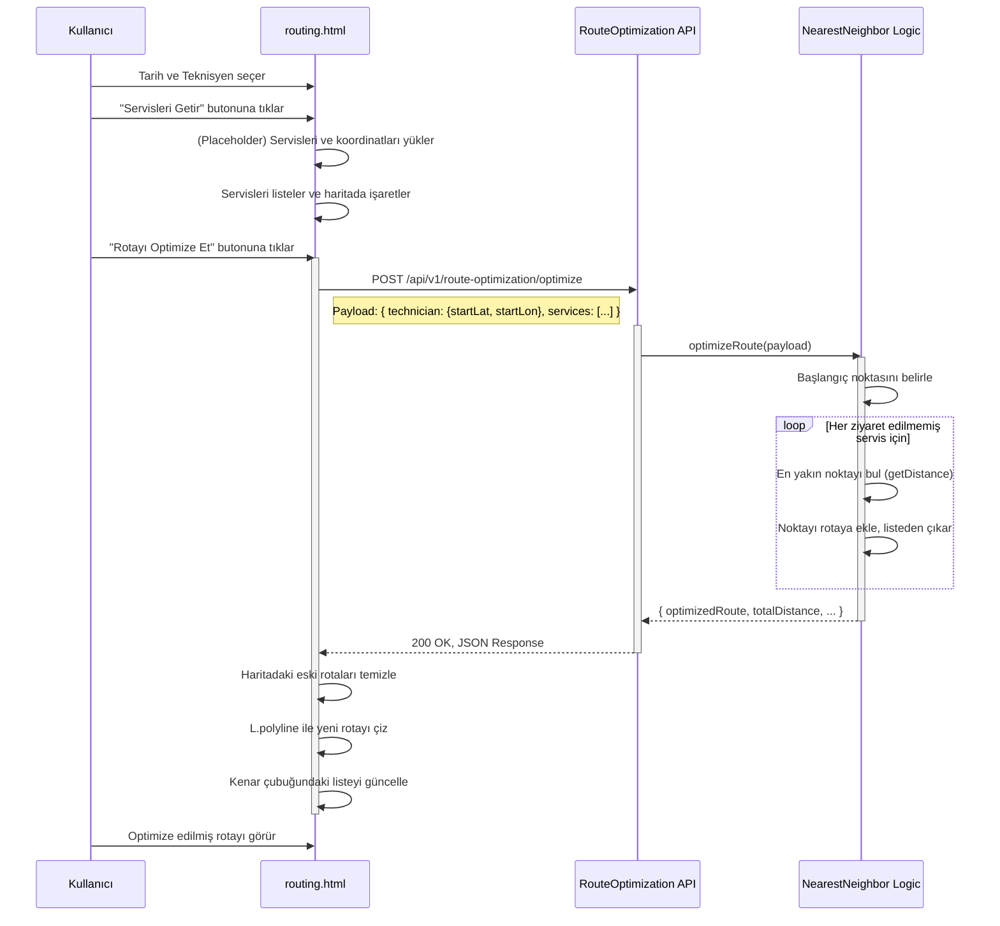

# Rota Optimizasyonu (Route Optimization) Modülü Teknik Kılavuzu

**Sürüm:** 1.0.0
**Son Güncelleme:** 12 Kasım 2025

## 🎯 1. Misyon ve Genel Bakış

### 1.1. Modül Kimliği

- **Modül Adı:** Rota Optimizasyonu (Route Optimization)
- **Sorumlu Ekip:** Backend Ekibi, Altyapı Ekibi
- **Ana Sorumluluk:** Belirli bir teknisyenin, seçilen bir gündeki servis ziyaretlerini, toplam mesafeyi ve süreyi en aza indirecek şekilde sıralayarak en verimli rotayı oluşturmak.

### 1.2. Stratejik Rolü

Bu modül, saha operasyonlarının verimliliğini doğrudan etkileyen kritik bir bileşendir. Manuel rota planlamanın getirdiği zaman kaybını, yakıt israfını ve insan hatasını ortadan kaldırır. Teknisyenlerin güzergahlarını optimize ederek daha fazla servise zaman ayırmalarını, yakıt maliyetlerini düşürmeyi ve müşteri bekleme sürelerini kısaltmayı hedefler. AI destekli planlama ile operasyonel mükemmelliğe zemin hazırlar.

### 1.3. Diğer Modüllerle Entegrasyonları

- **Services/Appointments:** Optimize edilecek servislerin ve randevuların adres ve zaman bilgilerini bu modüllerden alır.
- **Technicians:** Teknisyenlerin başlangıç konumlarını ve uygunluk durumlarını bu modülden alır.
- **Customers:** Servis adreslerinin doğrulanması ve koordinatlarının alınması için müşteri verilerini kullanır.
- **Dashboard:** Optimize edilen rotaların özet istatistiklerini (toplam mesafe, tasarruf edilen süre vb.) anlık olarak gösterebilir.

---

## 🗄️ 2. Veritabanı Mimarisi

Bu modül doğrudan kendine ait bir tabloya sahip değildir. Bunun yerine, mevcut operasyonel tablolardan veri okuyarak çalışır.

### 2.1. Veri Kaynağı Olan Tablolar

- **`public.services` / `public.appointments`:** Rota planlaması için temel veri kaynağıdır. Servisin adresi (`address`, `lat`, `lon`), planlanan tarihi (`scheduled_date`) ve atanan teknisyen (`technician_id`) bilgilerini içerir.
- **`public.users` / `public.technicians`:** Teknisyenlerin başlangıç konumlarını (örneğin, `start_lat`, `start_lon`) ve günlük çalışma saatlerini içerir.
- **`public.customers`:** Servis adreslerinin eksik olduğu durumlarda, müşterinin ana adres bilgilerine başvurmak için kullanılır.

### 2.2. Örnek Veri Akışı (Okuma Odaklı)

Rota optimizasyonu istendiğinde, sistem aşağıdaki gibi bir veri toplama süreci işletir:

```sql
-- 1. Belirli bir teknisyen ve tarih için planlanmış servisleri çek
-- (NOT: Bu sorgu, optimizasyon öncesi servis listesini almak için kullanılır)
SELECT
    s.service_id,
    s.scheduled_date,
    s.address,
    c.lat, -- Müşterinin enlem bilgisi
    c.lon  -- Müşterinin boylam bilgisi
FROM
    public.services s
JOIN
    public.customers c ON s.customer_id = c.customer_id
WHERE
    s.technician_id = $1 -- Örn: 1 (Ali Yılmaz)
    AND s.scheduled_date::date = $2 -- Örn: '2025-11-12'
    AND s.status = 'planned';

-- 2. Teknisyenin başlangıç konumunu çek
SELECT
    u.start_lat,
    u.start_lon
FROM
    public.users u
WHERE
    u.user_id = $1; -- Örn: 1 (Ali Yılmaz)
```
Bu veriler toplandıktan sonra, optimizasyon algoritmasına girdi olarak verilir. Modül, veritabanına yeni bir rota kaydı **yazmaz**, sadece sıralanmış servis listesini ve rota bilgilerini frontend'e döndürür.

---

## ⚙️ 3. Backend API Endpoint'leri

**Base URL:** `/api/v1/route-optimization`

### 3.1. Rotayı Optimize Et

- **METHOD:** `POST`
- **URL:** `/optimize`
- **Handler Function:** `optimizeRoute` - `backend/src/modules/route-optimization/route-optimization.controller.ts`
- **Açıklama:** Bir teknisyenin başlangıç konumu ve bir dizi servis noktasını alarak, en yakın komşu (Nearest Neighbor) algoritmasına göre optimize edilmiş bir rota sırası döndürür.

#### Request Detayları
- **Request Body:**
  ```json
  {
    "technician": {
      "startLat": "number - Teknisyenin başlangıç enlemi - Zorunlu",
      "startLon": "number - Teknisyenin başlangıç boylamı - Zorunlu"
    },
    "services": [
      {
        "id": "number - Servis ID'si - Zorunlu",
        "lat": "number - Servis adresi enlemi - Zorunlu",
        "lon": "number - Servis adresi boylamı - Zorunlu"
      }
    ]
  }
  ```

#### Backend İşlem Akışı
1.  **INPUT VALIDATION:** Gelen `technician` ve `services` objelerinin yapısı NestJS DTO'su (`OptimizeRouteDto`) tarafından doğrulanır.
2.  **BUSINESS LOGIC:** `RouteOptimizationService` içindeki `optimizeRoute` metodu çağrılır.
    -   Eğer servis listesi boşsa, boş bir rota döndürülür.
    -   Teknisyenin başlangıç konumu `startPoint` olarak ayarlanır.
    -   Ziyaret edilmemiş servisler (`unvisited`) listesi oluşturulur.
    -   `while` döngüsü içinde, mevcut noktaya en yakın olan ziyaret edilmemiş servis bulunur (`findNearest` metodu).
    -   En yakın servis rotaya eklenir, toplam mesafeye eklenir ve `unvisited` listesinden çıkarılır.
    -   Tüm servisler ziyaret edilene kadar döngü devam eder.
3.  **RESPONSE FORMATLAMA:**
    -   Sıralanmış servis listesi (`optimizedRoute`), toplam mesafe (`totalDistance`) ve tahmini süre (`totalTimeMinutes`) hesaplanır.
    -   Ortalama hız (40 km/s) ve servis başına standart süre (30 dk) kullanılarak basit bir zaman tahmini yapılır.
    -   Sonuçlar JSON formatında frontend'e döndürülür.

#### Test CURL Komutu
```bash
curl -X POST 'http://localhost:3002/api/v1/route-optimization/optimize' \
  -H 'Content-Type: application/json' \
  -d '{
    "technician": {
      "startLat": 41.05,
      "startLon": 29.00
    },
    "services": [
      { "id": 101, "lat": 41.043, "lon": 29.002 },
      { "id": 102, "lat": 40.991, "lon": 29.028 },
      { "id": 103, "lat": 41.063, "lon": 28.987 }
    ]
  }'
```

#### Response Formatları

**Success Response (200):**
```json
{
  "optimizedRoute": [
    {
      "order": 1,
      "serviceId": 101,
      "lat": 41.043,
      "lon": 29.002,
      "distanceKm": "0.79"
    },
    {
      "order": 2,
      "serviceId": 103,
      "lat": 41.063,
      "lon": 28.987,
      "distanceKm": "2.59"
    },
    {
      "order": 3,
      "serviceId": 102,
      "lat": 40.991,
      "lon": 29.028,
      "distanceKm": "9.04"
    }
  ],
  "totalDistance": "12.42",
  "totalTimeMinutes": "109",
  "summary": "Optimized route for 3 services. Total distance: 12.42 km. Estimated total time: 109 minutes."
}
```

---

## 🖥️ 4. Frontend Mimarisi (Kod Seviyesinde)

- **Dosya:** `desktop/routing.html`
- **URL:** `/routing.html`
- **Erişim:** Authenticated

#### HTML Yapısı (Anahtar Elementler)
```html
<!-- Ana Konteynerler -->
<div class="sidebar">...</div>
<div class="map-container">
    <div id="map"></div> <!-- Satır: 80 -->
</div>

<!-- Kontrol Paneli (Sidebar içinde) -->
<div class="controls">
    <input type="date" id="routeDate"> <!-- Satır: 88 -->
    <select id="technicianSelect">...</select> <!-- Satır: 92 -->
    <button id="fetchServicesBtn">...</button> <!-- Satır: 97 -->
    <button id="optimizeRouteBtn">...</button> <!-- Satır: 98 -->
</div>

<!-- Servis Listesi (Sidebar içinde) -->
<div class="service-list" id="serviceListContainer">...</div> <!-- Satır: 100 -->
```

#### JavaScript Fonksiyonları (Detaylı)
```javascript
// FUNCTION: DOMContentLoaded Event Listener - Satır: 108
// AMAÇ: Sayfa yüklendiğinde haritayı ve temel olay dinleyicilerini başlatır.
document.addEventListener('DOMContentLoaded', function () {
    // 1. Leaflet haritasını başlatır.
    const map = L.map('map').setView([41.0082, 28.9784], 10);
    L.tileLayer('https://{s}.tile.openstreetmap.org/{z}/{x}/{y}.png', ...).addTo(map);

    // 2. Butonlara olay dinleyicileri ekler.
    fetchBtn.addEventListener('click', fetchServicesAndDisplay);
    optimizeBtn.addEventListener('click', optimizeRouteAndDraw);
});

// FUNCTION: fetchServicesAndDisplay() - Satır: 134 (fetchBtn click event'i içinde)
// AMAÇ: Seçilen teknisyen ve tarih için servisleri (placeholder) getirir, listeler ve haritada işaretler.
async function fetchServicesAndDisplay() {
    // 1. Seçili teknisyen ve tarihi alır.
    // 2. Örnek servis verisini kullanır (normalde API çağrısı yapılır).
    // 3. Haritadaki eski marker'ları temizler.
    // 4. Servis listesini HTML olarak oluşturur ve `serviceListContainer` içine basar.
    // 5. Her servis için haritaya bir `L.marker` ekler.
    // 6. `map.fitBounds` ile haritayı tüm marker'ları içerecek şekilde ayarlar.
}

// FUNCTION: optimizeRouteAndDraw() - Satır: 180 (optimizeBtn click event'i içinde)
// AMAÇ: Seçili servisleri backend'e gönderir, optimize edilmiş rotayı alır ve haritaya çizer.
async function optimizeRouteAndDraw() {
    // 1. Seçili teknisyen ve servislerin bilgilerini toplar.
    // 2. `payload` objesini oluşturur.
    // 3. `fetch` ile `POST /api/v1/route-optimization/optimize` endpoint'ine istek atar.
    // 4. Başarılı yanıttan gelen `optimizedRoute` verisini alır.
    // 5. Haritadaki eski rota çizgilerini (polyline) temizler.
    // 6. `L.polyline` kullanarak yeni rotayı haritaya çizer.
    // 7. `updateServiceListOrder` fonksiyonunu çağırarak kenar çubuğundaki listeyi günceller.
}

// FUNCTION: updateServiceListOrder(optimizedRoute) - Satır: 230
// AMAÇ: Optimize edilmiş rota sırasına göre kenar çubuğundaki servis listesini yeniden oluşturur.
function updateServiceListOrder(optimizedRoute) {
    // 1. `optimizedRoute` dizisini döngüye alır.
    // 2. Her bir rota adımı için yeni bir HTML `div` oluşturur.
    // 3. Bu `div`'lere sıralama numarasını, müşteri adını ve mesafeyi ekler.
    // 4. Oluşturulan HTML'i `serviceListContainer` içine basar.
}
```

#### Bağımlılıklar
- **Leaflet.js:** Harita gösterimi ve etkileşimi için kullanılır. CDN üzerinden projeye dahil edilmiştir.

---

## 🧬 5. Veri Akış Şeması (Rota Optimizasyonu)



---

## 🔎 6. Gerçek Kullanım Senaryosu (E2E)

1.  **Kullanıcı:** `routing.html` sayfasını açar.
2.  **Frontend:** Sayfa yüklenir, Leaflet haritası İstanbul merkezli olarak gösterilir. Tarih bugüne ayarlanır, teknisyen listesi doldurulur.
3.  **Kullanıcı:** "Teknisyen" dropdown menüsünden "Ali Yılmaz"ı seçer.
4.  **Kullanıcı:** "Servisleri Getir" butonuna tıklar.
5.  **Frontend:** Örnek servis verisini yükler. Kenar çubuğunda 5 adet servisi listeler. Harita üzerinde bu 5 servisin konumuna birer marker koyar. Haritanın zoom seviyesini tüm marker'ları gösterecek şekilde ayarlar. "Rotayı Optimize Et" butonu aktif hale gelir.
6.  **Kullanıcı:** "Rotayı Optimize Et" butonuna tıklar.
7.  **Frontend:** `optimizeRouteAndDraw` fonksiyonu tetiklenir. Seçili teknisyenin başlangıç konumu ve 5 servisin ID ve koordinatlarından oluşan bir JSON `payload` oluşturulur.
8.  **Frontend:** `POST /api/v1/route-optimization/optimize` endpoint'ine bu `payload` ile bir `fetch` isteği gönderir.
9.  **Backend:** İstek `RouteOptimizationController` tarafından karşılanır ve `RouteOptimizationService`'e yönlendirilir.
10. **Backend (Service):** `optimizeRoute` metodu çalışır. "Ali Yılmaz"ın başlangıç konumundan başlayarak, 5 servis arasında en yakın komşu algoritmasını çalıştırır. Her adımda en yakın mesafedeki servisi bularak bir rota sırası oluşturur.
11. **Backend:** Sıralanmış rota, toplam mesafe ve tahmini süre bilgilerini içeren bir JSON objesi oluşturur ve 200 OK status kodu ile yanıt olarak döner.
12. **Frontend:** Başarılı yanıtı alır.
13. **Frontend:** Harita üzerindeki mevcut rota çizgilerini (varsa) temizler.
14. **Frontend:** Yanıttaki koordinatları kullanarak teknisyenin başlangıç noktasından başlayıp tüm servisleri sırayla gezen bir rota çizgisini (`L.polyline`) haritaya ekler.
15. **Frontend:** Kenar çubuğundaki servis listesini, optimize edilmiş sıraya ve her adımın mesafesini gösterecek şekilde günceller.
16. **Kullanıcı:** Haritada en verimli rotayı ve kenar çubuğunda sıralı iş listesini görür.

---

## 🛡️ 7. Güvenlik ve Performans

### 7.1. Güvenlik Notları
- **Yetkilendirme:** Rota optimizasyon endpoint'i, sadece `admin` veya `dispatcher` gibi yetkili roller tarafından erişilebilir olmalıdır. Şu anki implementasyonda bu kontrol eksiktir ve eklenmelidir.
- **Veri Doğrulama (Input Validation):** Gelen koordinat verilerinin geçerli enlem/boylam aralığında olup olmadığı sunucu tarafında kontrol edilmelidir. Aksi takdirde, geçersiz koordinatlar algoritmanın hatalı çalışmasına neden olabilir.

### 7.2. Performans Optimizasyonu
- **Algoritma Karmaşıklığı:** Mevcut "En Yakın Komşu" algoritması, `O(n^2)` zaman karmaşıklığına sahiptir (n: servis sayısı). Bu, 15-20 servise kadar kabul edilebilir performans sunar. Ancak yüzlerce noktanın optimizasyonu için yetersiz kalacaktır.
- **Önbellekleme (Caching):** İki nokta arasındaki mesafeler sık sık hesaplanıyorsa, bu hesaplamaların sonuçları bir cache mekanizmasında (örn: Redis) saklanarak tekrar tekrar hesaplanması önlenebilir.
- **Asenkron İşlem:** Çok sayıda noktanın optimizasyonu (örneğin, 50'den fazla), senkron bir API isteği için çok uzun sürebilir. Bu gibi durumlar için, optimizasyon isteği bir kuyruk sistemine (örn: RabbitMQ, BullMQ) alınıp bir background worker tarafından işlenmeli ve sonuç kullanıcıya bir bildirim (notification) veya WebSocket mesajı ile iletilmelidir.

---

## 🚀 8. Gelecek Geliştirmeler ve İyileştirmeler (Kapsamlı)

Bu modül, operasyonel verimlilik için büyük bir potansiyele sahiptir. Aşağıdaki geliştirmelerle çok daha güçlü hale getirilebilir:

### 8.1. Gelişmiş Optimizasyon Algoritmaları
- **Gerçek TSP Çözücüleri:** "En Yakın Komşu" yerine, daha optimal sonuçlar veren algoritmalara geçiş yapılabilir (örn: Simulated Annealing, Genetic Algorithms). Alternatif olarak, Google OR-Tools gibi açık kaynaklı, güçlü kütüphaneler entegre edilebilir.
- **Harici Servis Entegrasyonu:** Google Maps Directions API, Mapbox Optimization API gibi profesyonel servisler kullanılarak, sadece mesafe değil, aynı zamanda **gerçek zamanlı trafik verisi** de optimizasyona dahil edilebilir.

### 8.2. Kısıt (Constraint) Bazlı Optimizasyon
- **Zaman Pencereleri (Time Windows):** Müşterilerin "sadece 14:00-16:00 arası gelin" gibi taleplerinin optimizasyonda bir kısıt olarak dikkate alınması.
- **Teknisyen Yetenekleri (Skill-Based Routing):** Belirli bir iş için özel ekipman veya sertifika gerekiyorsa, rotanın sadece o yeteneğe sahip teknisyenler için planlanması.
- **Kapasite Kısıtları:** Teknisyenin aracındaki malzeme veya parça kapasitesinin dikkate alınması. Belirli sayıda servisten sonra depoya geri dönme ihtiyacının rotaya eklenmesi.
- **Çalışma Saatleri:** Teknisyenin mesai başlangıç ve bitiş saatlerinin, mola sürelerinin optimizasyonda zorunlu kısıtlar olarak kullanılması.

### 8.3. Dinamik ve Gerçek Zamanlı Optimizasyon
- **Canlı Takip ve Yeniden Rotalama:** Teknisyenin gün içindeki konumu GPS ile takip edilerek, trafiğe veya acil bir işe göre mevcut rotanın anlık olarak yeniden optimize edilmesi.
- **"What-If" Senaryoları:** Dispeçerin, "Bu acil servisi Ali Yılmaz'ın rotasına eklersem toplam gecikme ne olur?" gibi senaryoları simüle edebileceği bir arayüz geliştirilmesi.

### 8.4. Kullanıcı Deneyimi ve Entegrasyon
- **Mobil Uygulama Entegrasyonu:** Optimize edilen rotanın, doğrudan teknisyenin mobil uygulamasına gönderilmesi ve Google Maps/Yandex gibi navigasyon uygulamalarıyla entegre çalışması.
- **Detaylı Rota Bilgisi:** Frontend'de sadece rota çizgisini değil, adım adım yol tarifini ("Sağa dön", "300 metre sonra varış" gibi) gösteren bir panel eklenmesi.
- **Maliyet ve Tasarruf Raporlaması:** Optimize edilmiş rota ile standart (manuel) rota arasındaki yakıt ve zaman tasarrufunun hesaplanıp raporlanması. Bu, modülün ROI (Yatırım Geri Dönüşü) değerini gösterir.
