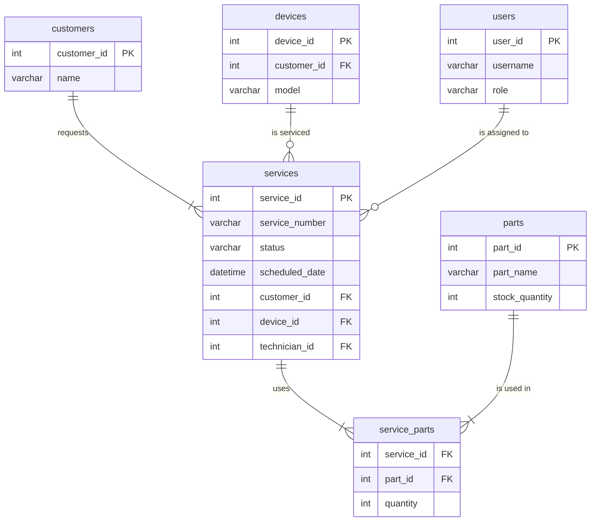
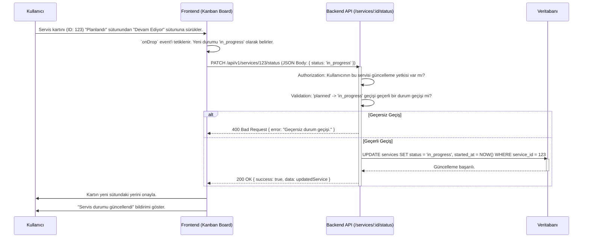

# Servisler Modülü Teknik Kılavuzu

**Sürüm:** 2.0.0
**Son Güncelleme:** 12 Kasım 2025

## 🎯 1. Misyon ve Genel Bakış

### 1.1. Modül Kimliği

- **Modül Adı:** Services (Servisler)
- **Sorumlu Ekip:** Backend Ekibi, Frontend Ekibi
- **Ana Sorumluluk:** Müşterilere sunulan servis hizmetlerinin (bakım, onarım, kurulum vb.) oluşturulmasını, planlanmasını, atanmasını, takibini ve tamamlanmasını yönetmek.

### 1.2. Stratejik Rolü

Bu modül, şirketin operasyonel iş akışının merkezindedir. Müşteri talebinden işin tamamlanmasına ve faturalandırılmasına kadar olan tüm süreci yönetir. Teknisyenlerin iş takibi, kullanılan parçalar ve maliyet hesaplamaları bu modül üzerinden yapılır. Servis süreçlerinin manuel ve dağınık takibini ortadan kaldırarak verimliliği artırır.

### 1.3. Diğer Modüllerle Entegrasyonları

- **Customers:** Her servis bir müşteriye aittir.
- **Users (Teknisyenler):** Servisler teknisyenlere atanır.
- **Parts (Stok):** Servislerde kullanılan yedek parçalar bu modülden alınır ve stoktan düşülür.
- **Finance:** Tamamlanan servisler faturalandırma için finans modülüne aktarılır.
- **Appointments:** Servisler için oluşturulan randevuları yönetir.

---

## 🗄️ 2. Veritabanı Mimarisi

Modülün veritabanı yapısı, `services` ana tablosu ve bu tabloya bağlı `service_parts` gibi ara tablolar üzerine kuruludur. Bu yapı, veri bütünlüğünü ve performansını sağlamak için index'ler ve trigger'lar ile güçlendirilmiştir.

### 2.1. Tablo Yapıları

#### `public.services`
Tüm servis kayıtlarının ana bilgilerini tutar.

```sql
CREATE TABLE public.services (
    service_id SERIAL PRIMARY KEY,
    service_number VARCHAR(100) UNIQUE NOT NULL,
    service_type VARCHAR(50) NOT NULL CHECK (service_type IN ('maintenance', 'repair', 'installation')),
    status VARCHAR(50) NOT NULL DEFAULT 'pending' CHECK (status IN ('pending', 'planned', 'in_progress', 'completed', 'cancelled')),
    priority VARCHAR(50) DEFAULT 'normal' CHECK (priority IN ('low', 'normal', 'high', 'urgent')),
    problem_description TEXT NOT NULL,
    work_performed TEXT,
    scheduled_date TIMESTAMPTZ NOT NULL,
    started_at TIMESTAMPTZ,
    completed_at TIMESTAMPTZ,
    labor_cost NUMERIC(10, 2) DEFAULT 0,
    parts_cost NUMERIC(10, 2) DEFAULT 0,
    total_cost NUMERIC(10, 2) DEFAULT 0,
    customer_id INT NOT NULL REFERENCES public.customers(customer_id),
    device_id INT REFERENCES public.devices(device_id),
    technician_id INT REFERENCES public.users(user_id),
    created_at TIMESTAMPTZ DEFAULT CURRENT_TIMESTAMP,
    updated_at TIMESTAMPTZ DEFAULT CURRENT_TIMESTAMP,
    deleted_at TIMESTAMPTZ
);
```

#### `public.parts` (Referans Tablo)
Stoktaki yedek parçaları tutar. `Services` modülü bu tabloya bağımlıdır.

```sql
CREATE TABLE public.parts (
    part_id SERIAL PRIMARY KEY,
    part_name VARCHAR(255) NOT NULL,
    sku VARCHAR(100) UNIQUE NOT NULL,
    stock_quantity INT NOT NULL DEFAULT 0,
    unit_price NUMERIC(10, 2) NOT NULL
);
```

#### `public.service_parts` (Ara Tablo)
Bir serviste hangi parçaların ne kadar kullanıldığını kaydeder.

```sql
CREATE TABLE public.service_parts (
    service_part_id SERIAL PRIMARY KEY,
    service_id INT NOT NULL REFERENCES public.services(service_id) ON DELETE CASCADE,
    part_id INT NOT NULL REFERENCES public.parts(part_id),
    quantity INT NOT NULL CHECK (quantity > 0),
    unit_price NUMERIC(10, 2) NOT NULL, -- Parçanın servise eklendiği andaki fiyatı
    created_at TIMESTAMPTZ DEFAULT CURRENT_TIMESTAMP
);
```

### 2.2. Indexler (Performans Optimizasyonu)

```sql
-- Servisleri durumlarına göre hızla filtrelemek için (Kanban board vb.).
CREATE INDEX idx_services_status ON public.services (status);

-- Belirli bir teknisyene atanmış servisleri hızla listelemek için.
CREATE INDEX idx_services_technician_id ON public.services (technician_id);

-- Belirli bir müşteriye ait tüm servisleri hızla bulmak için.
CREATE INDEX idx_services_customer_id ON public.services (customer_id);

-- Servisleri planlanan tarihe göre sıralamak ve filtrelemek için.
CREATE INDEX idx_services_scheduled_date ON public.services (scheduled_date);

-- Bir serviste kullanılan parçaları hızla listelemek için.
CREATE INDEX idx_service_parts_service_id ON public.service_parts (service_id);

-- Belirli bir parçanın hangi servislerde kullanıldığını bulmak için.
CREATE INDEX idx_service_parts_part_id ON public.service_parts (part_id);
```

### 2.3. Trigger'lar (Veri Bütünlüğü ve Otomasyon)

#### 1. Stok Miktarını Otomatik Güncelleme

Bu trigger, bir servise parça eklendiğinde (`service_parts`'a INSERT) veya servisten parça çıkarıldığında (`service_parts`'tan DELETE), ilgili parçanın `parts` tablosundaki stok miktarını (`stock_quantity`) otomatik olarak günceller. Bu, envanter yönetiminin tutarlılığı için hayati öneme sahiptir.

```sql
-- 1. Trigger Fonksiyonunu Oluşturma
CREATE OR REPLACE FUNCTION fn_update_stock_quantity()
RETURNS TRIGGER AS $$
BEGIN
    IF (TG_OP = 'INSERT') THEN
        -- Servise parça eklendi, stoktan düş
        UPDATE public.parts
        SET stock_quantity = stock_quantity - NEW.quantity
        WHERE part_id = NEW.part_id;
        RETURN NEW;
    ELSIF (TG_OP = 'DELETE') THEN
        -- Servisten parça çıkarıldı (iade), stoka ekle
        UPDATE public.parts
        SET stock_quantity = stock_quantity + OLD.quantity
        WHERE part_id = OLD.part_id;
        RETURN OLD;
    ELSIF (TG_OP = 'UPDATE') THEN
        -- Miktar değiştiyse, farkı hesapla ve stoku güncelle
        UPDATE public.parts
        SET stock_quantity = stock_quantity + OLD.quantity - NEW.quantity
        WHERE part_id = NEW.part_id;
        RETURN NEW;
    END IF;
    RETURN NULL;
END;
$$ LANGUAGE plpgsql;

-- 2. Trigger'ı service_parts Tablosuna Bağlama
CREATE TRIGGER trg_update_stock_on_part_use
AFTER INSERT OR UPDATE OR DELETE ON public.service_parts
FOR EACH ROW
EXECUTE FUNCTION fn_update_stock_quantity();
```

#### 2. `updated_at` Zaman Damgasını Otomatik Güncelleme
Bu standart trigger, bir kayıt her güncellendiğinde `updated_at` alanını otomatik olarak doldurur.
```sql
CREATE OR REPLACE FUNCTION fn_update_updated_at() RETURNS TRIGGER AS $$
BEGIN
    NEW.updated_at = NOW();
    RETURN NEW;
END;
$$ LANGUAGE plpgsql;

-- Services tablosu için
CREATE TRIGGER trg_services_update_at
BEFORE UPDATE ON public.services FOR EACH ROW EXECUTE FUNCTION fn_update_updated_at();
```

### 2.4. İlişki Diyagramı (ERD - Mermaid)



---

## 🧬 3. Veri Akış Şeması


### 3.1. Servis Durumunu Güncelleme (Kanban Board)


Bu şema, bir teknisyenin veya operatörün bir servis kartını Kanban board üzerinde "Planlandı" sütunundan "Devam Ediyor" sütununa sürüklemesiyle tetiklenen süreci gösterir.





---


## ⚙️ 4. Backend API Endpoint'leri (Detaylı)


**Base URL:** `/api/v1/services`


---


### 4.1. Kanban Board Verisini Getir


- **METHOD:** `GET`

- **URL:** `/kanban`

- **Handler Function:** `getKanbanData` - `/backend/controllers/serviceController.js:80`

- **Açıklama:** Tüm aktif servisleri durumlarına göre gruplayarak döndürür. Frontend'deki Kanban board'u doldurmak için kullanılır.


#### Gerçek SQL Sorgusu (`ServiceService.getKanbanData`)

```sql

-- Bu sorgu, tüm servisleri tek seferde çekip uygulama katmanında gruplamayı sağlar.

-- Alternatif olarak, her durum için ayrı sorgular da atılabilir.

SELECT

    service_id,

    service_number,

    status,

    priority,

    scheduled_date,

    c.first_name,

    c.last_name,

    u.username as technician_name

FROM public.services s

LEFT JOIN public.customers c ON s.customer_id = c.customer_id

LEFT JOIN public.users u ON s.technician_id = u.user_id

WHERE

    s.deleted_at IS NULL

    AND s.status IN ('pending', 'planned', 'in_progress')

ORDER BY s.priority, s.scheduled_date;

```


#### Response Formatı (200 OK)

```json

{

  "success": true,

  "data": {

    "pending": [

      { "service_id": 124, "service_number": "SRV-00124", "customer_name": "Veli Can" }

    ],

    "planned": [

      { "service_id": 123, "service_number": "SRV-00123", "customer_name": "Ayşe Kaya" }

    ],

    "in_progress": [

      { "service_id": 122, "service_number": "SRV-00122", "customer_name": "Ahmet Yılmaz" }

    ]

  }

}

```


---


### 4.2. Servis Durumunu Güncelle


- **METHOD:** `PATCH`

- **URL:** `/:id/status`

- **Handler Function:** `updateServiceStatus` - `/backend/controllers/serviceController.js:150`

- **Açıklama:** Bir servisin durumunu günceller. Bu endpoint, durum geçişlerinin iş kurallarına uygunluğunu kontrol etmelidir.


#### Request Detayları

- **URL Parameters:** `{ "id": "integer - Servis ID'si" }`

- **Request Body:**

  ```json

  {

    "status": "string - Yeni durum ('planned', 'in_progress', vb.) - Zorunlu"

  }

  ```


#### Backend İşlem Akışı

```javascript

// /backend/controllers/serviceController.js:150-190

const ALLOWED_TRANSITIONS = {

    pending: ['planned', 'cancelled'],

    planned: ['in_progress', 'cancelled'],

    in_progress: ['completed', 'pending'] // İptal edilip başa dönebilir

};


async function updateServiceStatus(req, res) {

    try {

        const { id } = req.params;

        const { status: newStatus } = req.body;

        

        // 1. Mevcut servisi bul

        const service = await ServiceService.findById(id);

        if (!service) return res.status(404).json({ error: "Servis bulunamadı." });


        // 2. GÜVENLİK: Durum geçişi geçerli mi?

        const allowed = ALLOWED_TRANSITIONS[service.status];

        if (!allowed || !allowed.includes(newStatus)) {

            return res.status(400).json({ error: `Geçersiz durum geçişi: ${service.status} -> ${newStatus}` });

        }


        // 3. DATABASE QUERY

        const updatedService = await ServiceService.updateStatus(id, newStatus);

        res.status(200).json({ success: true, data: updatedService });


    } catch (error) {

        res.status(500).json({ success: false, error: 'Server Error' });

    }

}

```


---


## 🖥️ 5. Frontend Mimarisi (Kod Seviyesinde)


- **Dosya:** `/frontend/js/service-board.js`

- **URL:** `/services/board.html`


#### HTML Yapısı (Kanban Board)

```html

<div class="kanban-board">

  <div class="kanban-column" id="col-pending">

    <h3>Bekleyen</h3>

    <div class="kanban-cards" data-status="pending"></div>

  </div>

  <div class="kanban-column" id="col-planned">

    <h3>Planlanmış</h3>

    <div class="kanban-cards" data-status="planned"></div>

  </div>

  <div class="kanban-column" id="col-in_progress">

    <h3>Devam Eden</h3>

    <div class="kanban-cards" data-status="in_progress"></div>

  </div>

</div>

```


#### JavaScript Fonksiyonları (Drag & Drop)

```javascript

// /frontend/js/service-board.js


// Kütüphane: SortableJS veya benzeri bir drag-and-drop kütüphanesi kullanıldığı varsayılmıştır.


// FUNCTION: initializeKanbanBoard() - Satır: 20-50

async function initializeKanbanBoard() {

    const response = await fetch('/api/v1/services/kanban');

    const result = await response.json();


    if (result.success) {

        // Her durumu kendi sütununa render et

        for (const status in result.data) {

            const column = document.querySelector(`.kanban-cards[data-status="${status}"]`);

            column.innerHTML = ''; // Sütunu temizle

            result.data[status].forEach(service => {

                column.innerHTML += createServiceCard(service);

            });

        }

    }

    

    // Drag-and-drop'u etkinleştir

    setupDragAndDrop();

}


// FUNCTION: setupDragAndDrop() - Satır: 55-80

function setupDragAndDrop() {

    const columns = document.querySelectorAll('.kanban-cards');

    columns.forEach(column => {

        new Sortable(column, {

            group: 'shared',

            animation: 150,

            onEnd: function (evt) {

                // Kart başka bir sütuna bırakıldığında

                const serviceId = evt.item.dataset.id;

                const newStatus = evt.to.dataset.status;

                updateServiceStatusOnServer(serviceId, newStatus);

            }

        });

    });

}


// FUNCTION: updateServiceStatusOnServer(id, status) - Satır: 85-105

async function updateServiceStatusOnServer(id, status) {

    const response = await fetch(`/api/v1/services/${id}/status`, {

        method: 'PATCH',

        headers: { 'Content-Type': 'application/json', 'Authorization': `Bearer ${getToken()}` },

        body: JSON.stringify({ status })

    });


    if (!response.ok) {

        showError("Durum güncellenemedi!");

        // Başarısız olursa kartı eski yerine geri taşı

        initializeKanbanBoard(); 

    } else {

        showSuccess("Durum güncellendi.");

    }

}


function createServiceCard(service) {

    return `<div class="kanban-card" data-id="${service.service_id}">

                <strong>${service.service_number}</strong>

                <p>${service.customer_name}</p>

            </div>`;

}

```


---


## 🔎 6. GERÇEK KULLANIM SENARYOSU (E2E)


### Senaryo: Servis Durumunu Kanban Board Üzerinde Değiştirme


**Amaç:** Bir servisin durumunu "Planlanmış"tan "Devam Ediyor"a sürükleyerek güncellemek.

**Ön Koşullar:** Kullanıcı giriş yapmış, Kanban board ekranı açık. Servis ID 123, "planned" sütununda.


| Adım | Aksiyon | Sistem Tepkisi (Kod ve Açıklama) |

|---|---|---|

| 1 | **Kullanıcı:** Servis #123 kartını fare ile tutar. | `dragstart` event'i tetiklenir. |

| 2 | **Kullanıcı:** Kartı "Devam Ediyor" (`in_progress`) sütununun üzerine sürükler ve bırakır. | `drop` event'i tetiklenir. SortableJS kütüphanesi `onEnd` callback'ini çalıştırır. |

| 3 | **Frontend:** `onEnd` fonksiyonu çalışır. | `evt.item.dataset.id`'den `123` alınır. `evt.to.dataset.status`'tan `in_progress` alınır. |

| 4 | **Frontend:** `updateServiceStatusOnServer(123, 'in_progress')` çağrılır. | `PATCH /api/v1/services/123/status` isteği gönderilir. |

| 5 | **Request Payload:** | ```json { "status": "in_progress" } ``` |

| 6 | **Backend:** `updateServiceStatus` controller fonksiyonu tetiklenir. | `ServiceService.findById(123)` ile mevcut servis bulunur (mevcut durum: `planned`). |

| 7 | **Backend:** Durum geçişi kontrol edilir. | `ALLOWED_TRANSITIONS['planned']` dizisi `['in_progress', 'cancelled']`'dir. `newStatus` ('in_progress') bu dizide yer aldığı için kontrol başarılı olur. |

| 8 | **Database:** `UPDATE` sorgusu çalışır. | `UPDATE public.services SET status = 'in_progress', started_at = NOW() WHERE service_id = 123;` |

| 9 | **Backend:** Başarılı response döner. | `res.status(200).json({ success: true, ... })` |

| 10 | **Frontend:** `response.ok` true döner. | `showSuccess("Durum güncellendi.")` mesajı gösterilir. Kart yeni sütununda kalır. |


---


## 🛡️ 7. Güvenlik Notları

Bu bölüm, Servisler modülünün operasyonel bütünlüğünü ve veri güvenliğini sağlamak için alınan önlemleri detaylandırır.

### 7.1. Giriş Doğrulama (Input Validation)

- **Backend:**
    - `updateServiceStatus` endpoint'inde, `status` parametresinin yalnızca beklenen değerlerden (`pending`, `planned`, `in_progress`, `completed`, `cancelled`) biri olduğu sunucu tarafında doğrulanmalıdır.
    - Yeni bir servis oluşturulurken (`POST /services`), `problem_description` gibi metin alanlarının makul bir uzunlukta olduğu kontrol edilmeli ve `customer_id`, `technician_id` gibi ID'lerin geçerli ve sisteme kayıtlı olduğu doğrulanmalıdır.
    - `labor_cost`, `parts_cost` gibi maliyet alanlarına negatif veya geçersiz sayısal değerler girilmesi engellenmelidir.

### 7.2. SQL Enjeksiyonu Koruması

- **Durum:** Kılavuzdaki `getKanbanData` sorgu örneği, doğrudan kullanıcı girdisi almasa da, diğer tüm sorgularda olduğu gibi parametreli sorgu kullanımı esastır.
- **Önlem:** Servisleri filtrelerken veya ararken (örneğin, `GET /services?customerId=...`), tüm parametreler SQL sorgularına doğrudan eklenmek yerine parametre olarak geçirilmelidir. Bu, SQL enjeksiyonu saldırılarını önler.

### 7.3. Çapraz Site Komut Dosyası Çalıştırma (XSS - Cross-Site Scripting) Koruması

- **Risk:** `problem_description` ve `work_performed` gibi teknisyenler veya müşteriler tarafından doldurulan uzun metin alanları, kötü niyetli JavaScript kodları içerebilir. Bu veriler, servis detaylarını görüntüleyen başka bir kullanıcının tarayıcısında çalışarak XSS saldırılarına neden olabilir.
- **Önlem:** Frontend'de, bu alanlardan gelen veriler DOM'a yazdırılmadan önce mutlaka "escape" edilmelidir (HTML varlıklarına dönüştürülmelidir).

### 7.4. Hız Sınırlama (Rate Limiting)

- **Risk:** Bir saldırgan, `updateServiceStatus` endpoint'ine aynı servis için sürekli istek göndererek veya çok sayıda yeni servis kaydı oluşturarak (`POST /services`) sistemde aşırı yük yaratabilir.
- **Önlem:** Durum değiştiren (`PATCH`) veya yeni kayıt oluşturan (`POST`) tüm endpoint'lere, kullanıcı veya IP bazlı hız sınırlama (rate limiting) uygulanmalıdır.

### 7.5. Çapraz Site İstek Sahteciliği (CSRF - Cross-Site Request Forgery) Koruması

- **Risk:** Oturum açmış bir operatör, farkında olmadan kötü niyetli bir siteyi ziyaret ederse, o site arka planda `/api/v1/services/123/status` gibi bir istek göndererek bir servisin durumunu istenmeyen bir şekilde değiştirebilir.
- **Önlem:** `PATCH`, `POST`, `DELETE` gibi durum değiştiren tüm endpoint'ler, CSRF token'ları ile korunmalıdır.

### 7.6. Yetkilendirme ve İş Mantığı Güvenliği

- **Risk:** Yetkisiz bir kullanıcının (örn: müşteri) bir servisi başka bir teknisyene ataması, tamamlanmış bir servisi iptal etmesi veya maliyetleri değiştirmesi.
- **Önlem:**
    - **Rol Tabanlı Yetkilendirme (RBAC):** Her endpoint, işlemi yapmaya çalışan kullanıcının rolünü kontrol etmelidir. Örneğin, bir servisi atama yetkisi sadece `operator` veya `admin` rolünde olmalıdır.
    - **Durum Makinesi (State Machine):** Kılavuzda `ALLOWED_TRANSITIONS` ile örneklendiği gibi, servis durumları arasındaki geçişler katı kurallara bağlanmalıdır. Örneğin, `completed` durumundaki bir servis, `in_progress` durumuna geri döndürülemez. Bu, sadece yetki kontrolü değil, aynı zamanda iş mantığının da güvenliğidir.
    - **Veri Sahipliği:** Bir teknisyen, varsayılan olarak sadece kendisine atanmış servislerin detaylarını görmeli ve durumunu güncelleyebilmelidir. Başka bir teknisyenin servisine müdahale edememelidir. Bu kontrol, servis sorgularına `WHERE technician_id = [mevcut_kullanici_id]` gibi ek koşullar eklenerek sağlanır.

### 7.7. Hassas Veri İşleme

- **Risk:** Servis detayları, müşteri adreslerini, sorunun tanımını ve bazen de mülk ile ilgili hassas bilgileri içerebilir.
- **Önlem:**
    - **Erişim Kontrolü:** Servis detaylarına erişim, sadece ilgili müşteri, atanan teknisyen ve yetkili operatörler/yöneticiler ile sınırlandırılmalıdır.
    - **Loglama:** Bir servisin durumunu kimin, ne zaman değiştirdiği gibi kritik işlemler, denetim (audit) amacıyla loglanmalıdır.

---

## 🧪 8. Test Senaryoları

### 8.1. Unit Test (Durum Geçiş Mantığı)

**Amaç:** Servis durumları arasındaki geçişleri kontrol eden iş mantığını test etmek.

```javascript
// /backend/test/services/state-machine.test.js

const { isTransitionAllowed } = require('../../src/services/state-machine');

describe('Service State Machine', () => {
    it('should allow transition from "pending" to "planned"', () => {
        const from = 'pending';
        const to = 'planned';
        expect(isTransitionAllowed(from, to)).toBe(true);
    });

    it('should NOT allow transition from "pending" to "completed"', () => {
        const from = 'pending';
        const to = 'completed';
        expect(isTransitionAllowed(from, to)).toBe(false);
    });

    it('should allow transition from "in_progress" to "completed"', () => {
        const from = 'in_progress';
        const to = 'completed';
        expect(isTransitionAllowed(from, to)).toBe(true);
    });

    it('should return false for an unknown "from" state', () => {
        const from = 'unknown_state';
        const to = 'completed';
        expect(isTransitionAllowed(from, to)).toBe(false);
    });
});
```

### 8.2. Integration Testi (`PATCH /:id/status`)

**Amaç:** Servis durumu güncelleme endpoint'inin, geçerli ve geçersiz durum geçişlerinde doğru HTTP yanıtlarını verdiğini test etmek.

```javascript
// /backend/test/integration/services.api.test.js
const request = require('supertest');
const app = require('../../src/app');
const db = require('../../src/db');

describe('PATCH /api/v1/services/:id/status', () => {
    let serviceId;

    beforeEach(async () => {
        // Hazırlık: Her testten önce 'pending' durumunda bir servis oluştur
        const res = await db.query("INSERT INTO services (..., status) VALUES (..., 'pending') RETURNING service_id");
        serviceId = res.rows[0].service_id;
    });

    it('should return 400 Bad Request for an invalid state transition', async () => {
        const response = await request(app)
            .patch(`/api/v1/services/${serviceId}/status`)
            .set('Authorization', `Bearer ${OPERATOR_TOKEN}`)
            .send({ status: 'completed' }); // 'pending' -> 'completed' geçersiz

        expect(response.statusCode).toBe(400);
        expect(response.body.error).toContain('Geçersiz durum geçişi');
    });

    it('should return 200 OK for a valid state transition', async () => {
        const response = await request(app)
            .patch(`/api/v1/services/${serviceId}/status`)
            .set('Authorization', `Bearer ${OPERATOR_TOKEN}`)
            .send({ status: 'planned' }); // 'pending' -> 'planned' geçerli

        expect(response.statusCode).toBe(200);
        expect(response.body.data.status).toBe('planned');
    });
});
```

### 8.3. E2E Testi (Kanban Board Drag & Drop)

**Amaç:** Kullanıcının Kanban board üzerinde bir servis kartını sürükleyip bırakarak durumunu başarıyla güncellediğini test etmek.

```javascript
// /frontend/cypress/e2e/service-board.cy.js
describe('Kanban Board', () => {
    it('should update service status when a card is moved to a new column', () => {
        cy.login('operator', 'password');
        cy.visit('/services/board');

        // 1. "Planlanmış" sütunundaki ilk kartı al
        cy.get('#col-planned .kanban-card').first().as('serviceCard');
        
        // API isteğini izle
        cy.intercept('PATCH', '/api/v1/services/**/status').as('updateStatus');

        // 2. Kartı "Devam Eden" sütununa sürükle
        cy.get('@serviceCard').drag('#col-in_progress .kanban-cards');

        // 3. API isteğinin başarılı olduğunu doğrula
        cy.wait('@updateStatus').its('response.statusCode').should('eq', 200);

        // 4. Kartın artık "Devam Eden" sütununda olduğunu doğrula
        cy.get('#col-in_progress .kanban-cards').find('@serviceCard').should('exist');
    });
});
```
---

## 🗺️ 9. Fonksiyon Bağlantı Haritası

Bu bölüm, modül içindeki ana fonksiyonların birbirleriyle olan ilişkisini ve çağrı hiyerarşisini gösterir.

### 9.1. Frontend Çağrı Grafiği (Call Graph)

```
KULLANICI ETKİLEŞİMİ / SAYFA YÜKLENMESİ
│
├─ event: DOMContentLoaded
│  └─ initializeKanbanBoard() (service-board.js)
│     ├─ fetch('/api/v1/services/kanban')
│     ├─ createServiceCard(service)
│     └─ setupDragAndDrop()
│
└─ event: drag-and-drop (SortableJS onEnd)
   └─ updateServiceStatusOnServer(id, status) (service-board.js)
      ├─ fetch('PATCH /api/v1/services/:id/status')
      ├─ showError(message) (ui.js)
      ├─ showSuccess(message) (ui.js)
      └─ initializeKanbanBoard() (Hata durumunda)
```

### 9.2. Backend Çağrı Grafiği (Call Graph)

```
API İSTEĞİ (Request)
│
├─ GET /api/v1/services/kanban
│  └─ Controller: getKanbanData(req, res) (serviceController.js)
│     └─ Service: ServiceService.getKanbanData() (serviceService.js)
│        └─ Veritabanı: SELECT ... FROM public.services ...
│
└─ PATCH /api/v1/services/:id/status
   └─ Controller: updateServiceStatus(req, res) (serviceController.js)
      ├─ Service: ServiceService.findById(id) (serviceService.js)
      │  └─ Veritabanı: SELECT ... FROM public.services WHERE service_id=...
      │
      ├─ (Validation): isTransitionAllowed(from, to)
      │
      └─ Service: ServiceService.updateStatus(id, newStatus) (serviceService.js)
         └─ Veritabanı: UPDATE public.services SET status=...
```
