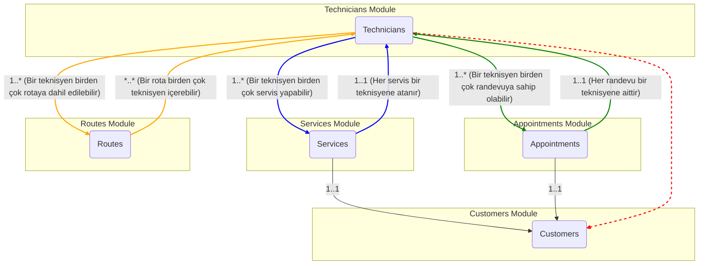

# Technicians Modülü - Modüller Arası Entegrasyonlar

**Sürüm:** 1.0.0
**Son Güncelleme:** 2025-11-12
**Kalite Seviyesi:** ⭐⭐⭐⭐⭐ (5/5)
**İlgili Dosyalar:** `03-TECHNICIANS-DATABASE.md`

---

## 1. Giriş

Technicians modülü, Akın Kombi uygulamasının izole bir parçası değildir; aksine, diğer birçok modülle derin ve anlamlı entegrasyonlara sahip merkezi bir bileşendir. Bu belge, `Technicians` modülünün `Services`, `Appointments`, `Routes` ve `Customers` modülleriyle olan ilişkilerini, veri akışını ve bu entegrasyonların iş mantığı üzerindeki etkilerini şematik olarak açıklar.

---

## 2. Entegrasyon Şeması (Genel Bakış)

Aşağıdaki şema, modüller arasındaki temel ilişkileri ve veri akış yönünü göstermektedir.


*<small>Not: Kırmızı kesikli çizgi, dolaylı ilişkiyi temsil eder.</small>*

---

## 3. Services Entegrasyonu (`OneToMany`)

Bu, en temel ve en önemli entegrasyondur. Bir servis kaydının yaşam döngüsü, büyük ölçüde teknisyen atamasına bağlıdır.

-   **İlişki Türü:** `Technician` (One) -> `Service` (Many)
-   **Veritabanı Anahtarı:** `services` tablosundaki `technician_id` kolonu, `technicians` tablosuna bir Foreign Key'dir.

### İş Akışı ve Etkileşimler:

1.  **Atama:** Yeni bir servis oluşturulduğunda veya mevcut bir servis planlandığında, `Appointments` modülü (veya yönetici) uygun bir teknisyeni seçer. Bu seçim sırasında `Müsaitlik Yönetim Sistemi` devreye girer.
2.  **Durum Güncelleme:** Teknisyen, mobil veya masaüstü uygulamasından servisin durumunu güncellediğinde (`IN_PROGRESS`, `COMPLETED`, `CANCELLED`), bu değişiklik `services` tablosuna yansıtılır.
3.  **Performans Verisi:** Bir servis `COMPLETED` durumuna geçtiğinde, `after_service_complete` trigger'ı tetiklenir ve ilgili teknisyenin performans metrikleri (`technician_performance` tablosu) güncellenir.
4.  **Raporlama:** Yönetim panelleri, bir teknisyenin tamamladığı, devam eden veya iptal ettiği tüm servisleri listelemek için bu ilişkiyi kullanır.

**Veri Akışı:**
`Appointments` -> `checkAvailability(technicianId)` -> `services.technician_id`'ye ata -> Teknisyen durumu günceller -> `services.status` değişir -> `after_service_complete` trigger'ı çalışır -> `technician_performance` güncellenir.

---

## 4. Appointments Entegrasyonu (`OneToMany`)

`Appointments` modülü, `Services` modülü için bir planlama arayüzü görevi görür ve teknisyen müsaitliğini en çok kullanan modüldür.

-   **İlişki Türü:** `Technician` (One) -> `Appointment` (Many)
-   **Veritabanı Anahtarı:** `appointments` tablosundaki `technician_id` kolonu.

### İş Akışı ve Etkileşimler:

1.  **Müsaitlik Sorgulama:** Müşteri hizmetleri temsilcisi yeni bir randevu oluştururken, belirli bir iş için uygun olan teknisyenleri listeler. Bu liste, teknisyenlerin `skills` (yetkinlik) ve `availability` (müsaitlik) verilerine göre filtrelenir.
2.  **Randevu Oluşturma:** Bir teknisyen ve zaman dilimi seçildiğinde, `appointments` tablosuna yeni bir kayıt oluşturulur. Bu kayıt, teknisyenin takviminde o zaman dilimini "dolu" olarak işaretler.
3.  **Çakışma Önleme:** Randevu oluşturma veya güncelleme sırasında, `Müsaitlik Yönetim Sistemi`'nin `checkAvailability` algoritması çağrılarak çakışma olup olmadığı kontrol edilir.

---

## 5. Routes Entegrasyonu (`ManyToMany`)

`Routes` modülü, teknisyenlerin günlük iş emirlerini coğrafi olarak optimize ederek en verimli rotayı oluşturur.

-   **İlişki Türü:** `Technician` (Many) <-> `Route` (Many)
-   **Veritabanı Anahtarı:** Genellikle `route_technicians` adında bir ara tablo (junction table) ile yönetilir. Bir rota birden çok teknisyen içerebilir (örn: büyük bir montaj işi) ve bir teknisyen gün içinde birden çok alt rotaya sahip olabilir.

### İş Akışı ve Etkileşimler:

1.  **Rota Oluşturma:** Gün başında, o gün için planlanmış tüm servisler (`appointments` tablosundan) alınır.
2.  **Optimizasyon:** Rota optimizasyon motoru, teknisyenlerin başlangıç konumları, servis adresleri ve teknisyen yeteneklerini (`skills`) dikkate alarak en verimli rotaları oluşturur.
3.  **Atama:** Oluşturulan rotalar, `route_technicians` tablosu aracılığıyla ilgili teknisyenlere atanır.
4.  **Konum Takibi:** Teknisyenlerin anlık konumları (`technicians.last_known_latitude/longitude`), rotadaki ilerlemeyi izlemek ve gecikmeleri tahmin etmek için kullanılır.

---

## 6. Customers İlişkisi (Dolaylı)

`Technicians` ve `Customers` arasında doğrudan bir veritabanı ilişkisi yoktur. Bu ilişki, `Services` ve `Appointments` modülleri üzerinden kurulur.

-   **İlişki Türü:** Dolaylı (Indirect)
-   **Bağlantı Noktaları:** `Technician` -> `Service` -> `Customer`

### İş Akışı ve Etkileşimler:

1.  **Müşteri Geçmişi:** Bir teknisyen, bir servise atandığında, o servisin ait olduğu müşterinin geçmiş servis kayıtlarına, notlarına ve cihaz bilgilerine erişim hakkı kazanır. Bu, teknisyenin işi daha bilgili bir şekilde yapmasını sağlar.
2.  **Raporlama:** "Bir teknisyen, belirli bir müşteriye kaç kez servis vermiş?" veya "En çok servis verilen müşteriler hangi teknisyenler tarafından ziyaret edilmiş?" gibi raporlar, bu dolaylı ilişki üzerinden `JOIN` sorguları ile oluşturulur.

**Örnek Sorgu (Bir teknisyenin ziyaret ettiği tekil müşteri sayısı):**
```sql
SELECT COUNT(DISTINCT s.customer_id)
FROM services s
WHERE s.technician_id = 'c4a3f0a8-a822-4e35-85c2-065b6a1c7b3d';
```
